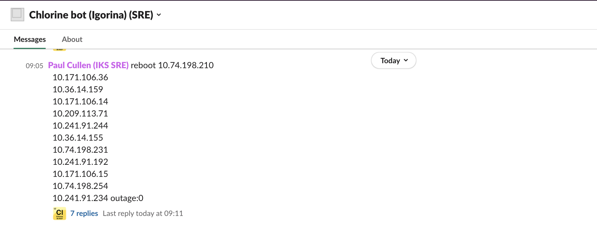

Alert
{: .label .label-purple}

## Overview

General information for debugging csutil onto a tugboat

## Log into the tugboat

Start by logging into the tugboat referenced in the firing alert.  
_More information on [logging into the tugboat](https://pages.github.ibm.com/alchemy-conductors/documentation-pages/docs/runbooks/armada/armada-tugboats.html#access-the-tugboats)_

## Example Alert(s)

~~~~
Labels:
 - alertname = IbmServicesNotInstalled
 - alert_key = armada-csutil/ibm-services-not_installed
 - alert_situation = ibm-services-not_installed
 - service = armada-csutil
 - severity = critical
Annotations:
 - namespace = armada
~~~~

## Table of contents for alerts

Follow the link depending on the alertname in the firing PD alert.

| Alert_Situation | Info | Start |
|--
| `IbmServicesNotInstalled`| No pods found in ibm-services-system namespace. csutils needs to be reinstalled. | [Csutils Not Installed](#csutils-not-installed) |
| `BESLocalClientDaemonsetsNotRunning`| One or more bes-local-client pods are experiencing issues. | [Daemonsets Not Running](#daemonsets-not-running) |
| `ChangeTrackerDaemonsetsNotRunning`| One or more change-tracker pods are experiencing issues. | [Daemonsets Not Running](#daemonsets-not-running) |
| `CrowdstrikeDaemonsetsNotRunning`| One or more crowdstrike pods are experiencing issues. | [Daemonsets Not Running](#daemonsets-not-running) |
| `SyslogConfiguratorDaemonsetsNotRunning`| One or more syslog-configurator pods are experiencing issues. | [Daemonsets Not Running](#daemonsets-not-running) |
| `KubeAuditlogForwardFailure`| There are issues with the kube-auditlog-forwarder pod. | [Kube Auditlog Forwarder](#kube-auditlog-forwarder) |
| `SOSToolsDown`| There are issues with the sos-tools pod. | [SOS Tools](#sos-tools) |
{:.table .table-bordered .table-striped}


## Actions to Take

## Csutils Not Installed

Start by listing the PODs in `ibm-services-system` namespace.  
`kubectl get po -n ibm-services-system`

If this returns, `No resources found in ibm-services-system namespace.` then a reinstall of csutil on this tugboat is required - see [tugboat re-install csutil](./tugboat_install_csutil.html)
```
[prod-dal10-carrier115] cullepl@prod-dal10-carrier2-worker-1010:~$ kubectl get pods -n ibm-services-system
No resources found in ibm-services-system namespace.
```

## Daemonsets Not Running

These alerts occur when the daemonsets are installed, but there may be issues with the nodes or something else that is keeping them from spinning up properly. Take note of the daemonset(s) that are experiencing issues. This should be one of either `bes-local-client`, `crowdstrike`, `change-tracker`, or `syslog-configurator`.

The nodes should be indicated already in the alert but, if not, a useful command to run which will idenify which node(s) are not running the daemonset POD are as follows:

```
export DS=<name of daemonset>
export NAMESPACE=ibm-services-system

kubectl get pods -l name=$DS -n $NAMESPACE -o wide | grep 0/1
```
This should return details of the machines not running the daemonset PODs, and actions can then be taken against those nodes.

Example output:
```
[prod-sjc04-carrier104] remolina@prod-dal10-carrier2-worker-1001:~$ export DS=bes-local-client
[prod-sjc04-carrier104] remolina@prod-dal10-carrier2-worker-1001:~$ export NAMESPACE=ibm-services-system
[prod-sjc04-carrier104] remolina@prod-dal10-carrier2-worker-1001:~$ kubectl get pods -l name=$DS -n $NAMESPACE -o wide | grep 0/1
bes-local-client-5t7jj   0/1     Running   8          26d     172.18.42.221    10.87.120.149   <none>           <none>
bes-local-client-6bzjd   0/1     Running   9          26d     172.18.162.203   10.87.120.176   <none>           <none>
```

Once you've obtained the problem pods and which nodes they are on, proceed to the below subsections for daemonset specific debug.

### bes-local-client

When problems with `bes-local-client` PODs are observed via PD, always check for other nodes on the same tugboat with similar symptoms.  If further PDs fire for nodes in the same tugboat, more reboots or reload will be required to fix the POD issue.  Running multiple reboots for nodes in the same tugboat can overload the remaining nodes in the tugboat whilst cordons and drains are executed.  Therefore, its best submit one chlorine request to reboot the nodes in series on the nodes where `bes-local-client` POD issues are found.


- Review state of the `bes-local-client` PODs on the node in the `csutil` namespace, specifically searching for ones not in a fully running state.  
`kubectl get pod -n ibm-services-system -owide | grep bes-local-client | grep 0/1`

- Describe all of the PODs which are not running correctly.  Take note of what is returned in the events section of each describe as the follow on actions depend on what state the pod is in.  
`kubectl get pod -n ibm-services-system -owide | grep bes-local-client | grep 0/1 | awk '{print $1}' | xargs -L1 kubectl describe pod -n ibm-services-system`

#### ERROR: it has been more than 1500 minutes since successful report

If you observed events such as `ERROR: it has been more than 1500 minutes since successful report` (example below) this usually indicates an connection issue on the node to SOS Bigfix.  

```
Events:
  Type     Reason     Age                   From     Message
  ----     ------     ----                  ----     -------
  Warning  Unhealthy  3m48s (x179 over 3h)  kubelet  (combined from similar events): Readiness probe failed: MY_NODE_NAME='10.211.111.182'
RELAY_SERVER_1='172.19.56.131'
EXPECTED_REPORT_TIME_IN_MINUTES='1500'
2021-09-07 14:59:41 ERROR: it has been more than 1500 minutes since successful report
```

Use `chlorine` to reboot the node(s) to refresh any connections.

__**PRO TIP!**__ Use the following command to return all the IP addresses to pass to chlorine.  
`kubectl get pod -n ibm-services-system -owide | grep bes-local-client | grep 0/1 | awk '{print $7}'` 

Example submission of multiple reboots to chlorine

<a href="images/csutil_alert_reboot_multiple_nodes.png">
</a>

#### Warning  BackOff  5m7s (x7828 over 28h)  kubelet  Back-off restarting failed container

Using the POD name found from the previous `describe` set the following variable  
`export TROUBLED_POD=<pod name>`

Get the POD status  
`kubectl get po -n ibm-services-system $TROUBLED_POD`

If the POD is in a `CrashLoopBackoff` state, issue an osreload of the node via chlorine.

If the POD is in a `Running` state, but showing `0/1` then gather some further debug and attempt a re-install of the besagent.

```
kubectl exec -it -n ibm-services-system $TROUBLED_POD -- sos alive_debug
kubectl exec -it -n ibm-services-system $TROUBLED_POD -- sos ready_debug
kubectl exec -it -n ibm-services-system $TROUBLED_POD -- sos logs
```

If the logs indicate a readiness check that is failing but the alive check is passing, re-install the IEM Client on that node:

```
kubectl exec -it -n ibm-services-system $TROUBLED_POD -- sos uninstall
kubectl exec -it -n ibm-services-system $TROUBLED_POD -- sos install
```

If the re-install does not allow the `bes-local-client` to start in a full running state and resolve the PD, then, use `chlorine` to reload the node.

If the issue still persists after IEM Client reinstall AND reload of the node, go to [Escalation Policy](#escalation-policy).

### crowdstrike

In addition to the commands in the previous section, run the following commands to gather more helpful debug data:

```
kubectl describe pod -n $NAMESPACE $TROUBLED_POD   # take note of what is returned in the events section
kubectl exec -it -n $NAMESPACE $TROUBLED_POD -- cmd alive_debug
kubectl exec -it -n $NAMESPACE $TROUBLED_POD -- cmd ready_debug
kubectl exec -it -n $NAMESPACE $TROUBLED_POD -- cmd status
```

Check the Events output of the `describe pod` command.

#### Pod stuck in 'Init'

If the pod is stuck in `Init`, the node may need a hard reboot vis SoftLayer. The pod state may be like this:

```
crowdstrike-g6v7t                          0/1     Init:0/1   0                25h    172.18.230.102   10.126.128.167   <none>           <none>
```

Try to cycle the pod.

If that doesn't help (the pod may get stuck `Terminating`), then issue a hard reboot via chlorine:

```
reboot 10.126.128.167 softlayer outage:0
```

#### Many pod restarts: logs say 'Already installed'

Check if the crowdstrike pod shows many restarts, and the logs show entries like this:

```
[prod-wdc04-carrier100] milan.viradia@prod-wdc06-carrier1-worker-03:~$ kubectl logs -n ibm-services-system crowdstrike-7zttt
2022-09-12 06:37:41 crowdstrike-7zttt Check RHEL version
2022-09-12 06:37:41 crowdstrike-7zttt RHEL version  7.9  with package GC-falcon-sensor-6.41.0-13804.el7.x86_64.rpm
2022-09-12 06:37:41 crowdstrike-7zttt >>>install_crowdstrike
2022-09-12 06:37:41 crowdstrike-7zttt Already installed
2022-09-12 06:37:41 crowdstrike-7zttt <<<install_crowdstrike
...wait_for_ever
```

Run the following to clear the temporary file and restart the failing pod:

```
export NODE=CROWDSTRIKE_NODE_IP
BES_POD=$(kubectl get pod -n ibm-services-system -o wide | grep -w $NODE | grep bes-local-client | awk $'{print $1}')
kubectl exec -n ibm-services-system $BES_POD -- rm -rf /host/etc/crowdstrike
kubectl get pod -n ibm-services-system -o wide | grep -w $NODE | grep crowdstrike | awk '{print $1}' | xargs -L1 kubectl delete po -n ibm-services-system
```

#### context deadline exceeded
```
Events:
  Type     Reason     Age                     From     Message
  ----     ------     ----                    ----     -------
  Warning  Unhealthy  3m57s (x8146 over 23h)  kubelet  Readiness probe errored: rpc error: code = DeadlineExceeded desc = failed to exec in container: timeout 1s exceeded: context deadline exceeded
```

If you see the above error, then you can try reinstalling crowdstrike on the worker via the below commands.  If that does not resolve the issue, then attempt to do a reload on the node where this pod is located.

```
kubectl exec -it -n $NAMESPACE <troubled pod> -- cmd uninstall
kubectl exec -it -n $NAMESPACE <troubled pod> -- cmd install
```


#### Running in Reduced Functionality Mode (RFM)
```
Events:
  Type     Reason     Age                     From     Message
  ----     ------     ----                    ----     -------
  Warning  Unhealthy  28s (x2741 over 7h37m)  kubelet  (combined from similar events): Readiness probe failed: 2021-06-08 21:51:48 crowdstrike-t2btk Running in Reduced Functionality Mode.  Failing readiness: rfm-state=true. 
2021-06-08 21:51:48 crowdstrike-t2btk rfm-reason=Modules file was not found, code=0xC0000034.
```

If you see the above error, then the root issue is due to the falcon-sensor that we were provided by the EDR team not being compatable with the kernel version that is on that worker node. The only way to resolve this error is to install an updated sensor that is compatable. These are provided to us by the EDR team. Sensors are installed through csutils and the version that is installed can be seen [here](https://github.ibm.com/ibmcloud/ArmadaCrowdstrike/blob/master/falcon-pkg.sh).  Please check in the #armada-crowdstrike channel for any updates on when a new sensor will be provided.

If other nodes in the tugboat are at the same kernel version and crowdstrike is running on them, recreating the POD will usually address the problem and all crowdstrike to fully start.

Run the following command to find crowdstrike PODs in a tugboat and recreate them
~~~
kubectl get po -n ibm-services-system -l name=crowdstrike | grep 0/1 | awk '{print $1}' | xargs -L1 kubectl delete po -n ibm-services-system
~~~


### change-tracker

Change-tracker problems are still not fully understood. For now, a data gathering exercise is needed and the only fix observed is to reload the node

Create a [conductors team GHE](https://github.ibm.com/alchemy-conductors/team/issues/new), add label `COMPLIANCE` a link to the PD, and dump the following information into it.
If you are hitting multiple issues whilst on call, feel free to add details to a single GHE issue.

- Set these variables 
```
export TROUBLED_POD=<pod name>
```

- Collect logs from the POD
```
kubectl logs -n ibm-services-system $TROUBLED_POD
```

- Describe the POD
```
kubectl describe po -n ibm-services-system $TROUBLED_POD
```

Once all data has been gathered, issue a node reload via chlorine to fix the issue.
```
reload <node ip> outage:0
```

The PD alert should resolve once the reload completes - if it doesn't, proceed to the [escalation policy](#escalation-policy)

### syslog-configurator

To be populated when next alert comes in. [Escalate](#escalation-policy)


### Kube Auditlog Forwarder

First thing to do is to check the kube-auditlog forwarder pod and determine why it is failing
`kubectl get po -n ibm-services-system -l app=kube-auditlog-forwarder`

If the error is `CreateContainerConfigError` recreate the pod and it will spin up without issues
```
[prod-dal10-carrier107] rmolina@prod-dal10-carrier2-worker-1001:~$ kubectl -n ibm-services-system get pods -l app=kube-auditlog-forwarder
NAME                                       READY   STATUS                       RESTARTS   AGE
kube-auditlog-forwarder-565b6796f7-zkm95   0/1     CreateContainerConfigError   0          13m
[prod-dal10-carrier107] rmolina@prod-dal10-carrier2-worker-1001:~$ kubectl -n ibm-services-system delete pods -l app=kube-auditlog-forwarder
pod "kube-auditlog-forwarder-565b6796f7-zkm95" deleted
[prod-dal10-carrier107] rmolina@prod-dal10-carrier2-worker-1001:~$ kubectl -n ibm-services-system get pods -l app=kube-auditlog-forwarder
NAME                                       READY   STATUS    RESTARTS   AGE
kube-auditlog-forwarder-565b6796f7-b4nm4   1/1     Running   0          38s
```

If the error is `OOMKilled` then the pod has reached its memory request limit and crashed.  You will need to scale the deployment to resolve the issue
```
[prod-sng01-carrier101] rmolina@prod-tok02-carrier1-worker-1001:~$ kubectl -n ibm-services-system get pods -l app=kube-auditlog-forwarder
NAME                                       READY   STATUS                       RESTARTS   AGE
kube-auditlog-forwarder-565b6796f7-zkm95   0/1     OOMKilled                    12         33m
[prod-dal10-carrier107] rmolina@prod-dal10-carrier2-worker-1001:~$ kubectl -n ibm-services-system delete pods -l app=kube-auditlog-forwarder
pod "kube-auditlog-forwarder-565b6796f7-zkm95" deleted
[prod-dal10-carrier107] rmolina@prod-dal10-carrier2-worker-1001:~$ kubectl -n ibm-services-system scale --replicas=3 deployment/kube-auditlog-forwarder
NAME                                       READY   STATUS    RESTARTS   AGE
kube-auditlog-forwarder-565b6796f7-b4nm4   1/1     Running   0          38s
kube-auditlog-forwarder-565b6796f7-8h3q4   1/1     Running   0          38s
kube-auditlog-forwarder-565b6796f7-9fjr2   1/1     Running   0          38s
```

## SOS Tools

### Background
The sos-tools pod is compromised of 4 containers: `vpn-client`,`bes-relay` `syslog-forwarder`, and `fim-proxy`. Each of these applications has a distinct function in relaying the necessary logs and data to Shared Operational Services (SOS). The `vpn-client` container is the application that establishes the VPN that provides connectivity with SOS. Without this, a VPN tunnel cannot be established to the SOS servers. Therefore it is the most important application in this pod. The `bes-relay` container is the main BigFix relay, and is responsible for creating the bes-relay-service for the cluster. The `syslog-forwarder` container is the application responsible for creating the syslog-forwarder-service and is responsible for forwarding logs to Qradar.  Finally, the `fim-proxy` application creates the fim-proxy-service and is responsible for forwarding change information from the NNT Changetracker agent to the SOS FIM hub.

### Debug
Check that there are no issues with the current deployment.  There should be 4/4 containers online and only one replica. Clean up any sos-tools pod that are in a bad state:

```
[prod-dal10-carrier114] remolina@prod-dal10-carrier2-worker-1001:~$ kubectl get pods -n ibm-services-system -l app=sos-tools
NAME                         READY   STATUS    RESTARTS   AGE
sos-tools-6bc6655d97-44rfw   4/4     Running   0          20h
sos-tools-6bc6655d97-tcmm8   0/4     Evicted   0          6d17h
[prod-dal10-carrier114] remolina@prod-dal10-carrier2-worker-1001:~$ kubectl delete pods -n ibm-services-system sos-tools-6bc6655d97-tcmm8
pod "sos-tools-6bc6655d97-tcmm8" deleted
[prod-dal10-carrier114] remolina@prod-dal10-carrier2-worker-1001:~$ kubectl get pods -n ibm-services-system -l app=sos-tools
NAME                         READY   STATUS    RESTARTS   AGE
sos-tools-6bc6655d97-44rfw   4/4     Running   0          20h
```

If there are not 4/4 containers running or there are multiple restarts on this pod, run a describe output to identify which container is experiencing the problems and pull the logs from that container.

```
kubectl describe pod -n $NAMESPACE -l app=sos-tools
```

Scroll through the output and find the container that is having issues, it will be the one with `Ready: False` under the container heading and/or have a high restart count (`Restart Count: XX`). The `Events` section may also have some useful info.
```
...
...
Containers:
  vpn-client:                               # <----------- Application Troubled
    ...
    ...
    State:          Running
      Started:      Tue, 08 Jun 2021 18:45:42 +0000
    Last State:     Terminated
      Reason:       Completed
      Exit Code:    0
      Started:      Tue, 08 Jun 2021 18:39:13 +0000
      Finished:     Tue, 08 Jun 2021 18:45:40 +0000
    Ready:          False                   # <----------- Ready State is False
    Restart Count:  33                      # <----------- High Restart Count
    ...
    ...
  bes-relay:
    ...
    ...
    State:          Running
      Started:      Tue, 08 Jun 2021 17:06:04 +0000
    Last State:     Terminated
      Reason:       Error
      Exit Code:    137
      Started:      Tue, 08 Jun 2021 12:13:10 +0000
      Finished:     Tue, 08 Jun 2021 17:06:02 +0000
    Ready:          True
    Restart Count:  1
    ...
    ...
  syslog-forwarder:
    ...
    ...
    State:          Running
      Started:      Tue, 08 Jun 2021 12:13:21 +0000
    Ready:          True
    Restart Count:  0
    ...
    ...
  fim-proxy:
    ...
    ...
    State:          Running
      Started:      Tue, 08 Jun 2021 12:13:30 +0000
    Ready:          True
    Restart Count:  0
    ...
    ...
Events:                                     # <----------- Events Section
  Type     Reason     Age                     From     Message
  ----     ------     ----                    ----     -------
  Warning  Unhealthy  4m9s (x194 over 6h38m)  kubelet  Readiness probe failed: command timed out
  Warning  Unhealthy  26s (x141 over 6h34m)   kubelet  Liveness probe failed: command timed out
```

#### vpn-client
Usually the problem will be the result of issues with the vpn-client being unable to establish and/or maintain a connection. You can verify that the container is able to establish a connection with the following commands:
```
export SOS_POD_NAME=$(kubectl get pods --namespace ibm-services-system -l name=sos-tools -o jsonpath="{.items[0].metadata.name}")
kubectl exec -it --namespace ibm-services-system ${SOS_POD_NAME} -c vpn-client -- ./check-vpn.sh
```

Good Output:

```
10.143.108.75 (10.143.108.75:52311) open
VPN is alive and ready
```

Bad output:
```
10.143.108.75 (10.143.108.75:52311)
Unable to connect to 10.143.108.75:52311.  VPN is NOT alive.
```

Collect all data found, open a GHE issue, and [Escalate](#escalation-policy).

### Other scenarios

There have been scenarios where PD alerts are received and querying the `ibm-services-system` namespace returns no resources

```
[prod-tok02-carrier108] cullepl@prod-dal12-carrier2-worker-1083:~$ kubectl get po -n ibm-services-system -owide 
No resources found in ibm-services-system namespace.
```
Review all the objects associated with the `ibm-services-system` namespace.  
Example command `kubectl get all -n ibm-services-system`

If this returns `No resources found in ibm-services-system namespace.` then proceed to [re-install csutil runbook](./tugboat_install_csutil.html)

If resources are returned (example below) but nothing is starting, it's likely a missing `rolebinding` is the cause.
```
[prod-tok02-carrier108] cullepl@prod-tok02-carrier1-worker-1001:~$ kubectl get all -n ibm-services-system -owide
NAME                                      TYPE        CLUSTER-IP       EXTERNAL-IP   PORT(S)     AGE     SELECTOR
service/bes-relay-service                 ClusterIP   172.19.246.167   <none>        52311/TCP   6h25m   app=sos-tools
service/fim-proxy-service                 ClusterIP   172.19.38.89     <none>        443/TCP     6h25m   app=sos-tools
service/kube-auditlog-forwarder           ClusterIP   172.19.47.160    <none>        8080/TCP    6h25m   app=kube-auditlog-forwarder
service/kube-auditlog-forwarder-metrics   ClusterIP   172.19.150.134   <none>        9095/TCP    6h25m   app=kube-auditlog-forwarder
service/syslog-forwarder-service          ClusterIP   172.19.44.230    <none>        10514/TCP   6h25m   app=sos-tools

NAME                                 DESIRED   CURRENT   READY   UP-TO-DATE   AVAILABLE   NODE SELECTOR   AGE     CONTAINERS            IMAGES                                          SELECTOR
daemonset.apps/bes-local-client      0         0         0       0            0           <none>          6h25m   bes-client            us.icr.io/ibmcloudsos/sos-bes-client:72-rhel    name=bes-local-client
daemonset.apps/change-tracker        0         0         0       0            0           <none>          6h25m   change-tracker        us.icr.io/ibmcloudsos/changetracker:32-rhel     name=change-tracker
daemonset.apps/crowdstrike           0         0         0       0            0           <none>          6h25m   crowdstrike           us.icr.io/ibmcloudsos/crowdstrike:84-rhel       name=crowdstrike
daemonset.apps/syslog-configurator   0         0         0       0            0           <none>          6h25m   syslog-configurator   us.icr.io/ibmcloudsos/syslog-configurator:174   name=syslog-configurator

NAME                                      READY   UP-TO-DATE   AVAILABLE   AGE     CONTAINERS                                        IMAGES                                                                                                                                                             SELECTOR
deployment.apps/kube-auditlog-forwarder   0/1     0            0           6h25m   kube-auditlog-forwarder                           us.icr.io/ibmcloudsos/ibm-kube-profile-auditlog-syslogforwarder:240                                                                                                app=kube-auditlog-forwarder
deployment.apps/sos-tools                 0/1     0            0           6h25m   vpn-client,bes-relay,syslog-forwarder,fim-proxy   us.icr.io/ibmcloudsos/sos-vpn-client:58,us.icr.io/ibmcloudsos/sos-bes-relay:87,us.icr.io/ibmcloudsos/syslog-forwarder:108,us.icr.io/ibmcloudsos/sos-fim-proxy:42   app=sos-tools

NAME                                                DESIRED   CURRENT   READY   AGE     CONTAINERS                                        IMAGES                                                                                                                                                             SELECTOR
replicaset.apps/kube-auditlog-forwarder-9475c5c7b   1         0         0       6h25m   kube-auditlog-forwarder                           us.icr.io/ibmcloudsos/ibm-kube-profile-auditlog-syslogforwarder:240                                                                                                app=kube-auditlog-forwarder,pod-template-hash=9475c5c7b
replicaset.apps/sos-tools-58585d56f7                1         0         0       6h25m   vpn-client,bes-relay,syslog-forwarder,fim-proxy   us.icr.io/ibmcloudsos/sos-vpn-client:58,us.icr.io/ibmcloudsos/sos-bes-relay:87,us.icr.io/ibmcloudsos/syslog-forwarder:108,us.icr.io/ibmcloudsos/sos-fim-proxy:42   app=sos-tools,pod-template-hash=58585d56f7
```

To check the `rolebinding` for the `ibm-services-system` namespace run the following command  
`kubectl get rolebinding -n ibm-services-system`

If this returns a role binding, proceed to the escalation policy.

If this returns `No resources found in ibm-services-system namespace.` then recreate the role binding following these steps

1. Create a `rolebinding.yaml` file with these contents
```
apiVersion: rbac.authorization.k8s.io/v1
kind: RoleBinding
metadata:
  name: ibm-ibm-services-system-privileged-user
  namespace: ibm-services-system
roleRef:
  kind: ClusterRole
  name: ibm-privileged-psp-user
  apiGroup: rbac.authorization.k8s.io
subjects:
- kind: Group
  apiGroup: rbac.authorization.k8s.io
  name: system:serviceaccounts:ibm-services-system
```

2.  Apply the rolebinding yaml using  
`kubectl apply -f rolebinding.yaml`

3.  Monitoring the pods in the `ibm-services-system` namespace.  If they do not successfully start, proceeed to the escalation policy

### Other helpful commands

1. Find out not running pods with following commands
    `kubectl get pods -n ibm-services-system -o wide | grep -v Running`
    and
    `kubectl get pods -n ibm-services-system -o wide | grep 0/1`
    _Sometimes these commands do not return any PODs as down if the daemonset pod is not running on a troubled node_
 1. If pod is not in `Running` state, then delete the pod
 `kubectl delete pod -n ibm-services-system <pod>`
 1. A node reload can sometimes fix this issue.
 1. If pod does not come back up or if the problem still persist, proceed to [Escalation Policy](#escalation-policy)


## Additional Information
Some other helpful links for csutils:

- [General Troubleshooting](https://github.ibm.com/ibmcloud/ArmadaClusterSetupCLI/blob/master/troubleshooting.md)
- [Csutil CLI](https://github.ibm.com/ibmcloud/ArmadaClusterSetupCLI)
- [Csutil Charts](https://github.ibm.com/ibmcloud/charts)


## Escalation Policy

csutils is owned and maintained by SRE now so reach out to other SREs in `#armada-csutils` (private channel) for assistance if you are stuck fixing an issue.
If you need access to this channel, ask in #conductors-for-life and someone will add you.
