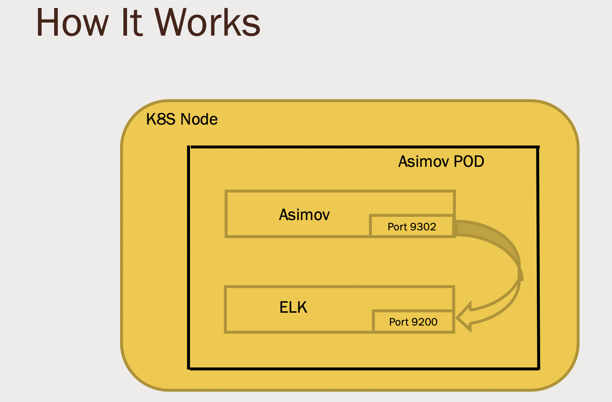

Informational
{: .label }

## Overview
asimov is a helpful bot that extracts runbook links based on given search query

This runbook is here to provide an understanding of asimov, its deployment, and how to repair common issues.

## Detailed information

Asimov is a python based bot that take requests  on Slack and responds .The purpose of the bot is to dig the runbook information based on the given query and post the result into slack .This bot uses ELK (elasticsearch)
to index runbooks .For every 6 minutes Asimov  bot monitors runbooks git repo and creates index .

Attach flow chart here


### Useful links:
* GHE repo is: https://github.ibm.com/sre-bots/asimov
* 1337 secrets are defined in: https://github.ibm.com/alchemy-1337/asimov-bot-creds
* Jenkins build  job: https://alchemy-containers-jenkins.swg-devops.com/view/Conductors/job/Support/job/asimov-build/
* Jenkins  deploy job: https://alchemy-containers-jenkins.swg-devops.com/view/Conductors/job/ConductorTestFolder/job/helm-deploy-asimov/
* Playback video link: https://ibm.box.com/s/vz1q6bq7gbqm3h2u3yrhgulze81wx7w3 , https://ibm.box.com/s/ura3nfroyfjtxi1e4ccmznel8mkmc3ku

* Runs on the `bots(d34580e8ca3a47939515766ff7d9d515)` cluster in "Alchemy Support(800fae7a41e7d4a1ec1658cc0892d233)" account  (us-east)
  * DO NOT delete Asimov Pods in this cluster - the runbook below will take you through fixing her.

## Deployment Description
Asimov Deployment includes two steps
1.   Building the Asimov Image
2.  Deploying Asimov Pod using Asimov image built in previous step

### Building The Asimov image
We build asimov Image using below jenkins job.This job takes repo from sre-bots/asimov and builds the image  and pushes it to 'srebot/asimov' repository under 'bots' cluster.

[Build jenkins job](https://alchemy-containers-jenkins.swg-devops.com/view/Conductors/job/Support/job/asimov-build/)

Once build is done jenkins job attaches an artifact file called "image.yml" which contains the image details of Asimov .

### Deploying The Asimov
Once building of Asimov image is done, we use below jenkins job to deploy it .

[Deployment jenkins job](https://alchemy-containers-jenkins.swg-devops.com/view/Conductors/job/ConductorTestFolder/job/helm-deploy-asimov/)

This job takes below parameters
CHART : Name of the chart for asimov bot .In Asimov case it should be 'asimov'.
CLUSTER_NAME : Name of the cluster in which bot needs to be deployed .In Asimov case it should be 'bots' .
BLUEMIX_ACCOUNT : Id of the bluemix account under which bots cluster is running
REGION : Region of the cluster
UPSTREAM_BUILD_NAME : This jenkins job uses 'image.yaml' to deploy asimov bot and 'image.yaml' is taken from asimov build jenkins job .So we should mention value of this parameter as 'Support/asimov-build' .
BRANCH : Branch of the chart .It should be 'main' unless we want to test some other BRANCH.

Once we trigger this jenkins job it deploys Asimov bot pod on 'bots' cluster .

We use helm to install asimov pod on bots cluster . We keep charts for asimov bot under below git repo .In deployment jenkins job we pull this repo from github and use helm to install bot .


## How Asimov works ?
Asimov pod contains two containers asimov and elasticsearch. Asimov container runs the code and elasticsearch container is used to create runbook index .
When User gives a query request to asimov bot it extracts the query string from user request and runs search on that query and sends results back to slack.By default
Asimov gives top 5 runbooks based on relavence of search query .If user wants to know more runbooks ,required value can be passed to asimov bot and those many no of runbooks ll be shown in the result .

{:height="50%" width="50%"}

## Common issues

### Asimov bot pod is Evicted state
Sometimes asimov bot pod may end up in evicted state as node on which pod is hosted is exhausted with resources like memory.In this case we need to reschedule the pod and make sure
it lands on node which is having high resources

### Asimov container is in Error state
Asimov container may end up in error state because of parsing issues in runbook or code related issues .We can check the reason for error state in container logs of asimov .We are writing all runbooks indexing logs to
print console of container .So we can identify at which runbook asimov is facing issues and ended up error state .

## Collecting Debug Information
Instructions how to collect logs and other useful information needed for debugging asimov issues.
Data collected below should be attached to GHE issue documenting the problem.

GHE issues to track asimov problems go into https://github.ibm.com/sre-bots/asimov .

Asimov pod contains two containers ,one is asimov and other one is elasticsearch

### Pod logs

Steps to collect  logs are as follows:

Login to IBM Cloud CLI ` ibmcloud login --sso` , select account ` IBM (800fae7a41e7d4a1ec1658cc0892d233) <-> 278445`
Set region ` ibmcloud ks region-set us-east`
Set kubeconfig `ibmcloud ks cluster-config bots`
Show asimov pods `kubectl get po -n sre-bots | grep asimov` , this returns something like

```
asimov-c499884b4-g9lkz                2/2     Running   0          45h
asimov2test-6fbc899655-6zwm8          2/2     Running   0          23h
```

Now to get the logs of containers use below commands

`kubectl logs <"Asimov pod name"> -c asimov`
`kubectl logs <"Asimov pod name"> -c elasticsearch`

Attach logs to the GHE issue.


## Escalation Policy

There is no formal escalation policy.

This is an SRE owned tool so should be raised and discussed in either

- `#conductors` if you are not a member of the SRE Squad. (mention `@conductors-in`)
- `#sre-cfs`  if you are a member of the SRE squad (these are internal private channels)
- Raise GHE issues in https://github.ibm.com/sre-bots/asimov
