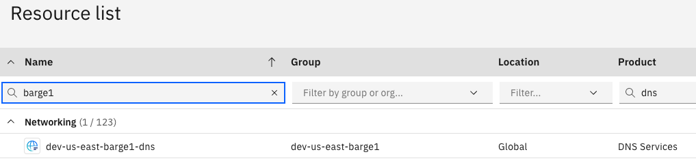
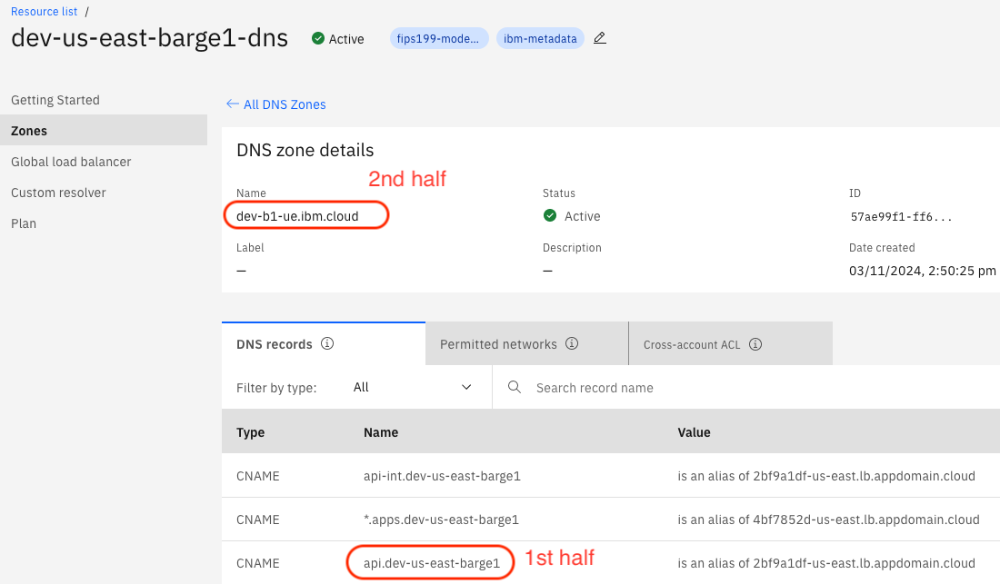
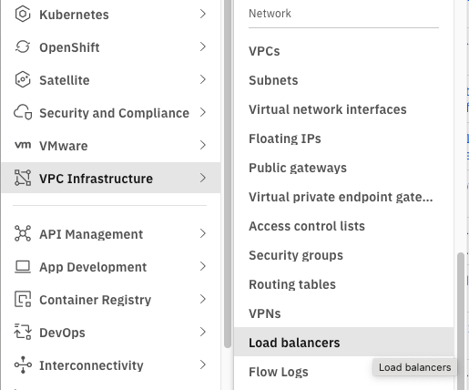
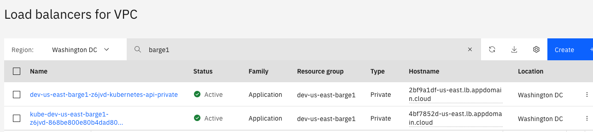
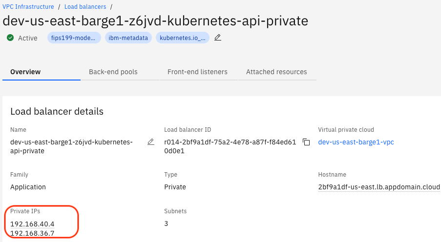
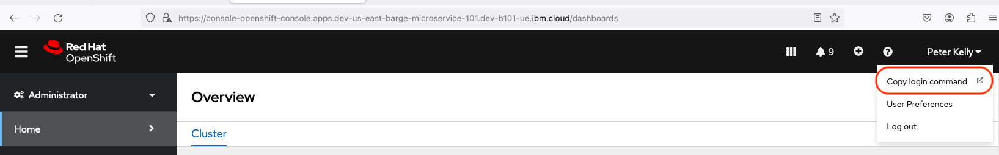

Ops
{: .label .label-green}

## Overview

Runbook pertains details of actions to deploy ROKS Production Control plane on VPC, aka Barge in Multi Zone Region (MZR) roll-out. The runbook is referencing Openshift [Installing a cluster on IBM Cloud VPC with customizations](https://docs.openshift.com/container-platform/4.12/installing/installing_ibm_cloud_public/installing-ibm-cloud-customizations.html)

## Detailed Information
Barge is an openshift carrier cluster on infrastructure using IPI on IBM Cloud VPC. Openshift Cluster Installation Program is provided by Openshift Cluster Manager site. 

## Detailed Procedure

### Planning
The pre-defined specification of VPC and Barge capacity are set as default. Example is seen at [barge-deploy-module](https://github.ibm.com/alchemy-containers/barge-deploy-module/blob/main/module/barge-network/main.tf)

Install-config is embedded to main.tf and this can be separated for customization. Example is seen at [barge-deploy-module](https://github.ibm.com/alchemy-containers/barge-deploy-module/blob/main/module/barge-network/main.tf#L165)

### Deployment Pipeline Automation

There are two parts to the creation of a new barge:

1. VPC which will hold the barge (must be updated **before** attempting the barge deployment):
   1. Create the new VPC if none exists
   1. **OR** Update the `nested_cidr_bases` of the existing VPC to create the required subnets
2. Barge deployment pipeline

The Deployment pipeline is fully automated and located in:
- [Containers-Jenkins stable-region-rollout](https://alchemy-containers-jenkins.swg-devops.com/view/Conductors/job/stable-region-rollout/)
  - [Containers-Jenkins stable-region-rollout/vpc-deploy-pipeline](https://alchemy-containers-jenkins.swg-devops.com/view/Conductors/job/stable-region-rollout/job/vpc-deploy-pipeline/)
  - [Containers-Jenkins stable-region-rollout/barge-deploy-pipeline](https://alchemy-containers-jenkins.swg-devops.com/view/Conductors/job/stable-region-rollout/job/barge-deploy-pipeline/)
- [Testing-Jenkins pipeline-testing](https://alchemy-testing-jenkins.swg-devops.com/job/Conductors/job/dev-barge-pipeline/job/pipeline-testing/)
  - [Testing-Jenkins pipeline-testing/vpc-deploy-pipeline](https://alchemy-testing-jenkins.swg-devops.com/job/Conductors/job/dev-barge-pipeline/job/pipeline-testing/job/vpc-deploy-pipeline/)
  - [Testing-Jenkins pipeline-testing/barge-deploy-pipeline](https://alchemy-testing-jenkins.swg-devops.com/job/Conductors/job/dev-barge-pipeline/job/pipeline-testing/job/barge-deploy-pipeline/)

#### Deployment Pipeline   Pre-requisite
1. A service ID for Barge deploy is created in the account where Barge is to be deployed. The service ID is provisioned as part of initial account set up.  Its API key is stored in jenkins Credential. 
1. COS bucket for tf state files of barge deploy pipeline is provisioned as part of initial account setup. 
1. VPC SSH Key to be used during IPI deployment is stored in Jenkins. the user of SSH Key is created as a 'coreuser' in barge. 
1. Secret Manager instance is provisioned as part of account set up . 
1. Pull Secret used by IPI is downloaded from [Openshift Cluster Manager site](https://sso.redhat.com/auth/realms/redhat-external/protocol/openid-connect/auth?client_id=cloud-services&redirect_uri=https%3A%2F%2Fconsole.redhat.com%2Fopenshift%2Finstall%2Fpull-secret&state=0c6912d7-2381-44e5-80a3-aa23890c891b&response_mode=fragment&response_type=code&scope=openid&nonce=ca6c9a21-9d45-4b05-b79d-bcaba83eebca) and stored in Jenkins Credential. This pull secret allows you to authenticate with the services that are provided by the included authorities, including Quay.io, which serves the container images for OpenShift Container Platform components.
1. A service ID for openshift console user onboarding to Barge is created in the account where Barge is to be deployed. The service ID is to fetch users in IAM group who were onboarded to the IAM group by Access-Sync.

#### Deployment Pipeline Stage - Automation

Information to be gathered before starting:

```
Cloud instance (cloud.ibm.com or test.cloud.ibm.com)
Cloud account
Region
Env level (dev/prestage/stage/prod)
VPC type (hub or spoke or satellite)
VPC prefix (ENV_LEVEL-REGION-{hub|spoke|satellite}NN)
Barge name (ENV_LEVEL-REGION-carrier{BARGE_NUMBER})  # where BARGE_NUMBER is between 10 and 99
CIDR bases for the Barge (generated with help from `scripts/subnet.py`)
```

Details for the creation/update of the VPC are found in [README](https://github.ibm.com/alchemy-containers/vpc-deploy-module#readme)

Details for the Barge deployment pipeline are found in [README](https://github.ibm.com/alchemy-containers/barge-deploy-module/blob/main/README.md)

Instructions for creating VPC and Barge resources are in this wiki: <https://github.ibm.com/alchemy-conductors/barge-deploy/wiki/Barge-and-VPC-deployment>

### Access Barge via the Openshift console

#### Step 1. Download ovpn file
The connection to the barge is currently via openVPN. The VPN config files are stored in Secrets Manager as an `Arbitrary secret` with the following naming convention: `<env>-<region>-barge-<purpose>-<barge-number>-vpn-config-file`. 

1. Obtain ovpn file from CLI

    a. Pre-requisite:  
      - install secrets manager plugin: `ibmcloud plugin install sm`  
      - Access to the relevant Secret Manager instance  

      Cloud | Env | Account | Secret Manager Name | Secret Manager Endpoint
      -|-|-|-|-
      prod cloud | dev | argo-dev | dev_us-east_secretsmanager | https://eafd9ee5-e538-425e-86b9-ea7febc69e0f.us-east.secrets-manager.appdomain.cloud
      prod cloud | dev | alchemy support | viks-secretsmanager-dev-us-south | https://2b287924-ce1f-495c-8ffa-6c2447b1a164.eu-gb.secrets-manager.appdomain.cloud
      test cloud | dev | alch dev - test | dev_us-south_secretsmanager | https://0e0ca868-4d21-45f3-80c3-bec3bac33791.eu-gb.secrets-manager.test.appdomain.cloud
      test cloud | dev | roks.dev.controlplane | dev-us-south-secrets-manager-barge | https://87c58657-34f6-41c5-8c30-1ab9bdee92ea.eu-gb.secrets-manager.test.appdomain.cloud

    b. Run the following command with the Secret Manager EP to see which VPN config files are available to you  
      `ibmcloud secrets-manager secrets --service-url <Secret Manager EP> | grep vpn-config`

    c. Find the secret id for the config file you wish to download and run the following command to save it as a ovpn file:  
      `ibmcloud secrets-manager secret --service-url <Secret Manager EP> --id <secret-id> --output json | jq -r .payload > <barge-name>-vpn-config.ovpn`

    Table. Barge ovpn config files & secret ID

    Env | Account| Region | Secret Name | Secret ID
    -|-|-|-|-
    prestage | roks-prestage-controlplane  | prestage-us-south | pres-us-south-hub01-vpn-config | f1da1245-d112-f29a-c161-6b3c337a356b
    dev | roks-dev-controlplane  | dev-us-south | dev-dal10-carrier10-vpn-config-file | 7b5b2ff4-2a4d-d029-c766-572d8687ce81
    dev | argo-dev| us-east | dev-us-east-barge-microservice-100-vpn-config | 0ace0b0b-1d4c-1bb4-91a6-a4ada83c79cc
    dev | argo-dev| us-east | dev-us-east-barge-microservice-101-vpn-config | d5dadc34-f483-c2d4-4997-b491dd8af385
    dev | argo-dev| us-east | dev-us-east-barge-csutil-102-vpn-config | d284ef1c-3933-de04-b8ac-bb62e5daedf4
    dev | alchemy support| us-south | dev-us-south-hub02-vpn-config | ba1d1616-bdd1-54a8-8d3f-d24c39466bbf

    Example:  
    Secret Manager: `dev_us-east_secretsmanager`  
    Region: `us-east`  
    ovpn secret ID: `eafd9ee5-e538-425e-86b9-ea7febc69e0f`  
    Secret Manager EP: `https://eafd9ee5-e538-425e-86b9-ea7febc69e0f.us-east.secrets-manager.appdomain.cloud`  

    ```
    ibmcloud secrets-manager secrets --service-url https://eafd9ee5-e538-425e-86b9-ea7febc69e0f.us-east.secrets-manager.appdomain.cloud | grep vpn-config

    Expiration                 ID                                     Locks   Name                                                 Secret_Type         State    secret_group_id
                                  0ace0b0b-1d4c-1bb4-91a6-a4ada83c79cc   0       dev-us-east-barge-microservice-100-vpn-config        arbitrary           active   3a930832-62e8-910b-dbaa-1ea6a76540e7
                                  4a79a4d6-e139-98ab-63ca-c19f6ac3e4e1   0       dev-barge0-us-east-vpn-config-file                   arbitrary           active   3a930832-62e8-910b-dbaa-1ea6a76540e7
                                  d5dadc34-f483-c2d4-4997-b491dd8af385   0       dev-us-east-barge-microservice-101-vpn-config        arbitrary           active   3a930832-62e8-910b-dbaa-1ea6a76540e7


    # download

    ibmcloud secrets-manager  secret --service-url https://eafd9ee5-e538-425e-86b9-ea7febc69e0f.us-east.secrets-manager.appdomain.cloud --id 4a79a4d6-e139-98ab-63ca-c19f6ac3e4e1 --output json | jq -r .payload > dev-barge0-us-east-vpn-config.ovpn
    ```

2. Update ovpn file

    a.  Open ovpn file and add `dhcp-option DOMAIN ibm.cloud ` as shown in example

    ```
    remote-cert-tls server
    nobind
    dhcp-option DOMAIN ibm.cloud   <<<< New line to be add
    ```

#### Step 2. Configure openVPN application
1. Import the ovpn file to openVPN application such as `tunnelblick` or `openVPN Connect`. 

#### Step 3. Configure your local machine

**Prerequisites:**
- Permissions needed.  
The minimum permissions needed are 
  - `is.load-balancer.load-balancer.view` in IAM under Service: VPC Infrastructure Services, Platform Access: Viewer
  - `dns-svcs.zones.read` in IAM under Service: DNS Services, Service Access: Reader 
- The barge account location is in the table in `Step 4.` below.
- The API Url & Loadbalancer IPs need to be added your local(your laptop) hosts file.
1. **Constructing API URL**
 - Locate the DNS instance for the relevant barge using the Resource List  
  <br />
  <a href="images/barge_dns_search.png">
  </a>
  <br />
  <br />

 - DNS instance > Zones > Under the DNS Zones tab > Click the url ending in `ibm.cloud` to show details > Locate the api endpoint under DNS records  
  <a href="images/barge_dns.png">
  </a>
  <br />
  <br />

 - make the URL as follows API-CNAME.DNS-ZONE-NAME  

using the above as an example -> api.dev-us-east-barge1.dev-b1-ue.ibm.cloud

2. **Get Loadbalancer IPs**
 - Go to `Load balancers for VPC` located under VPC Infrastructure > Network > Loadbalancers  
  <a href="images/vpc_loadbalancer.png">
  </a>
  <br />
  <br />

 - Enter barge name in to the search. Click on the LB that ends in `-api-private` .  
    Note: you might have to change the region  
  <a href="images/lb_search.png">
  </a>
  <br />
  <br />

 - Copy the values under `Private IPs`  
  <a href="images/lp_private_ips.png">
  </a>
  <br />
  <br />

3. **Update /etc/hosts file**
    - Update /etc/hosts on your local workstation as a sudo. `sudo vi /etc/hosts`
    - Add an entry for both IPs using the same API URL. Follow the barge1 example below.
    - Loadbalancer IPs from active barges are in the table below.
    ```
    cat /etc/hosts

    # example for dev-us-east-barge1
    192.168.40.4 api.dev-us-east-barge1.dev-b1-ue.ibm.cloud
    192.168.36.7 api.dev-us-east-barge1.dev-b1-ue.ibm.cloud
    ```

#### Step 4. Connect to Barge Openshift Console 
1. Connect to the ovpn 
  - if other VPNs are connected, disconnect before initiating openVPN connection
  - NOTE, The connection authentication mode is client certificate. There is no 2FA prompt. 
  - Established Connectivity is visible from Cloud UI

2. Access the console endpoint from Web
    Env | Account| Region | Console URL
    -|-|-|-
      prestage | roks-prestage-controlplane  | prestage-us-south | https://console-openshift-console.apps.prestage-dal10-carrier10.pres-us-south-hub01.test.cloud 


### Access Barge via the CLI

1. Follow `Step 4. Connect to Barge Openshift Console` above to login to the cluster console.  
1. Once logged in to console, Go to your login user name which is located on top right of the page. There is oc login command with one time token.
<a href="images/oc_token.png">
</a>
<br />

1. Copy oc login command from console and open your terminal to proceed. 

   ```
   // example
   oc login --token=xyz --server=https://api.dev-us-east-barge-microservice-101.dev-b101-ue.ibm.cloud:6443
   ```
   P.S. if you encounter the following error, append `--insecure-skip-tls-verify`  flag at the end of oc login command and run it.
   ```
   error: tls: failed to verify certificate: x509: certificate signed by unknown authority
   ```

#### Barge Worker Node - Scale Up/Down steps

  - Login to cluster using oc command
  - List all machinesets with `oc get machinesets -n openshift-machine-api`
  - Scale machineset with `oc scale --replicas=<desired worker count> machineset <machineset> -n openshift-machine-api`

P.S. Since we have machineset per AZ make sure to scale all 3 machinesets equally.

#### Break The Glass Scenario

  - The BG scenario is only to be used by SREs
  - This option is to set ADMIN KUBECONFIG on local machine.
  - Kubeconfig files are stored in Secrets Manager as an `Arbitrary secret` with the following naming convention: `<env>-<region>-barge-<purpose>-<barge-number>-kubeconfig`

1. Obtain kubeconfig from Secrets Manager

    a. Run the following command with the Secret Manager EP to see which kubeconfig files are available to you  
      `ibmcloud secrets-manager secrets -service-url <Secret Manager EP> | grep kubeconfig`

    b. Find the secret id for the kubeconfig file you wish to download and run the following command to save it as a ovpn file:  
      `ibmcloud secrets-manager secret -service-url <Secret Manager EP> --id <secret-id> --output json | jq -r .payload > <barge-name>-kubeconfig`  
      Use following table to get secret id of barges

      Env | Account | Region | Secret Name | Secret ID
      -- | -- | -- | -- | --
      prestage | roks-prestage-controlplane  | prestage-us-south | prestage-dal10-carrier10-kubeconfig | f4e08b4b-5ce1-bf54-45c1-60f312839ddd
      dev | roks-dev-controlplane  | dev-us-south | dev-dal10-carrier10-kubeconfig | 6270a8d2-e83a-29b5-6060-814df404addc
      dev | argo-dev | us-east | dev-us-east-barge-microservice-100-kubeconfig | 10f329b8-a8eb-b444-5aab-5f24315312ac
      dev | argo-dev | us-east | dev-us-east-barge-microservice-101-kubeconfig | bba9a66d-1e71-b5ea-6623-9a931bc8494d
      dev | argo-dev | us-east | dev-us-east-barge-csutil-102-kubeconfig | 9b9375b2-1f5a-8303-594d-5b68a73943ef
      dev | alchemy support| us-south | dev-dal10-carrier11-kubeconfig | d14ab269-8043-20f0-eb79-47512f576932

      Here is a details of Secrets Manager in argo-dev account  
      Secret Manager: `dev_us-east_secretsmanager`  
      Region: `us-east`  
      ovpn secret ID: `eafd9ee5-e538-425e-86b9-ea7febc69e0f`  
      Secret Manager EP: `https://eafd9ee5-e538-425e-86b9-ea7febc69e0f.us-east.secrets-manager.appdomain.cloud`  

2. Use kubeconfig to access barge

   Usage 1. export environment variable to start using oc
   ```
   export KUBECONFIG=/Users/jpark/Downloads/dev-barge0-kubeconfig
   oc get pod -n <namespace>
   ```

   Usage2. Use --kubeconfig flag
   ```
   example
   oc get node --kubeconfig /Users/jpark/Downloads/dev-barge0-kubeconfig
   ```

### Post barge deployment manual steps

The following steps are required to be executed manually. Each task is linked with an issue where details
of manual steps are documented. Any updates and changes in the steps would be updated in each github issue.

_Valid as of 1st Oct 24_

- [CCM liveness prob failure](https://github.ibm.com/alchemy-conductors/barge-deploy/issues/577)
- [Update CBR](https://github.ibm.com/alchemy-conductors/barge-deploy/issues/475)
- [Create missing priorityclass](https://github.ibm.com/alchemy-conductors/barge-deploy/issues/139)
