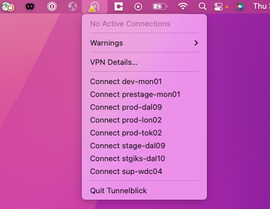
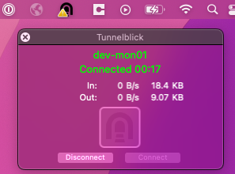
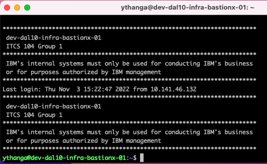

Informational
{: .label }

# Break the glass scenarios for platform bastion installation in FS Cloud

## Overview

This Document is used when GP VPN is not available, bastion host is not accessible, IAM ID login failure due to IAM verification down , login failure due to OSS plugin issue.

The breakout Glass scenario would leverage Chlorine interactive mode, SL VPN and openVPN

## Detailed Information

### Scenario 1 - Chlorine Interactive

If GP VPN is not working:

#### Slackbot

    1. Go to **Slack**
    2. Add _Chlorine bot (Igorina) (SRE)_ by searching for Chlorine in the search bar if not already done
    3. Use _interactive_ mode to issue commands to run on an instance  
        **Example:** `interactive prod-ams03-carrier1-master-01 outage:0m`
    4. This opens interactive session with the machine for *30 mins*. Some example commands are:

        ```bash
        kubectl <cmd> <args> [ | grep <string> ]
        kubx-kubectl <clusterid> <cmd> <args>
        armada-get-cordoned-nodes  [| grep <string>]
        ```

    5. Type `help interactive` to get list of all commands that can be use in interactive mode.
    6. Type `help` to get list of all commands/modes supported by the bot

Information on accessing EU nodes from slackbot can be found in this [runbook](https://pages.github.ibm.com/alchemy-conductors/documentation-pages/docs/runbooks/conductors_eu_cloud.html)

### Scenario 2 - SL VPN Access

To access VSI and BM with Softlayer VPN, please follow [runbook](https://pages.github.ibm.com/alchemy-conductors/documentation-pages/docs/runbooks/kvm_access.html)

### Scenario 3 - Log into Bastion with a temp token

If the ticketing validation plugin fails to validate the ticket (i.e. in case the ServiceNow system is down, the OSS API layer is not responding, etc.), the operator is presented with a temporary token, which can be used to trigger a break-glass scenario:

For example an operator tries to login with the following command and details:

```bash
tsh login --user=Jane.Smith@ibm.com \
 --proxy teleport43-apprfl-809757-4a630fc27c9bf891cc7a1b739bb53e01-0001.us-south.containers.appdomain.cloud:443 \
 --request-reason=CHGXXXXXX1
```

output:

```bash
tsh login --user=Jane.Smith@ibm.com \
 --proxy teleport43-apprfl-809757-4a630fc27c9bf891cc7a1b739bb53e01-0001.us-south.containers.appdomain.cloud:443 \
 --request-reason=CXXXXXXXX1
If browser window does not open automatically, open it by clicking on the link:
 http://127.0.0.1:63121/873061d9-ca6f-4b27-a389-d8438bc5586e

Seeking request approval... (id: 1fb65d37-0295-4024-b98b-27dabf5cb711)
error: request 1fb65d37-0295-4024-b98b-27dabf5cb711 has been set to DENIED,
reason="Connectivity error with OSS API Server.
For urgent access to the system use the break glass token (valid for 90 seconds): 1fb65d37-XXXX-XXXX-XXXX-2XXXXXXXXXX1"
```

Since there is no communication with the OSS API Server, a "break glass" token is issued for the user with a limited validity period. The user can use this "token" as the ticket number to attempt a login.

After that the "break glass" token is generated, it can be used to perform a "break glass" login:

```
tsh login --user=Jane.Smith@ibm.com \
 --proxy teleport43-apprfl-809757-4a630fc27c9bf891cc7a1b739bb53e01-0001.us-south.containers.appdomain.cloud:443 \
 --request-reason=1fb65d37-XXXX-XXXX-XXXX-2XXXXXXXXXX1
```

- the operator can trigger the Teleport login again, specifying the temporary token instead of the ticket number, bypassing the ticketing validation step
- the temporary token can be used just once
- the temporary token cannot be used after it expired
- the break-glass scenario triggers special alerting to the SOC team

For a complete list of use cases please see the section: [Ticket id validation Plugin - use cases](https://test.cloud.ibm.com/docs/bastionx?topic=bastionx-auth-bastion-overview#ticket-id-validation-plugin-use-cases)

### Scenario 4 - OpenVPN access
This scenario is where production env access is required from OpenVPN. Change Request (CHG) needs to be created and approved
1. Prod CHG
    1. [ServiceNow](https://watson.service-now.com/)
    1. Navigate to **Change** > **Create New**
    1. select **Normal, Emergency, or Standard** changes
    1. Get approval of CHG from # cfs-prod-trains

2. Prod Ops CHG
    ```
    PROD TRAINS OPS Template:
    Squad: operations
    Title: Promote <microservice>:<build> to prod
    Environment: <Region list stage-us-south etc>
    Details: |
    Update microservice <insert microservice name here>
    <description of change >
    Risk: <high, med or low>
    PlannedStartTime: <YYYY-MM-DD HH:MM -ZZZZ or 2018-04-23 10:30 -0500>
    PlannedEndTime: <2018-04-23 10:30 CST or 2018-04-23 10:30 GMT or now + 30m >
    Ops: true
    BackoutPlan: <description of what the plan is if the deploy goes badly>
    ```
3. Use Tunnelblick to connect to the respective environment. Refer this [link](https://github.ibm.com/alchemy-conductors/team/wiki/Connect-to-nodes-and-tugboat-from-a-mac-using-tunnelblick-and-DUO) for Tunnelblick and DUO install, setup.

4. Select the environment which you want to connect
   <br />
   <a href="../images/conductors/tunnelblick.png"></a>
5. Enter SOS ID username and password, 

6. Look for prompt in DUO app in your mobile and choose Approve

7. A successful connection will look like as below,
   <br />
   <a href="../images/conductors/tunnelblick_success.png"></a>

8. Open a terminal and enter the appropriate login creds as below,
   ```
   $ ssh 10.221.95.117 # if localusername is same as SOS ID:
   $ ssh <SOS_ID>@10.221.95.117 # if NOT,
   ```
   <br />
   <a href="../images/conductors/tunnelblick-conn-server.png"></a>

## Reference

### Open a support ticket

Engage the Bastion team for support by opening a ServiceNow ticket

1. Open the ServiceNow webpage: [ServiceNow Queue](https://watson.service-now.com/ess_portal?id=sc_cat_item&sys_id=b0c4fefcdbe75b0072583c00ad96199e&sysparm_category=3375fa30db2b5b0072583c00ad9619e3%23)
2. Fill in the following details  
   *Assignment Group:* `Infrastructure Security and Protection`  
   *Severity:* `Sev - 1`  
   *C_Code:* `BMX`  
   *Short Description:* `The title of your problem e.g. IAM is down, not able to authenticate to bastion`  
   *Description:* `Please provide your account number, a briefly description of your environment and of your problem`  
   *Add to watchlist:* `The people you want to have into the loop (they will receive an email notification)`
3. Click on **Submit**
   
### Rescue mode for bastion VSI

**Warning:** _Use rescue mode only for bastion VSIs to fix any teleport issues. Don't use this as a general workaround._

   1. In IBM Cloud UI pick Actions -> Rescue mode, This will power down the system and power it up off a network boot with the default network config and the root password from the portal
   2. Once Server has booted into rescue mode ssh in using *root* and the Password in portal
   3. Find the correct disk using `fdisk -l` in this example we will use /dev/xvda2
   4. Mount the disk `mount /dev/xvda2 /mnt`
   5. Go to teleport folder to investigate and fix the issue
   6. Exit from terminal after issue has been fixed
   7. **Hard reboot** from the IBM Cloud UI   

### LogDNA instances

The following URLs can be used to access logs related to bastion hosts:

  1. EU Platform LogDNA use this [URL](https://app.eu-de.logging.cloud.ibm.com/ddfc9c8033/logs/view?q=bastionx)
  2. non-EU Platform LogDNA [URL](https://app.us-south.logging.cloud.ibm.com/442ca9392b/logs/view?q=bastionx)
