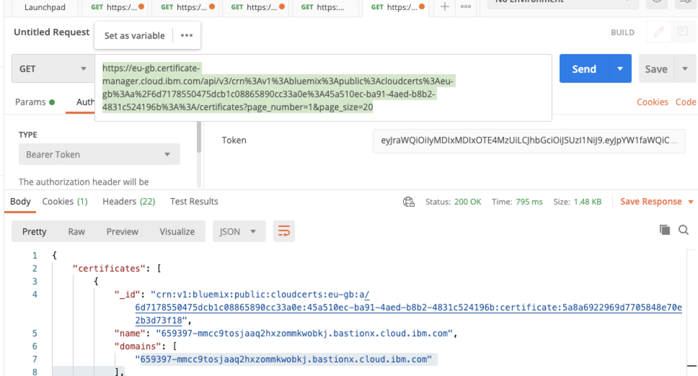
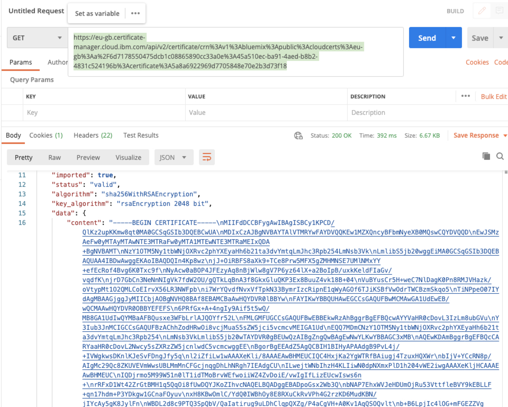

Informational
{: .label }

# How To Renew TLS Cert on Platform Bastion

## Overview

This document describes the procedure to renew a TLS certificate for plastform bastion proxy.

The following link is used as the primary source for these instructions: [Bastion Teleport Scenario](https://test.cloud.ibm.com/docs/bastionx?topic=bastionx-renew-and-replace-let-s-encrypt-certificate)

## Pre-requisites
1. Obtain Vault Role ID and Vault Secret ID from Thycotic
1. Install Vault on your local workstation.
On MacOS, teleport can be installed using `brew`:
```
$ brew install vault
```

### Detailed Information

#### 1. Create a token from Vault
Retun data is specfied as "key=value" pairs. we are looking for key: `token`

```
export VAULT_ROLE_ID=xxxxxxx
export VAULT_SECRET_ID=xxxx
export VAULT_ADDR="https://vserv-eu.sos.ibm.com:8200"

vault write auth/approle/login role_id=$VAULT_ROLE_ID secret_id=$VAULT_SECRET_ID

example output
---                         -----
token                       s.6LtJk5NhC2EPCTGbchaNQBXi
token_accessor              rp76FhjVEnCkkFfSbZ4a0i8w
token_duration              6h
token_renewable             true
token_policies              ["crn/v1/bluemix/public/bastionx/global:r:containers-kubernetes" "default"]
identity_policies           []
policies                    ["crn/v1/bluemix/public/bastionx/global:r:containers-kubernetes" "default"]
token_meta_accountnumber    1445183
token_meta_person           jpark@ie.ibm.com
token_meta_role_name        crn_v1_bluemix_public_bastionx_global_containers-kubernetes
```

#### 2. Login Vault
The *login* command authenticates user to Vault using the provided arguments.
```
$ vault login
Token (will be hidden): <enter token value from step1> <enter>

Success! You are now authenticated. The token information displayed below
is already stored in the token helper. You do NOT need to run "vault login"
again. Future Vault requests will automatically use this token.

Key                         Value
---                         -----
token                       s.4b6mYm2YwMen8557HwFJmfPg
token_accessor              rzjsRGi2fClbrdEH0ZxX94G6
token_duration              5h56m51s
token_renewable             true
token_policies              ["crn/v1/bluemix/public/bastionx/global:r:containers-kubernetes" "default"]
identity_policies           []
policies                    ["crn/v1/bluemix/public/bastionx/global:r:containers-kubernetes" "default"]
token_meta_accountnumber    1445183
token_meta_person           jpark@ie.ibm.com
token_meta_role_name        crn_v1_bluemix_public_bastionx_global_containers-kubernetes
```
<br />

#### 3. Read Vault
The *read* command reads data from Vault at the given path. This can be used to read secrets, generate dynamic credentials, get configuration details, and more.
We are going to access a bastion region specific folder. Change parameter of the command per `Bastion Host Region`. We are looking for key: `cert_manager_key`
```
<example for dev Bastion Host >
vault read /generic/crn/v1/bluemix/public/bastionx/global/containers-kubernetes/659397-mmcc9tosjaaq2hxzommkwobkj

Key                       Value
---                       -----
refresh_interval          768h
cert_manager_key          xxxxxxxxxxxxxxxxxxxxxxxxxxxxxxxxxxx
cloud_function_apikey     cf03f754-577f-4bea-a058-18ff63014108
cos_key                   xKeToGp2kh9zPoxw4saYuWjfwh5X35sPGeSwl1PABXkd
dbpass                    ea2ac887325d44c84bd92719693ac758d7f8ce21
dbuser                    apikey-20d6f880117847749962ef00871eb1e2
hmac_access_key_id        fe25d90126ae4d00a1621c78ab0b764e
hmac_secret_access_key    6ac728d9d8eb48d238a9ff4ebb45293b79ea218e17be3746
ingestion_key             ca1620a7400b51576d70554a8f9c38af
```
<br />

#### 4. Generate a bearer token
We need to obtain Value of key: `cert_manager_key ` from Step 3

```
export apikey=<cert_manager_key>

curl -k -X POST \
    --header "Content-Type: application/x-www-form-urlencoded" \
    --header "Accept: application/json" \
    --data-urlencode "grant_type=urn:ibm:params:oauth:grant-type:apikey" \
    --data-urlencode "apikey=$apikey" \
    "https://iam.cloud.ibm.com/identity/token"

```
<br />

#### 5. Obtain a TLS cert ID and cert content
We are going to use Postman on Desktop for this step
```
a. Select GET
b. Authentication > Token  <add a bearer token from step 4>
c. Create a url encoded the crn ID, this can be done using a common tool found in web `crn_id=crn:v1:bluemix:public:cloudcerts:eu-gb:a/6d7178550475dcb1c08865890cc33a0e:45a510ec-ba91-4aed-b8b2-4831c524196b::`
d. Send https://eu-gb.certificate-manager.cloud.ibm.com/api/v2/<url_encoded_crn_ID>/certificates?page_number=1&page_size=20
e.  Take a note of cert ID returned from step iiii. this ID needs to be url encoded
f. Send https://eu-gb.certificate-manager.cloud.ibm.com/api/v2/certificate/<url_encoded_cert_ID>
```
Cert ID
<a href="../images/postman_cert_id.png">
</a>

Cert Content
<a href="../images/postman_cert_content.png">
</a>
<br />

#### 6. Create pem and key
Raw json format needs to be reformatted and put into `teleport_cert.pem` and `teleport_key.key`
One trick to remove line breakers is using FIND and Replace ALL with regex `.*`
```
FIND \\n
Replace All: \n
```
<br />

#### 7. Import TLS cert to Cloud account
Import the content of pem and cert to update each Front End Cloud Load Balancer
```
a. Log in as an admin or user with admin priv
b. Classic > Security > SSL > Import
c. Classic > Network > Load Balancing > searh with Bastion Host Domain
d. We are only updating Front End (FE) Load balancer 0, 1, 2
e. Go to FE load balancer > Protocols > HTTPs > Edit
f. After each FE load balancer is updated with new cert, go back to SSL list > Delete old cert
```
<br />

#### 8. Update Cert on each Bastion Host
TLS cert needs to be updated on each Bastion Host machines.
Copy over teleport_cert.pem and teleport_key.key to `/teleport` on each bastion host machines
Make sure ownership of cert is `root`
```
$ls -al /teleport
-rw-r--r-- 1 root root 3538 Mar 25 16:04 /teleport/teleport_cert.pem
-rw-r--r-- 1 root root 3538 Mar 25 16:00 /teleport/teleport_cert.pem_BACKUP_2021-03-25
-rw-r--r-- 1 root root 1704 Mar 25 16:04 /teleport/teleport_key.key
-rw-r--r-- 1 root root 1704 Mar 25 16:00 /teleport/teleport_key.key_BACKUP_2021-03-25
```
#### 9. Verification
With GP VPN connected, 
```
echo | openssl s_client -connect <bastion-proxy>:443 2>/dev/null | openssl x509 -noout -enddate

example:
$ echo | openssl s_client -connect 659397-mmcc9tosjaaq2hxzommkwobkj.bastionx.cloud.ibm.com:443 2>/dev/null | openssl x509 -noout -enddate
$ notAfter=May 11 05:17:14 2021 GMT
```
