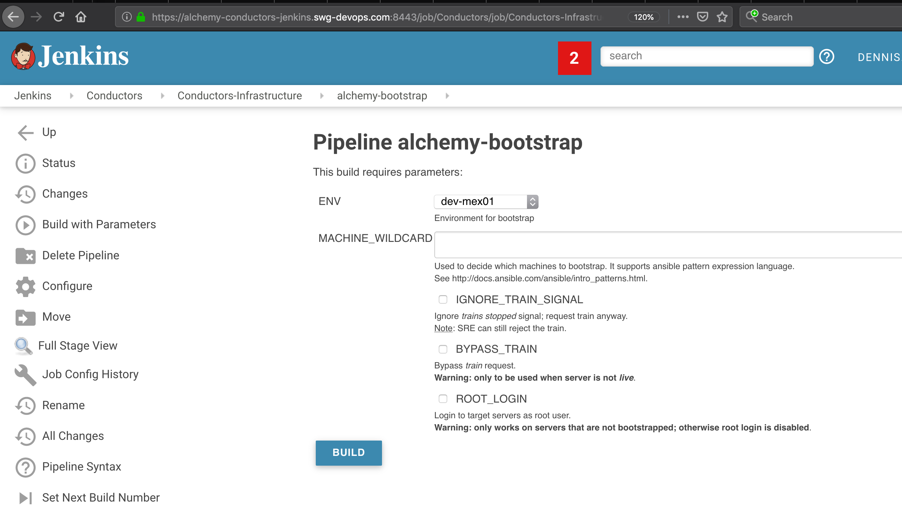
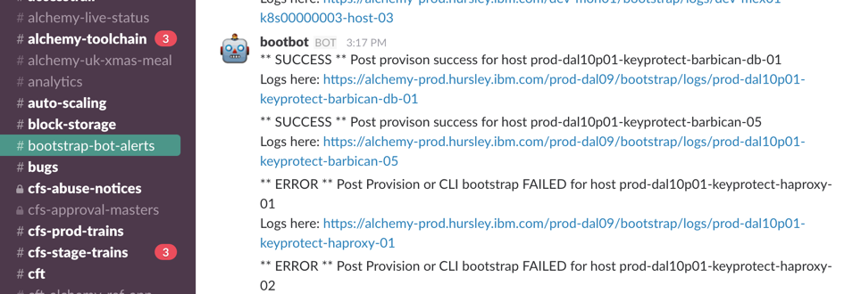

Informational
{: .label }

## Overview

This runbook describes covers the following areas.

1. What environments are covered by what `bootstrap-one` servers

1. How to kick off a bootstrap.

1. How to debug, monitor and correct failures during bootstrap execution.

1. Common error examples and how to correct them

This bootstrap process is to harden and configure the Alchemy dev, stage and production machines, and should not be confused with the bootstrap process that runs inside of the Armada development process when Armada patrols or cruisers are created.

## Detailed Information

### Environments which are covered by the bootstrap deployments

There are only a few bootstrap deployments.

As a result, we have this idea of an extended environment in our bootstrap process.
That means one environment uses the bootstrap and infrastructure resources of the main environment.

The netint teams therefore open some networking capability between these subnets so the bootstrap pods can talk to the other environments.

Below is a list of main environments, and the extended environments they are the bootstrap deploy for.

FYI:  This bootstrap process covers the machines in the following SL accounts

- Stage and Production (531277)
- development and prestage (659397)

Dev/Prestage:           https://bootstrap-one.bots.us-east.containers.mybluemix.net/firstboot
Stage:                  https://bootstrap-one.stage-us-east-conductor.us-east.containers.appdomain.cloud/firstboot
UK-South/EU-Central:    https://bootstrap-one.prod-eu-central-conducto.eu-de.containers.appdomain.cloud/firstboot
US-South/US-East:       https://bootstrap-one.prod-us-east-conductor-t.us-east.containers.appdomain.cloud/firstboot
AP-North/AP-South:      https://bootstrap-one.prod-ap-north-conductor.jp-tok.containers.appdomain.cloud/firstboot

## Submitting bootstraps

There are several ways by which a bootstrap can be started.

1. From jenkins - explained below.

1. From the command line of a machine, refer to [readme](https://github.ibm.com/alchemy-conductors/bootstrap-one/blob/master/README.md#command-line).

1. After an osreload or build of a new machine, refer to [readme](https://github.ibm.com/alchemy-conductors/bootstrap-one/blob/master/README.md#os-reload).

### Bootstrap via jenkins

Use jenkins job [alchemy-bootstrap](https://alchemy-conductors-jenkins.swg-devops.com/job/Conductors/job/Conductors-Infrastructure/job/alchemy-bootstrap/)

Click on `Build with parameters` and fill in the required information.

<a href="images/bootstrap/jenkins_bootstrap.png">
</a>  

## Debugging bootstrap execution

This section provides information on how to debug bootstrap execution.

### Via jenkins

Only bootstrap runs executed via jenkins will be logged in jenkins.

To review the execution success of the jenkins job, review the runs under  [alchemy-bootstrap](https://alchemy-conductors-jenkins.swg-devops.com/job/Conductors/job/Conductors-Infrastructure/job/alchemy-bootstrap/)

Find the job which you are interested in and review the console output.

Typical issues are:

1.  A run failed because the remote machines are unreachable.

1.  A run failed because of an error during the execution of a role.

### For osreload and bootstrapping via the command line

The postprovision process calls into a REST webservice.  

The first place to check if a bootstrap has completed is the #bootstrap-bot-alerts channel.

The webservice posts to this channel upon completion of a bootstrap. There will be an entry similar to this

<a href="images/bootstrap/bootstrap_bot_alerts_channel.png">
</a>  

If failures have occurred, use the link to download the logs to review the failure and correct.

### Debugging - A post has not appeared in the bootstrap-bot-alerts channel for the machine.

If a bootstrap has been called via the webservice, and there is not an entry in the bootstrap-bot-alerts channel, then a failure may well have occurred else where.

Check the following and action accordingly:

1.  Confirm that the osreload or machine build has completed in softlayer.  The server will have a timer/clock icon next to it if a transaction in Softlayer is still in progress.  The bootsrap will not start until the machine transactions have completed so be patient and wait a little longer.

1.  Is there an alert for the bootstrap service being down in PD for this environment?  If yes, then work with the conductors on PagerDuty to bring the bootstrap service back online. You will have to re-submit the bootstrap via jenkins or from the cmd line once the service is back.

#### Accessing post provision logs

Use the link in the #bootstrap-bot-alerts channel.

Logs access described [here](https://github.ibm.com/alchemy-conductors/bootstrap-one/blob/master/README.md#logs)

## Common errors and how to investigate and resolve.

List of errors that have previously been seen and how to correct them.

### Example 1:  

```
TASK [usam-config : Install tools on Ubuntu] ***********************************
Tuesday 10 January 2017  09:01:52 +0000 (0:00:00.297)       0:01:18.386 *******
An exception occurred during task execution. To see the full traceback, use -vvv. The error was: ValueError: bad marshal data (unknown type code)
failed: [stage-dal09-ccs-grsgobs-01] (item=[u'sssd-tools', u'ldap-utils', u'sssd', u'libnss-sss', u'libpam-sss', u'libpam-passwdqc']) => {"failed": true, "item": ["sssd-tools", "ldap-utils", "sssd", "libnss-sss", "libpam-sss", "libpam-passwdqc"], "module_stderr": "Traceback (most recent call last):\n  
File \"/tmp/ansible_eLEdnn/ansible_module_apt.py\", line 840, in <module>\n    
from ansible.module_utils.urls import *\n  File \"/tmp/ansible_eLEdnn/ansible_modlib.zip/ansible/module_utils/urls.py\", line 130, in <module>\n  
File \"/usr/lib/python2.7/dist-packages/requests/__init__.py\", line 60, in <module>\n    from .api import request, get, head, post, patch, put, delete, options\n  F
ile \"/usr/lib/python2.7/dist-packages/requests/api.py\", line 14, in <module>\n    
from . import sessions\nValueError: bad marshal data (unknown type code)\n",
"module_stdout": "", "msg": "MODULE FAILURE", "parsed": false}
```

The error above is this:
 `File \"/usr/lib/python2.7/dist-packages/requests/api.py\", line 14, in <module>\n    
 from . import sessions`

The error is with the import of sessions.pyc - it is corrupt.

The fix is to delete /usr/lib/python2.7/dist-packages/requests/sessions.pyc
***NB:  DO NOT delete the sessions.py file!***

Web example of the error/solution:  http://stackoverflow.com/questions/30861493/how-to-fix-python-valueerrorbad-marshal-data

### Example 2

Error in ansible execution:

  ```
  fatal: [prod-dal09p03-kraken2-host-19]: UNREACHABLE! => {"changed": false, "msg": "SSH Error: data could not be sent to the remote host. Make sure this host can be reached over ssh", "unreachable": true}

  msg: SSH Error: data could not be sent to the remote host. Make sure this host can be reached over ssh
  ```

Solution/Checks to make:

  This error usually means that the machine is down, or the userid being used to connect to the machine cannot connect.

  The following checks will help you determine what course of action to take.

  Check whether you can reach the machine?

  1. Can you ssh to this machine from your vagrant with SL or openvpn running?  If yes, there could be an issue with the userid we use to connect to the server (operations_<env>) - check the /etc/passwd file for the correct ID for the environment and switch to this user to further debug.  Possible issues are the ID is locked/expired, or the public ssh key is missing from the users .ssh/authorized_keys file.  

  2. From your vagrant machine, can you ssh or ping the machine?  If not, sounds like the server is down - use SL web interface to KVM to the machine. Runbook for this: [KVM Access](https://pages.github.ibm.com/alchemy-conductors/documentation-pages/docs/runbooks/kvm_access.html). If this is unsuccessful, reboot/power off/on to revive.

### Example 3

```
fatal: [dev-mon01-keyprotect-barbican-consul-01]: FAILED! => {"changed": false, "failed": true, "module_stderr": "Traceback (most recent call last):\n  File \"<stdin>\", line 123, in <module>\nNameError: name 'temp_path' is not defined\n", "module_stdout": "", "msg": "MODULE FAILURE", "parsed": false}
```

Read only filesystem on the server is the likely cause - follow this [runbook](./recover_read_only_fs.html) to recover.
