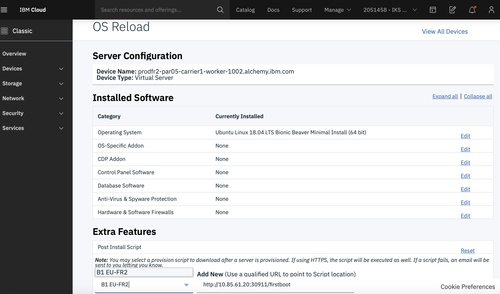

Informational
{: .label }

## Overview

This runbook describes all you need to know about the bootstrap process.  

## Detailed Information

The bootstrap service runs as a kubernetes deployment `bootstrap-one-server` and is controlled by the [razee deployment process](https://razeeflags.containers.cloud.ibm.com/alchemy-containers/flags/default/production/bootstrap-one-server)

A bootstrap can be invoked in the following ways:

- A post provision call from `Iaas` (Softlayer) at the end of a machine osreload / initial build.
- When logged into a machine, a bootstrap can be invoked from the command line, as outlined in the following [README](https://github.ibm.com/alchemy-conductors/bootstrap-one/blob/master/README.md#command-line)
- Bootstraps can also be executed via the following jenkins job, [bootstrap-with-latest-playbooks](https://alchemy-testing-jenkins.swg-devops.com/job/Conductors/job/bootstrap-with-latest-playbooks), as it pulls the latest version directly from the repo. Note: this is dangerous and should *not* be used for prod machines.

### Additional Information

See [bootstrapping using ansible](./bootstrap_executing_and_debugging.html) for more information about submitting bootstraps.

The tasks ran can be seen in the file [bootstrap.yaml](https://github.ibm.com/alchemy-conductors/bootstrap-one/blob/master/playbooks/bootstrap.yml).

### Architecture

In Spring 2019, the bootstrap process was redesigned.

The bootstrap code in split into two GHE Repositories:
- [bootstrap-one](https://github.ibm.com/alchemy-conductors/bootstrap-one)  
contains the bootstrap playbooks
- The [bootstrap-one-server](https://github.ibm.com/alchemy-conductors/bootstrap-one-server)  
contains the code to executes the playbooks in the `bootstrap-one` repo

### Bootstrap process dependencies

For the postprovision or command line bootstrap process to work, the following components need to be running:

#### The apt-repo:

Bootstrap [configures apt](https://github.ibm.com/alchemy-conductors/bootstrap-one/tree/master/playbooks/roles/apt-get) to use the [smith repos](https://github.ibm.com/alchemy-conductors/smith-agent)

### Source code:

Ansible scripts are used to perform the bootstrap process on a machine.
The ansible code is located in the [bootstrap-one](https://github.ibm.com/alchemy-conductors/bootstrap-one) repo.


### Bootstrap playbooks

We encourage you to read the attached [README](https://github.ibm.com/alchemy-conductors/bootstrap-one/blob/master/README.md) which is the most up to date source of information about how the code is structured and how to contribute.


## Troubleshooting

This section details some common bootstrapping issues encountered during the eu-fr2 rollout.

### Wrong bootstrap packages retrieved from bootstrap server

Follow the instructions below to confirm if affected server has correct bootstrap link in its metadata.

- Run the following curl query to see if the affected server contains a bootstrap link in the metadata:

    ```bash
    curl --retry 100 --retry-delay 10 --retry-max-time 1800 -s https://api.service.softlayer.com/rest/v3/SoftLayer_Resource_Metadata/UserMetadata.txt | jq
    ```

- If the output of above query does not contain a bootstrap link, then run the attached [bootstrap-submetadata jenkins job](https://alchemy-conductors-jenkins.swg-devops.com/job/Conductors/job/Conductors-Maintenance/job/bootstrap-submetadata/build?delay=0sec) to resolve the issue.

### Ansible fails during the [usam_ssh_keys : Make home directory] task

Ansible can fail while executing `Make home directory` task. There number of potential causes outlined below:

- An error may indicating that there were missing quotes, which results in an empty string being passed. Therefore nothing is retrieved from AD.
- Running bootstrap from the local script, `/opt/bootstrap-one/scripts/run.sh`.
- The `/opt/bootstrap-one/scripts/run.sh` script does not receive the credentials needed to access AD.


#### Solution

- Remove contents of `/opt` (except MegaRaid, if present) and remove `/etc/cron.d/reRunFirstboot`
- Run the following curl query to download the bootstrap scripts, then run these scripts on the affected server:

    ``` bash
    curl  <<bootstrap url>> | bash
    ```

    where bootstrap url has the following form:

    ``` yaml
    bstrap_url: "https://bootstrap-one.prod-eu-central-conducto.eu-de.containers.appdomain.cloud/firstboot"
    ```

### Unable to ssh to the server after running bootstrap manually

This is due to a bug within the following [ansible config file](https://github.ibm.com/alchemy-conductors/bootstrap-one/blob/master/playbooks/group_vars/prodfr2-par04.yml) where the `usam_ad_server_fqdn` variable is undefined.

#### Solution

- Perform an OS reload from SL (SoftLayer - IBM Cloud Web Console).
    1. Update `post-install` script with correct url.
    2. Ensure that Jenkins SSH keys are selected when reloading.

<a href="images/bootstrap/OS_reload_IBM_Cloud_Console.png">
</a>
