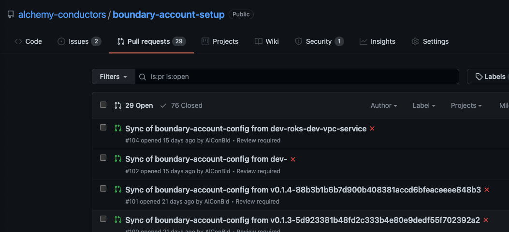

Informational
{: .label }


## Overview

The project `Boundary Account Setup Automation` is to provide IaC to set up a new account for replatform / FEDRAMP using terraform & terragrunt. 

## Detailed information

The automation is composed of multiple GHE projects to minimise complexity of IaC and improve ease of maintenance with managing IBM Cloud account configurations. It leverages powerful Terraform technology with Terragrunt to reduce the complexity for SRE to maintain. Even further consideration that `Terragrunt` is a new technology with minimum familiarity among the IKS SRE squads, the enhanced automation is implemented to convert a human readable configuration to a terragrunt template so SRE does not need to manually update a terragrunt scaffolding template. 

- [Boundary Account Config](https://github.ibm.com/alchemy-conductors/boundary-account-config) : Configuration data in JSON format stored by account / resource-type / resource level. 
- [Boundary Account Terragrunt Builder](https://github.ibm.com/alchemy-conductors/boundary-account-tg-builder) : Automation behind `boundary-account-config` to translate JSON files into terragrunt templates into https://github.ibm.com/alchemy-conductors/boundary-account-setup. 
- [Boundary Account Setup](https://github.ibm.com/alchemy-conductors/boundary-account-setup) : The repository holds terragrunt templates for each account separated by folder structure.
- [Boundary Account TF Custom](https://github.ibm.com/alchemy-conductors/boundary-account-tf-custom) : Any custom terraform modules to support IaC are stored in this GHE project. 

### Overall process of development and testing

If you need to create or update a resource in IBM Cloud accounts, only need to update an associated JSON file in https://github.ibm.com/alchemy-conductors/boundary-account-config. JSON file is populated with a file name of resource type, eg `access_groups.json` holds configurational data for access groups in the account. JSON file is validated using `jsonschema` populated from `boundary-account-tg-builder` (https://github.ibm.com/alchemy-conductors/boundary-account-tg-builder/tree/main/schemas)

If a new terraform / terragrunt module needs to be added, this can be tested manually first by populating a terragrunt template. Once new module works fine, this needs to be added into `boundary-account-tg-builder` as a template (eg: https://github.ibm.com/alchemy-conductors/boundary-account-tg-builder/blob/main/templates/access_group.tmpl) in order to apply into an existing account managed by the automation. 

###TBD: Update local testing instruction

### Process to update boundary-account-config 

There are existing resource types which have been validated and can be used as a reference. Further modification needs to be compplied with `jsonschema` to work with the terraform/terragrunt template the automation uses. JSON validation runs agains those json schemas and travisCI build result prints out traces if there is any issue with detailed information. 

### Process to populate boundary-account-setup

`boundary-account-setup` is inspired by the GoldenEye project - https://github.ibm.com/GoldenEye/scaffolding-terragrunt. Each account should be separated by a folder and each resource should be managed by a separate folder under the resource-type folder. The rationale behind this design is the remote state from Terragrunt execution (tf_state) can be stored in a separate object which allows SRE to manage it easily without impacting other resources. For example, in case an existing resource in IBM Cloud account needs to be removed, since the remote state file is separated as a single COS object, this file can be deleted along with the resource itself. 

More detailed about execution can be found https://github.ibm.com/GoldenEye/scaffolding-terragrunt#execution yet basically the terragrunt scaffolding template can be run as an account level after moving into the account folder and run the following command

```
../accounts/dev-sandbox> terragrunt run-all init
../accounts/dev-sandbox> terragrunt run-all plan
../accounts/dev-sandbox> terragrunt run-all apply 
```

### Process to update terragrunt template with `boundary-account-tg-builder`

`boundary-account-tg-builder` is using GoLang template based approach that a terragrunt template for a resource type is stored under `../template` folder. Using JSON file from `boundary-account-config` as the input, a terragrunt template is populated at the end of travisCI build (eg, https://v3.travis.ibm.com/github/alchemy-conductors/boundary-account-config/builds/2124672) 

If a new resource type or update in an existing terragrunt template is required, tg-builder project has to be updated accordingly. 


## Execution Process

### New account onboarding

If an IBM Cloud account needs to be managed by the account-setup automation, there are several steps to complete to onboard an account into the automation 

#### Create an APIKEY of a functional ID

- a FID with sufficient privileges to provision services and resources needs to be added into the account
- create an IBM Cloud APIKEY 
- store the APIKEY value into the secrets-manager instance `iks-access-management-secrets-manager` under Alchemy production. If no access, please reach out to IKS SRE to store the secret
- update `ikscreds.yaml.tmpl` (https://github.ibm.com/alchemy-conductors/boundary-account-setup-jenkins/blob/main/ikscreds.yaml.tmpl) using the following format. This is how the pipeline pulls the secret to access the account. 
```
iam-278445: #Alchemy Support   <- iam-[ACCOUNT_NUMBER]
    username: Alchemy.Access@uk.ibm.com <- FID email
    password: .sm.cloud.ibm.com_alchemy-support <- .sm.[secret_name]

```

### Versioning control

The automation strongly leverages the release tag in GHE project to make sure correct version is used during provisioning resources into IBM Cloud accounts. Since there are multiple projects linked into the automation, it is important to ensure only desired version should be executed into IBM Cloud accounts to avoid any potential impact. 

`boundary-account-config` - The GHE project is enabled with travisCI build pipeline that a commit triggers a build to populate terragrunt templates into `boundary-account-setup` under condition that if it has `dev-` or a release tag `v*`. Once a PR is successfully submitted, you can see the PR in https://github.ibm.com/alchemy-conductors/boundary-account-setup/pulls as the screenshot below. The PR should have the naming convention `[TAG]-[COMMIT_HASH]`. This PR branch should be for your final testing before it merges into the main branch.  




More details can be found from https://github.ibm.com/alchemy-conductors/boundary-account-setup/blob/main/PIPELINE.md#build--deploy-pipeline-overview

### Execution via Jenkins

The Jenkins project (https://alchemy-conductors-jenkins.swg-devops.com/job/Conductors/job/vpc-replatform/job/vpc-replatform-account-setup/) is implemented to run `terragrunt run-all` in more controlled way. The following parameters are required to run the job with correct account. 

```
BOUNDARY_CLOUD_ENV: environment where an account belongs
BOUNDARY_CLOUD_ACCOUNT: Name of IBM Cloud account 

BRANCH: branch of https://github.ibm.com/alchemy-conductors/boundary-account-setup-jenkins where jenkins pipeline and script is stored
TG_TEMPLATE_BRANCH: branch of boundary-account-setup where a target terragrunt template is located

TERRAGRUNT_ENVIRONMENT_NAME: this value is to set an uniqy environment name for the account to be used by bootstrap. The value needs to be kept consistent that cannot be changed once it's set
TF_IBM_REGION: location of COS bucket for remote state
COS_INSTASNCE_NAME: name of COS instance for remote state
COS_INSTANCE_RESOURCE_GROUP: name of resource group that COS instance for remote state belongs to. 
```

A jenkins job goes through `terragrunt init, plan and apply` actions. Any failure in the previous action stops a job from proceeding to avoid any impact. 

As a default, `dry_run` flag is set to `true` so it will only execute up to `init` & `plan`.

>Terraform & Terragrunt execution includes decent coverage of testing and validation so any potential damage due to mis-configuration can be detected prior to apply. However, it is known limitation that possibility to change or delete an existing resource(s) can occur if configuration mistake introduced. So it is important for every change of terragrunt template should complete test run througout proper CICD pipleine (dev/prestage/stage)


## Escalation Policy

There is no formal escalation policy.

This is an SRE owned tool so should be raised and discussed in either

- `#conductors-for-life` if you are not a member of the SRE Squad. (mention `@conductors-aus`)
- Raise GHE issues in https://github.ibm.com/alchemy-conductors/team/issues
