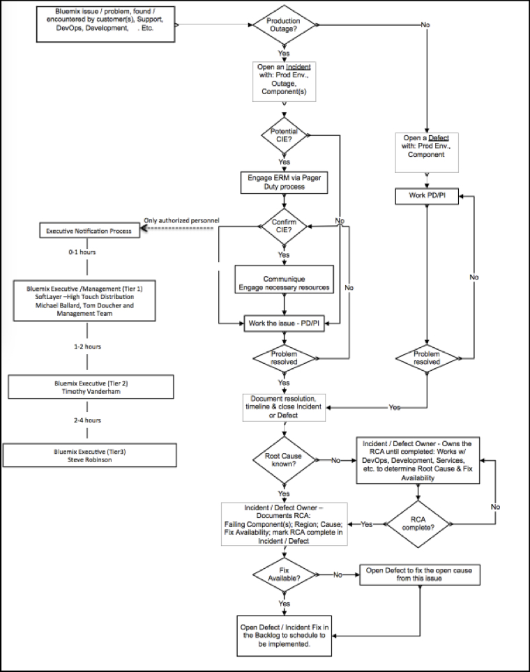

Informational
{: .label }

# What is a production incident ? {#incidentdefinition}

## Overview

A production incident is any event or set of events that could disrupt or diminish the service that *could impact the customer*. They can be detected in production through customer support tickets, developers and operators who discover issues and automated alarming.

To create a quick CIE as a result of a PagerDuty alert in a production environment, go to the [`Creating an incident`](./sre_raising_cie.html) runbook.

To understand more about the pCIE process and how it affects our customers, please continue reading.

---

## Detailed Information

### Production Incidents suck, they are expensive for everyone:

* Cloud customers are paying for the availability of the service and when an incident occurs they lose out on what they pay us for
* They can involve a lot of people at IBM (Support, Sales, Conductors, Operations, Development) and that drives cost
* They are *really* expensive for service owners. You get paged and you have to stop whatever you were doing (building the next great service, eating dinner, sleeping!) to help restore the service

### Production Incidents are also awesome:

* They allow customers to get help from the people who are best able to help them - us!
* They give us great and valuable information about the actual ways our software fails in production. They are the most exciting test cases.
* They give us a feedback we can use to improve our practices in how we design, development, test and operate.

### Closed loop mechanisms are also awesome:

* They use real feedback and easy to understand metrics
* They are simple to follow
* They lead to sustained and continuous improvement towards a goal (they spin a flywheel!)

### Our closed loop mechanism for production incident resolution has the following goals (and metrics):

* Quickly restore the availability of the service (MTTR- Mean[^meansuckage] Time to Restore)
* Reduce the number of production incidents that occur (MTBI- Mean[^meansuckage] Time Between Incidents)
* Give us our time back to focus on delivering more awesome capabilities in our services (Pager escalations per day)

A brief note on 'means as metrics': They suck - they hide problems. It is better to focus on TBI(p90) and TTR(p90) - 'the worst 10% of incidents' for Time To Restore, and Time Between Incidents. *BUT* Means are readily available and easy to talk about, so we can start with a mean until we can produce discrete distributions.

## Some terminology

PagerDuty incident
: An incident created in PagerDuty (normally from an alert sent by a monitoring component such as sensu or prometheus)

ServiceNow incident
: A work item of type Incident in ServiceNow tool. *All* production incidents which may cause a critical impact event need a ServiceNow incident created.

Critical Impact Event:
: An event that affects multiple users of the service.

Notification:
: A public message, different types include ‘emergency notifications’ and ‘planned maintenance’.

GHE issue:
: Github enterprise tooling where armada source code and issues are managed.

## Who's who

Service Reliability Engineer
: Internally in the containers tribe, known as conductor

EU Service Reliability Engineer
: Internally in the containers tribe, known as conductor but is able to access EU based servers

ERM / AVM
: Emergency Response Manager

Development Squad
: The squad who owns an Alchemy services

Bluemix 2nd responder
: Publishes notifications (among other jobs)

## NEW! EU changes as of December 2017

For the IBM Cloud Containers Service, Vulnerability Advisor and Registry offerings, we follow a different set of investigation and access rules if the incident/alert is firing from the EU(`eu-de`/`eu-es`) region.

As of 15th December 2017, only EU citizens are allowed logon access to the servers in the EU(`eu-de`/`eu-es`) region as they have access to customer sensitive information and secrets to access their cruisers where client owned data will be present.

The guidelines and steps to follow which are detailed in this document are true for both EU and Non-EU incidents, just be aware of the guidelines detailed in [IKS EU emergency access](./conductors_eu_cloud_iks.html) and [Satellite EU emergency access](./conductors_eu_cloud_sat.html) runbooks which will help the SRE squad to:

- Access EU servers in an emergency if you are not in the EU.
- Access tools / automation to help investigation of issues without accessing servers
- Escalate issues to the EU SRE squad

# The Closed-Loop Mechanism {#clm}

## Incident is Raised

__Goal__: *Reduce Time To Restore Service (MTTR)*

__Role__: *Everyone*

__Rule__: *All incidents flow through the Conductors, regardless of source.*

Incidents come in from many sources:

-  Customers through `support@bluemix.net`
-  IBMers who depend on you and your service availability for their customers (slack, email, face-to-face conversations etc.)
-  Automated alarms alarms and tests you have implemented to help detect problems before they impact the business (eg: PD alerts from sensu or prometheus)
-  Members of your own team who find a production problem that needs to be addressed.

If they have the could impact production, they must flow through the Conductors team. __No Exceptions__.

_Pro Tip_: Start a production incident [here](https://ibm.pagerduty.com/services/PYJ6RNS) - even if it is your own code, and you know how to solve the problem. If you know what to do next, give the team direction. If you don't - then rest assured that the issue is in good hands.

## Triage, Restoration, Escalation

__Goal__: *Reduce Time To Restore Service (MTTR)*

__Role__: *SRE*

__Rule__: *SRE can escalate any incident, but should not resolve an issue with unexplained root causes.*

1. Is it a production outage?
    - Examples:
        - An incident for stage is not a production outage.
        - An incident for a pipeline component (for example Jenkins) is not a production outage.
        - An incident for one server out of five in prod-dal09 *is* a production outage.
    - If it is not a production outage then follow the [Non production incident](#noncriticialincident)

1. If you are not a member of the SRE squad, make contact with the SRE squad via pagerduty [here](https://ibm.pagerduty.com/services/PYJ6RNS), providing details of the issue and how to make contact with you to discuss it further. If the incident is occurring in the EU (`eu-de`/`eu-es`) region then still page out the Worldwide conductors squad. If necessary, they will engage the EU SRE squad but investigation should start with the Worldwide on-call squad.

1. Is this a Potential Critical Impact Event (pCIE)?
    - It is a pCIE if you answer yes to either of these questions:
        - Does it inhibit the use of any Cloud Foundation Services service deployed in Bluemix production, and is affecting more than 5% of customers?
        - Does it pose an imminent threat to the security or stability of systems or services?
    - To arrive at an answer you should:
        - Look for a runbook for this PagerDuty Incident (see [Armada Pagerduty delegations]).
          Does the runbook indicate that customers are affected?
        - Do you have experience or knowledge that helps you make a decision?
        - Contact the owning squad if they are online in slack to clarify.
        - If it is still not clear, escalate the PagerDuty Incident to the squad to ask them if it is a customer outage.

    - For **ALL** pCIEs and cCIEs, SRE will open an _ServiceNow incident_
        - Check the [{{ site.data.cie.containers.comm.name }}]({{ site.data.cie.containers.comm.link }}) or [{{ site.data.cie.cloud-functions.comm.name }} ]({{ site.data.cie.cloud-functions.comm.link }}) or [{{ site.data.cie.message-hub.comm.name }} ]({{ site.data.cie.message-hub.comm.link }}), to see if an incident is already created and being worked for this problem or similar problem.
        - The SRE squad will create a _ServiceNow Incident_ using [cie-bot](./sre_raising_cie.html)

1. Engage AVM team
    - Executing `create incident` in with cie-bot will automatically page out the AVM team

1. Is this a Confirmed Critical Impact Event (cCIE)?
    - Is this really a Customer outage? Determine:
        - Who is affected
        - How are the customers affected. For example, are existing containers being stopped, and new containers not able to be started.
    - _External User Notification Text_ : Update Title and Body with proposed notification text. See previous status messages and [Guidelines for notifications content] for help constructing the notification text.
    - Check and update values in the _ServiceNow incident_ including the start time of the incident.

1. Communique and Engage necessary resources
    - Discuss the notification with the AVM on-call.
    - Keep updating the _ServiceNow incident_ with any and all details
    - Get the DSET team (who'll get paged out when an incident is created in ServiceNow) to get an external notification published.
    - Vendor Contact list: https://ibm.ent.box.com/s/thlmor1otfunlq1a5mxrfh6empwnb2gu
    
1. Work the issue
    - Attempt to restore the service and mitigate the customer impact
    - Use run books and other tools
    - Document all steps taken in _ServiceNow incident_
    - [Escalate the original _Pagerduty incident_](#escalatetodelivery) to the development squad if necessary.
    - SRE should keep the _ServiceNow incident_ under their name while it is a pCIE or cCIE.
    - Get development squad to update the _ServiceNow incident_ with details directly.

1. Problem resolved
    - When problem is resolved document the resolution, timeline and resolve _ServiceNow incident_
    - Update the _ServiceNow incident_ to reflect the accuracy of what actually occurred
    - Open any defects and log them in the _ServiceNow incident_. For example, request for runbook improvements.
    - Notify AVM that incident is resolved by contacting them on slack
    - Notify the DSET Team that the CIE is resolved and the external notification can be closed.

## Non critical impact event {#noncriticialincident}

1. For all non Critical Impacting events, a ServiceNow incident is **NOT** required.
1. Issues will be raised and tracked via an _GHE issue_ against the relevant microservice.
1. SRE Immediately work the issue:
    - Use runbooks referenced by the PD incident
    - Attempt to restore the service
    - Use search facility on the documentation pages website to find related runbooks and other tools
    - Document all steps taken in _GHE issue_ so others are aware of what has been performed.
    - [Escalate the original _Pagerduty incident_](#escalatetodelivery) to the development squad if necessary, making reference to the _GHE issue_ and the steps taken to debug.
    - Get the development squad to update the _GHE issue_ with details directly.
1. Problem resolved
    - When problem is resolved document the resolution and close _GHE issue_
    - Update the _GHE issue_ to reflect the accuracy of what actually occurred
    - Open any related issue and log them in the _GHE issue_. For example, request for runbook improvements.

## Escalation to the service delivery on-call developer {#escalatetodelivery}

__Goal__: *Reduce Time To Restore Service (MTTR)*

__Role__: *On Call Developer/Conductors*

__Rule__: *The on-call developer __owns__ the incident through the remainder of this process (i.e. Step 6). They can take help, but they should not abandon the incident.*

Once paged, a great on call developer will start working on the _GHE or ServiceNow incident_ within 15 minutes by:

1. Checking in on the _GHE or ServiceNow incident_ by updating the work log with 'On Call checking in'
2. Opening a conference call bridge and/or slack channel, and post the details in the incident item.
3. Reviewing the existing worklog with the SRE in the slack channel
4. Identifying steps to take to restore the service. Update the _GHE or ServiceNow Incident_ work log and the [paperwork](clm-incidents.html#paperwork). Some examples:
    - Does the worklog show all relevant run books have been identified and followed ?
    - Do production dashes show system health issues that can be addressed by component restarts or scaling steps ?
    - Are operations steps missing from the run book documentation ?
    - Are there incidents reported on dependent services or services you depend on that might be relevant to this issue ?
    - Are infrastructure (metal) components (storage, network, compute hosts) healthy ?
    - Was code pushed recently that you can back out ?
    - Can you connect to hosts and conduct investigation directly ?
5. If all attempts to restore the service fails, this is a good time to find help by paging in others on-call with your ServiceNow incident number and conference call info. This can include:
    - Your 'Escalation On Call' - if your group has one. This manager can help you escalate to other teams and reason about ways to mitigate the issue
    - Paging other teams' on-calls if you suspect their dependency is causing an issue
    - Update your [paperwork](clm-incidents.html#paperwork) with your escalations
{: style='list-style-type: lower-alpha'}

Throughout these 3 steps, the incident is urgent and we must act fast. Once the service is restored, the urgency reduces, but the importance stays the same.

_Pro Tip_: Ask for help - that means page others! Bashfulness is a terrible reason to have a long TTR, and no one should _EVER_ respond poorly to being paged by a colleague in need of help.

_Pro Tip_: Conference calls are a great high bandwidth way to collaborate in real time on incidents. Similarly, if you use slack, don't let people dog pile in. Kick out people who don't own the issue.

_Pro Tip_: Work logs are key - keeping track of your hypothesis/test/result each step of the way helps others help you. It also makes it easy to indentify solutions, back out incorrect changes and conduct root cause analyses.

## Determine the __real__ root cause of the incident (MTBF)

__Goal__: *Increase the Time Between Incidents (MTBI)*

__Role__: *On Call Developer, Conductors and the wider team*

__Rule__: *Root Cause Analysis is thorough, visible and actionable*

Once the availability of the service is restored, a great on call developer will start the root cause analysis process - which takes time to do well. Great on call developers take the time to do a great job on:

1. Update the [paperwork](clm-incidents.html#paperwork) detailing how the service was restored, and that RCA is Ongoing.
{: style='list-style-type: lower-alpha'}

_Pro Tip_: You can use this Closed Loop process for an defect you feel warrants it, not just incidents that could impact customers.

_Pro Tip_: Use ['DERP (Detect, Escalate, Restore, Prevent)'](RCATemplate.html#derp) and ['5 Whys'](RCATemplate.html#fivewhys) together to find all the root causes - in depth and breadth.

_Pro Tip_: For your action items, pick things that are actionable and reasonable, and reach across teams or organizations with your action items.

## Resolve action items arising from root cause analysis

__Goal__: *Increase the Time Between Incidents (MTBI)*

__Role__: *On Call Developer, Conductors and the wider team*

__Rule__: *The incident isn't really resolved until the action items are addressed - across squads and even organizations*

A great on call engineer, even after their on call rotation ends will:

1. Track the action items from their RCA to completion
2. Notify the interested parties and owners of key dates
3. Update [paperwork](clm-incidents.html#paperwork) when action item statuses change
4. Circulate the [paperwork](clm-incidents.html#paperwork) with interested parties and action item owners
5. escalate overdue action items
{: style='list-style-type: lower-alpha'}

_Pro Tip_: Link the GHE items related to your action items back to your original escalated ServiceNow incident. This will make it easy for you to track the status on action items from your system of record.

_Pro Tip_: Seeing an RCA and its action items through to completion is how we close the loop on incidents. They are the most important part of the entire process - and the entire team, through all levels are committed to completing the action items quickly.

## Close the RCA

__Goal__: *Increase the Time Between Incidents (MTBI)*

__Role__: *On Call Developer, Conductors and IBM Cloud*

__Rule__: *Measure the positive impact of your action items on availability*

When all action items on the RCA are closed, and necessary changes implemented in production, a great on-call will:

1. Summarize the RCA action items on all relevant [paperwork](clm-incidents.html#paperwork)
2. Identify any change in metrics that results from the action items that show improvement
3. Notify all interested parties and action item owners that the RCA is closed
{: style='list-style-type: lower-alpha'}

_Pro Tip_: RCA documents are visible across IBM Cloud at all levels and important to our availability efforts. As a cloud developer, mastering this process will help you drive availability across all of our services.

---

## Paperwork

Please maintain these artifacts in addition to your ServiceNow and PD Incident. For the RCA and CIE documents, copy the template to the corresponding location in 'Publish In..' and save it with a title based on the ServiceNow incident and Summary.

| Link To Document Template                                              | Guide to completing document                                               | Publish in..                                   |
|------------------------------------------------------------------------+----------------------------------------------------------------------------|------------------------------------------------|
|[CIE Template](http://ibm.biz/CFSCIEPPTTemplate) - save as a new file!  |Follow the instructions in the PPT template                                 |[CIE Box Folder](http://ibm.biz/CIEBoxFolder)   |
|[RCA Template](http://ibm.biz/CFSRCATemplate) - save as a new file!     |[RCA Template Guide](RCATemplate.html)                                      |[RCA Box Folder](https://ibm.box.net/AlchemyRCA)|
|========================================================================|============================================================================|================================================|
{:.table .table-bordered}

We all acknowledge and accept that reproducing the artifacts in numerous formats is not ideal - BUT it is necessary until we can coalesce into a single system and view. Until then, we need to produce these artifacts in a way that is most useful for us, and most transparent inside IBM Cloud. The author looks forward to removing the links and 'paperwork' related action items in the future and thanks you for your patience.

[Armada Pagerduty delegations]: /docs/runbooks/armada/armada_pagerduty_escalation_policies.html

[Notifications for incidents]: http://ibm.biz/bluemix_incidents

[Guidelines for notifications content]: https://w3-connections.ibm.com/wikis/home?lang=en-us#!/wiki/W0b18f57537fa_4d83_be88_7e9aaffed4f8/page/How%20to%20get%20a%20Notification%20Posted?section=guidelines
