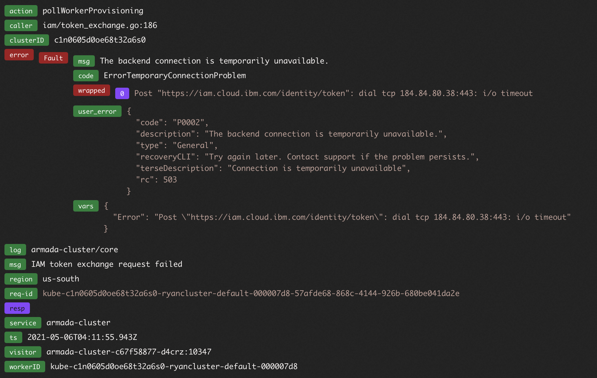

Troubleshooting
{: .label .label-red}

## Overview

This alert is fired when the system detects that there have been more than 20 instances of the reason code ErrorTemporaryConnectionProblem in a single region within the last 30 minutes during the processing of worker or subnet operations

## Example Alerts

Example PD title:

- `#3533816: bluemix.containers-kubernetes.armada-cluster_error_temporary_connection_worker`
- `#3533816: bluemix.containers-kubernetes.armada-cluster_error_temporary_connection_subnet`

## Investigation and Action

1. Determine whether this is a pCIE:

   - If multiple regions are experiencing the problem, raise a pCIE and continue to the next task.
   - If only one region is hitting the problem, snooze the alert and review the situation after one hour.
   - If the alert does not auto-resolve within an hour, raise a pCIE and continue to the next task.
   - If the alert has resolved, stand down.

1. Open LogDNA for the region carriers
1. In the left hand pane under `CLUSTER-SQUAD` there should be a view called `default-view`, open that view
1. Search for the error `ErrorTemporaryConnectionProblem`
1. Review the search results for over the last hour, cherry pick a few of the messages and review the entry to identify particular URLs that are experiencing issues (example below)

1. Collect the affected URL and the value of `req-id` from the log message
1. Use [this table](./resources/url-to-policy-mapping.html) to identify the affected service and escalation path
1. Refer to the [notification templates section](#notification-templates) to draft the CIE notification text
1. Refer to the [services section](#services) below to engage the relevant team and request assistance
1. The IKS automation will attempt to retry the inflight operations, so there is not an immediate need to confirm the CIE, unless ...

   - Multiple regions are affected and customers and we have customer reports of issues
   - The alerts are still firing after 90 minutes
1. If the CIE is confirmed, work with the respective service team and await a resolution. If further assistance is required, page the troutbridge squad.

## Services

### IAM

If IAM is the affected service, please raise the issue in the slack channel identified in the table. They will require the URL & the `req-id` to be able to look into the situation.

### BSS Resource Controller or Metering Service

If BSS is the affected service, please page the identified escalation policy. The team member paged will require the URL & the `req-id` to be able to look into the situation.

### VPC

If VPC is the affected service, please raise the issue in the slack channel identified in the table. They will require the URL & the `req-id` to be able to look into the situation.

A customer support ticket may be required, if one is requested, please follow [this runbook](https://pages.github.ibm.com/alchemy-conductors/documentation-pages/docs/runbooks/armada/armada-vpc-raise-support-ticket-for-worker.html) to raise a support ticket in the VPC Gen 2 service account. Provide the URL and the `req-id` for context.

### IBM Cloud Classic Infrastructure

From account 1185207 Raise a severity 1 ticket against IBM Cloud infrastructure indicating that their API may be experiencing problems. Use the following text when raising the issue:

```
*Subject*: API Question
*Severity*: Severity  1
*Title*: Our requests to the IBM Cloud infrastructure API have been timing out
*Details*:


IBM Kubernetes Service system monitoring have picked up increased number of HTTP request time outs when invoking the IBM Cloud Infrastructure API.

Some example API calls that the IBM  Kubernetes Service platform makes using the softlayer-go client are below:

Post https://api.softlayer.com/rest/v3/SoftLayer_Virtual_Guest/XXXXXXXX/reloadOperatingSystem.json: net/http: request canceled (Client.Timeout exceeded while awaiting headers) 

Get https://api.softlayer.com/mobile/v3/SoftLayer_Virtual_Guest/XXXXXXXX/rebootSoft.json: net/http: request canceled (Client.Timeout exceeded while awaiting headers)

Post https://api.softlayer.com/mobile/v3/SoftLayer_Product_Order/placeOrder.json?objectMask=orderId: net/http: request canceled (Client.Timeout exceeded while awaiting headers) 

Post https://api.softlayer.com/rest/v3/SoftLayer_Billing_Item/XXXXXXXX/cancelItem.json: net/http: request canceled (Client.Timeout exceeded while awaiting headers)

Customer specific information has been removed from the URLs above. The IKS platform provides services that interact with IBM Cloud Infrastructure for many customer accounts.

We've received a number of these failures within the last 30 minutes. Are you experiencing issues with the underlying API?
```

## Notification templates

### IAM

   ```txt
   TITLE:   Delay with IBM Kubernetes cluster provisioning and worker node operations

   SERVICES/COMPONENTS AFFECTED:
   - IBM Kubernetes Service
   - Red Hat OpenShift on IBM Cloud

   IMPACT:
   - Users may see delays in provisioning workers for new or existing clusters
   - Users may see delays in replacing, reloading or deleting existing workers of clusters
   - Kubernetes workloads otherwise using previously provisioned infrastructure resources are unaffected

   STATUS:
   - 202X-XX-XX XX:XX UTC - INVESTIGATING - The SRE team is aware and investigating.
   ```

### BSS Resource Controller or Metering Service

   ```txt
   TITLE:   Delay with IBM Kubernetes cluster provisioning and worker node operations

   SERVICES/COMPONENTS AFFECTED:
   - IBM Kubernetes Service
   - Red Hat OpenShift on IBM Cloud

   IMPACT:
   - Users may see delays in provisioning workers for new or existing clusters
   - Users may see delays in replacing, reloading or deleting existing workers of clusters
   - Kubernetes workloads otherwise using previously provisioned infrastructure resources are unaffected

   STATUS:
   - 202X-XX-XX XX:XX UTC - INVESTIGATING - The SRE team is aware and investigating.
   ```


### VPC

   ```txt
   TITLE:   Delay with IBM Kubernetes cluster provisioning and worker node operations

   SERVICES/COMPONENTS AFFECTED:
   - IBM Kubernetes Service
   - Red Hat OpenShift on IBM Cloud

   IMPACT:
   - Existing clusters, using VPC Gen 2 infrastructure
   - Users may see delays in provisioning workers for new or existing clusters
   - Users may see delays in provisioning persistent volume claims for existing clusters
   - Users may see delays in replacing, rebooting or deleting existing workers of clusters
   - Kubernetes workloads otherwise using previously provisioned infrastructure resources are unaffected

   STATUS:
   - 202X-XX-XX XX:XX UTC - INVESTIGATING - The SRE team is aware and investigating.
   ```

### IBM Cloud Classic Infrastructure

   ```txt
   TITLE:   Delay with IBM Kubernetes cluster provisioning and worker node operations

   SERVICES/COMPONENTS AFFECTED:
   - IBM Kubernetes Service
   - Red Hat OpenShift on IBM Cloud

   IMPACT:
   - IBM Kubernetes Service, using classic infrastructure
   - Users may see delays in provisioning workers for new or existing clusters
   - Users may see failures in provisioning portable subnets for new or existing clusters
   - Users may see delays in provisioning persistent volume claims for existing clusters
   - Users may see delays in reloading, rebooting or deleting existing workers of clusters
   - Kubernetes workloads otherwise using previously provisioned infrastructure resources are unaffected

   STATUS:
   - 202X-XX-XX XX:XX UTC - INVESTIGATING - The SRE team is aware and investigating.
   ```

## Resolution

The CIE can be put into monitoring if the respective service has informed us that mitigation has been applied and we're beginning to see the metrics behind the alert start a downward trend

The CIE can be considered resolved once the alerts have resolved

## Escalation Policy

If further information is required that only the troutbridge squad can provide, escalate the page to them and bring them up to speed on the status of the CIE and any updates from the affected service provider.
