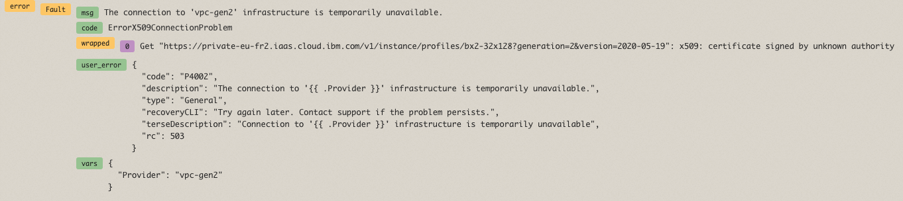

Troubleshooting
{: .label .label-red}

## Overview

This alert is fired when the system detects that there have been more than 20 instances of the `ErrorX509ConnectionProblem` error within a 30 minutes bucket when attempting to perform operations.

---
## Example Alert

Example PD title:

- `#3533816: bluemix.containers-kubernetes.armada-cluster_error_x509_connection_problem`

Example Body:

```yaml
Labels:
- severity = "critical",
- service = "armada-cluster",
- instance = "172.16.29.206:6970",
- hostname = "10.176.211.79",
- alert_situation = "armada-cluster_error_x509_connection_problem"
Annotations:
- summary = "IBM Cloud Infrastructure X509 connection problems have been hit twenty times in the last 30 minutes when performing operations."
- description = "IBM Cloud Infrastructure X509 connection problems have been hit twenty times in the last 30 minutes when performing operations."
- runbook = "https://pages.github.ibm.com/alchemy-conductors/documentation-pages/docs/runbooks/cluster-squad-ibmcloud-infrastructure-connection-problems.html"
```
---

## Investigation and Action

1\. Look at LogDNA for the region carriers

2\. In the left hand pane under `CLUSTER-SQUAD` there should be a view called `defaut-view`, open that view

3\. Search for the error `ErrorX509ConnectionProblem`

4\. Review the wrapped errors messages (example below)



5\. Review the URL and page the appropriate team

| URL                                         	| Escalation Policy                                                                                         	|
|---------------------------------------------	|-----------------------------------------------------------------------------------------------------------	|
| <https://billing.cloud.ibm.com>             	| [Bluemix BSS Metering](https://ibm.pagerduty.com/escalation_policies#PICP7UN)                             	|
| <https://resource-controller.cloud.ibm.com> 	| [Bluemix BSS Provisioning and Resource Controller](https://ibm.pagerduty.com/escalation_policies#PGPNMQI) 	|
| <https://iam.cloud.ibm.comc>                	| [IAM-Issues](https://ibm-cloudplatform.slack.com/archives/CS62UR3RD)                                      	|
| <https://.*iaas.cloud.ibm.com>              	| [IPOPS VPC](https://ibm-cloudplatform.slack.com/archives/CS62UR3RD)                                       	|
| <https://api.service.softlayer.com>         	| Raise Sev1 SoftLayer support ticket and engage with the SoftLayer team.                                   	|

<br/>

6\. If there is **NOT** a URL in the above message, go to the [Escalation Policy](#escalation-policy)

## Resolution

1. Raise a pCIE in the affected region and engage with the appropriate team (above)

   ```txt
   TITLE: Customers may experience delays when managing clusters

   SERVICES/COMPONENTS AFFECTED:
   - IBM Kubernetes Service
   - Red Hat OpenShift on IBM Cloud

   IMPACT:
   - Users may see delays in provisioning workers for new or existing Kubernetes clusters
   - Users may see delays in provisioning portable subnets for new or existing Kubernetes clusters
   - Users may see delays in provisioning persistent volume claims for existing Kubernetes clusters
   - Users may see delays in reloading, rebooting or deleting existing workers of Kubernetes clusters
   - Kubernetes workloads otherwise using previously provisioned infrastructure resources are unaffected

   STATUS:
   - 20XX-XX-XX XX:XX UTC - INVESTIGATING - The SRE team is aware and investigating.
   ```

2. Work with the required team to fix this, once done the alerts will auto-resolve

## Escalation Policy

_Only page the troutbridge squad if a URL did NOT exist in LogDNA_

**PD escalation policy**: [troutbridge](https://ibm.pagerduty.com/escalation_policies#PQORC98)

**Slack Channel**: [#armada-cluster](https://ibm-argonauts.slack.com/archives/C54FV49RU)
