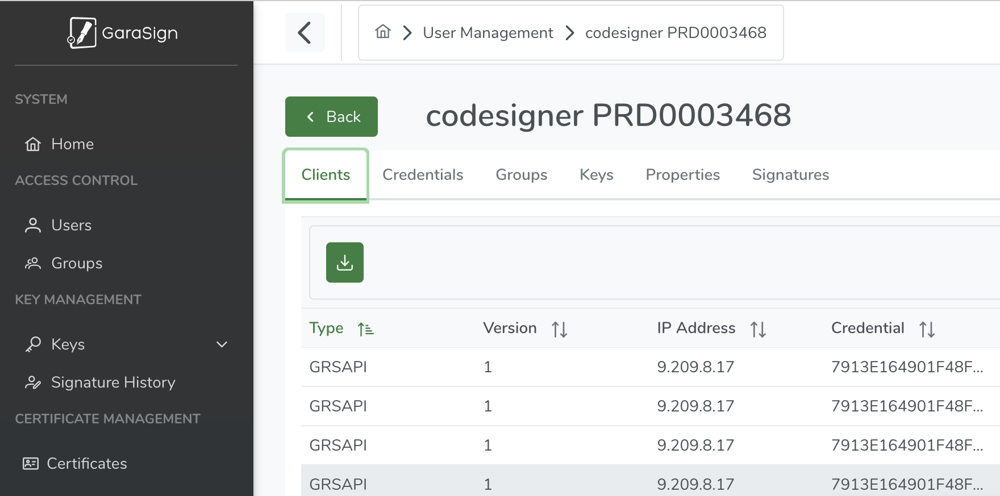

Ops
{: .label .label-green}

## Overview

All armada docker images are signed using the [CISO Code Signing Service](https://pages.github.ibm.com/Supply-Chain-Security/AppSec-External-Docs/appsec/CodeSigningService/overview/). The signing service uses a third-part SaaS tool called [Garanitr](https://garantir.io/).
  

IKS has been onboarded to the Code Signing Service. We use the same id for Satellite.
- ID is `PRD0003468` (This is the PSIRT id for IBM Cloud Kubernetes Service)
- TenantName is `psirt-PRD0003468.product.ibm.com`
  This is used when signing into [Garanitr](https://garantir.io/). 

1. There is a signing certificate held in the Code Signing Service which is stored in Garanitr and needs to be periodically rotated. This certificate never leaves the Garanitr website.
  
 - The verification of the signed image on customer clusters uses a public key associated with this certificate used to sign the images. When a new signing certificate is created, the new public key needs to be added to `armada-secure`.

2. There is also a Local Sign Client is used to access the Code Signing Service during a build. 
  This Client includes an authentication file and password which also needs to be periodically rotated. 
  This authentication file (.pfx) and password are stored in KeyProtect in the Alchemy Support account. During a build, the build tools will retrive the authentication file and password from KeyProtect.


This runbook describes the processes to follow when:

1. Renewing a code signing certificate
2. Creating a new Local Sign Client.

Note that these could coincidentally happen at the same time, but are two separate operations that do not have to be coordinated.


## Detailed Information

The certificate used for signing the armada images is held in an HSM owned by the Code Signing Service. 
This certificate needs to be rotated periodically and never leaves the Code Signing Service.

The [Razee build tools](https://github.ibm.com/alchemy-containers/build-tools) use a [Local Sign Client](https://pages.github.ibm.com/Supply-Chain-Security/AppSec-External-Docs/appsec/CodeSigningService/LocalSign/localsign/) to sign the docker image created in a Travis build. 
A local Sign Client signs the image without needing to upload the image to the CISO Code Signing Service. 
A [dynamic custom](https://pages.github.ibm.com/Supply-Chain-Security/AppSec-External-Docs/appsec/CodeSigningService/LocalSign/FromWhereDoYouWantToSign/dynamic/custom/) Local Sign Client is used because armada does not have a fixed set of build machines and we are not using the default TaaS or Travis tools.
The Local Sign Client is used to create a link from the client (for example, the Travis job) to the Signing certificate held in the CISO Code Signing Service.

The Local Sign Client package is obtained from the CISO Code Signing Service. Several clients could be created and they each have to be rotated periodically. Only one Local Sign Client is used by all armada builds that use the Razee build tools. 
  
The Local Sign Client package includes
  - An installation package .deb file that is stored in COS. This does not need to be updated every time but it is good practice to update whenever a new Local Sign Client package is created.
  - A certificate (`.pfx`) and password (`credentials.txt`) for authentication to the CISO Code Signing Service.

Armada stores parts of the Local Sign Client in two places in the Alchemy Support account:

- The installation package is stored in a COS bucket
- The certificate and password is stored in Key Protect

At build time, the build tools will retrieve the Local Sign Client authentication file and password from Key Protect using a component specific IAM apikey that gives access to the Key Protect instance. See [https://github.ibm.com/alchemy-containers/build-tools#signing-images](https://github.ibm.com/alchemy-containers/build-tools#signing-images) for details. 
This rotation of this apikey is out of scope of this runbook. 


## Detailed Procedure
  
Use the procedure below depending on what is being rotated:
  
- [Renew the code signing certificate in the Code Signing Service](#renew-a-code-signing-certificate)
- [Renew the Local Sign Client](#updating-the-new-local-sign-client)
  
See the follow section if you need to get access to the Code Signing Service. 

### Access to the Code Signing Service

SRE leads need access to the Code Signing Service. 
Request access via AccessHub. The following instructions are taken from [Code Signing Team Management Documentation](https://pages.github.ibm.com/Supply-Chain-Security/AppSec-External-Docs/appsec/CodeSigningService/GettingStarted/Team_Management/#css-team-management).
  
- Request access in [AccessHub](https://ibm-support.saviyntcloud.com/ECMv6/request/applicationRequest?search=Y2lzbyBjb2RlIHNpZ25pbmc=)
- Choose Application _CISO Code Signing Service_.
- Request New Access.
- Name is `PRD0003468`
  
### Logging in to the Code Signing Service
  
1. Open the [Garasign admin page in a browser](https://w3codesignadmin.sos.ibm.com/GaraSignAdminWeb)
1. The tenant is `psirt-PRD0003468.product.ibm.com`
1. Click `Login with W3idSSO` to login. 
  

### Renew a code signing certificate
 
The renewal will occur immediately.  Make sure you are ready to confirm that the rotation works immediately afterwards.  No additional steps
need to be taken.  Public key is the same, only the cert has changed.  The Cert needs to be uploaded to the server and then tested to make
sure it is still valid.
 
Overview of steps:

1. Contact the Garasign team and inform them that you would like to have your key renewed.

2.  They should acknowledge and renwew the key almost immediately.  (here is a link to my experience: https://ibm-argonauts.slack.com/archives/C03JYECNF60/p1718717804754019 ) 

3.  Update the the new cert using the instructions in Creating a new Local Sign Client section.

#### 1. Request the certificate renewal

1. An email will have been sent to the administrators with a renew link, or access into the [Code Signing Service certificate list](https://pgawdccosig01.sl.bluecloud.ibm.com/certificates).
45 days before your certificate expires, all team admins and cert admins will get regular emails.  I'm not sure who gets this email, but the renewal
doesn't need the email.  You can request a renewal via the Slack channel https://ibm.enterprise.slack.com/archives/C03JYECNF60 

2. Request the renewal.


### Updating the new Local Sign Client

Overview of steps:

1. Create a new client in Garasign

2. Add the encoded client authentication file (.pfx) and password (credentials.txt) to Key Protect

3. Update the install package in COS

4. Test the new client key in a build

5. Update the build tools to use the new client key 


##### 1. Create a new client

How to create a new client and get the files that need to be downloaded to access the Code Signing Service.

1. Log into the Code Signing Service: see [Logging in to the Code Signing Service](#logging-in-to-the-code-signing-service)

2. Choose the Users option on the left menu
  
    

3. Double-click on the entry with name `codesigner PRD0003468`
  
    
  
4. Click on the download client icon
  
5. Choose the options:
  - Platform: Ubuntu-20.04 (or appropriate client for your environment)
  - Client Type: Light
  - Create Credential: Enable (this creates a new credential at the same time as downloading the latest client)
    
    
  
6. Download the client.tgz file.
    - The tar file includes files:

    Example content:
    ``` 
    client_auth_*.pfx - authentication file to be added to KeyProtect
    credentials.txt - password for authentication file to be added to KeyProtect.
    readme.txt
    ```

##### 2. Add the encoded authentication file and credential to KeyProtect

Take the Client_*.pfx and credentials.txt file from the tar file and add the base64 encoded files to Key Protect:
  
1. Base64 encode the files

 `base64 -i client_auth_583_1706914576968.pfx -o client_auth_583_1706914576968.pfx.base64`
 `base64 -i credentials.txt -o credentials.txt.base64`
  
2. Add the base64 encoded content to Key Protect:

  - Key protect instance is in account `278445 - Alchemy Support` account, called `iks-pipeline-KeyP-prod-us-south`
  - Add a new key, using options to _Import your own Key_ and choose _Standard key_
  - Key name: 
    - For authentication file: `icdevops-ciso-api-key-YYYYMMDD` and substitute today's date.
    - For credential password file: `credential.txt-YYYYMMDD` and substitute today's date.
  - Key material: The base64 encoded file contents.
  
3. Make a note of keyid and keyname for use in the buildtools. 

##### 3. Update the install package in COS (optional)

1. Create a tar.gz file called `ekm_client_ubuntu.tar.gz` which will contain the other 3 files (`client.conf`, `config.txt`, `ekm-client_*.deb`)
   Do not include the `Client_*.pfx` file. 

2. Update existing object `ekm_client_buntun.tar.gz` in COS
    - COS Instance: `iks-pipeline-COS-prod-us-south` in `278445 - Alchemy Support`
    - Bucket: `ciso-image-signing` 

##### 4. Test the new client key in a build

- Engage the dev teams (Razee, deploy) to assist in the testing.
- Any repository build can override the default name of Key Protect key by setting `CISO_KEYPROTECT_KEY` in the Travis env vars to the new name `icdevops-ciso-api-key-YYYYMMDD` set in the earlier step. 

##### 5. Update the build tools to use the new client key

- When a new client key is created, the default key name needs to be updated here [https://github.ibm.com/alchemy-containers/build-tools/blob/master/build-tools/docker/install.sh#L122](https://github.ibm.com/alchemy-containers/build-tools/blob/master/build-tools/docker/install.sh#L122)


## References

CISO Code Signing:
- Garasign: https://w3codesignadmin.sos.ibm.com/GaraSignAdminWeb
- Internal home page: [https://w3.ibm.com/w3publisher/ciso-appsec/services/code-signing]
- documentation: [https://pages.github.ibm.com/Supply-Chain-Security/AppSec-External-Docs/appsec/CodeSigningService/overview/]
- Slack channel: [https://ibm-analytics.slack.com/archives/C03JYECNF60]
  

Armada Build tools repository: [https://github.ibm.com/alchemy-containers/build-tools](https://github.ibm.com/alchemy-containers/build-tools) 


