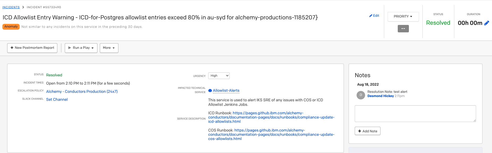
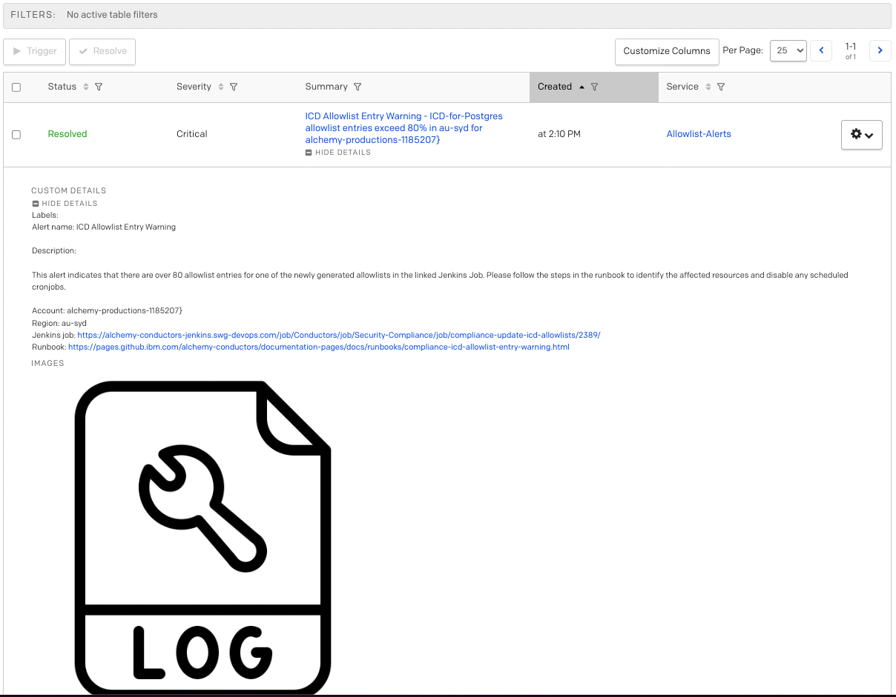

Informational
{: .label }

# ICD CBR/Allowlist automation

## Overview

This runbook shows IKS SRE how to address `ICD Allowlist Entry Warning` PagerDuty incidents.

## Detailed Information

This section covers some background information on the ICD allowlist entry warning, please feel free to skip straight to the [Actions required](#actions-required) section to address PagerDuty incidents.

### Background

IBM Cloud Databases (ICD) resources allow you to implement allowlists to restrict access to each database. Each instance is limited to `100` allowlist entries, documented [here](https://cloud.ibm.com/docs/databases-for-postgresql?topic=cloud-databases-allowlisting).

If the ICD allowlist automation generates an allowlist that is greater than 100 entires it will fail to apply the updated allowlist and the Jenkins job will fail. This has the potential to cause outages and possibly trigger a CIE. This alert attempts to prevent this situation occuring by triggering `[WARNING]` alerts once the allowlist entries exceed 80% of the total allowlist entry limit. 


#### More information

If you want more information of why this allowlisting automation exists and how it works, please refer to the background section of the [compliance-update-icd-allowlists](https://pages.github.ibm.com/alchemy-conductors/documentation-pages/docs/runbooks/compliance-update-icd-allowlists.html#background) runbook.


### Actions required


1. From the PagerDuty incident title, please take note of the `Resource Type`, `Region` & `account`. [Example Alert](#icd-example-alert)
1. Clone the [compliance-update-icd-cos-allowlists](https://github.ibm.com/alchemy-conductors/compliance-update-icd-cos-allowlists) repository.
1. Open Jenkinsfile.ICD
1. In the `triggers { parameterizedCron(` section of the Jenkinsfile, comment out any crons that contain this resource, region and account, by typing `#` before cron: `# H 8 * * * % Account=a`.
    - TIP: use `command/ctrl + f` to search for `Account={Account}; Region={Region}` to narrow down the results quickly.
1. Save the changes
1. Create a new branch with the name `icd-allowlist-entry-warning-{PD Alert ID}`
1. Push changes to the new branch
1. Create a PR with the following information:
    - Title: Disabling cronjob for {Resource Type} in the {Region} region, in account {Account}.
    - Reference GHE Issue or Issue Description: PD: `pagerduty link`
    - Description of change: Commenting out the following scheduled jobs: `Copy and paste in the lines being commented out`
    - Testing that was done: N/A
1. Request that the PR is reviewed and merged to master to prevent further scheduled jobs from running.
1. Notify IKS EU SRE team


#### ICD Example Alert

In this example, there is an issue with `ICD for Postgres` resource type in the `au-syd` region, in account `1185207`. Link to PD alert:

https://ibm.pagerduty.com/incidents/Q3U9NSKAIA46O4

Alert:


Alert Details:



Based on the details in this alert we can determine that we need to disable any ICD cronjobs for `ICD for Postgres` resources in the `au-syd` region, in account `1185207`such as: 

`H 10 * * * % Account=alchemy-productions-1185207; Region=au-syd; Delete=false; Dryrun=false;`

Commenting out this entry:

```Groovy
triggers {
        parameterizedCron('''
            ##############-------- ICD-for-Postgres --------##############

            #### Postgre stage-us-south 1858147 ####
            H 8 * * * % Account=argo-staging-1858147; Region=us-south; Delete=false; Dryrun=false; ResourceType=ICD-for-Postgres

            #### Postgre jp-osa 1185207 ####
            H 9 * * * % Account=alchemy-productions-1185207; Region=jp-osa; Delete=false; Dryrun=false; ResourceType=ICD-for-Postgres

            #### Postgre au-syd 1185207 ####
            # H 10 * * * % Account=alchemy-productions-1185207; Region=au-syd; Delete=false; Dryrun=false; ResourceType=ICD-for-Postgres

            #### Postgre jp-tok 1185207 ####
            H 11 * * * % Account=alchemy-productions-1185207; Region=jp-tok; Delete=false; Dryrun=false; ResourceType=ICD-for-Postgres
        ''')
    }

```

## Escalation Policy

1. Raise a team GitHub issue: [ICD or COS allowlist update](https://github.ibm.com/alchemy-conductors/team/issues/new?assignees=&labels=&template=icd_cos_allowlist.md&title=) to track.
1. Add any relavant informaiton including a links to the PR created and PD alert.
1. Notify in [#iks_cos_allowlist](https://ibm-argonauts.slack.com/archives/C02PZ56C5AL) slack channel with GHE issue raised.
