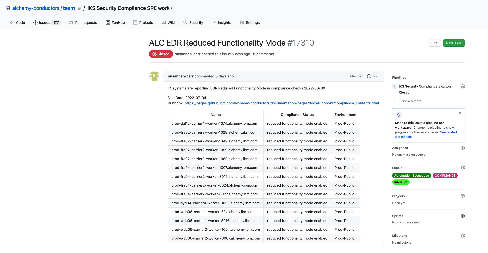
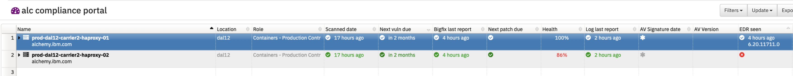
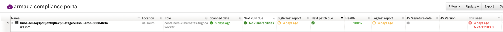

Informational
{: .label }

# Handling team tickets raised by the Compliance squad - ALC EDR issues

## Overview

This runbook covers scenario where an ALC machine reports EDR issues.

EDR is also referred to as Crowdstrike and is a tool which all of our ALC servers are configured to communicate with.

We install EDR as part of bootstrap-one for our ALC control plane servers

## Detailed Information

SRE will typically be informed of such a problem by a new GHE in the [conductors team repository](https://github.ibm.com/alchemy-conductors/team/issues)

They will usually cover these scenarios

- EDR old checkin
- EDR Reduced Functionality Mode (RFM)

The GHE will typically look like this

### Automation

Automation exists which is designed to process tickets of this nature.  It should be obvious if automation has been attempted on this type of ticket by the labels added to the ticket.

The automation is [compliance-automation in GHE](https://github.ibm.com/alchemy-conductors/compliance-automation) which runs on a schedule in this [jenkins job](https://alchemy-conductors-jenkins.swg-devops.com/job/Conductors/job/SRE%20Automation/job/Scan%20Gap%20Automation/) 

For EDR issues on ALC servers, the automation will attempt to stop and restart the `falcon-sensor` process.  It will then attempt some data collection to report the EDR status post this service restart.  If automation has executed, then please review the ansible output in the ticket.  This should indicate whether any further actions are needed or if the automation has successfully restarted the process and move the node out of `reduced functionality mode`

### Is the kernel version supported?

If large numbers of machines start reporting EDR reduced functionality mode, then it is worth checking in with the SREs who run patching to see if a new kernel is being rolled out across ALC environments via smith patching process

The following [EDR documentation](https://ibm.ent.box.com/s/nz9z3jhegwzbv562cwoj8reswxf3w4b1) details what versions of Ubuntu kernel are supported by EDR.

If the kernel being rolled out is currently unsupported, then there is little that can be done until a ZTL (zero touch library) update is released by EDR across all of the nodes running EDR.

In this case, speak to your Squad lead about options and whether a PCE is required.

It's also worth posting a question in [`#edr-support` slack channel](https://ibm-argonauts.slack.com/archives/CKZ7TFA78) providing some example nodes, kernel versions and requesting when the kernel will be supported.

### Review EDR status

To view live status of a node or multiple nodes:

- Go to [EDR host verification site]

- Select the correct instance.  For EU nodes, select `EU 2DBC46052BDB45839B294BA5FB05418D-7C`.  For Non-EU, select `GovCloud IBM Cloud	080749321C014B58A54CDD95E7F5C166-50`

- Enter the machine(s) you wish to query.

- You should be returned details about the device, including whether it is still running in `RFM`, when it last connected to EDR etc.  This should help you determine the next actions to take or if no actions are now needed if the node is talking to EDR again. (reboots and reloads are happening so often, sometimes these issues are created on slightly out of date data in SOS where-as the data in this EDR website is live)

### Review SOS

- Go to [SOS ALC Compliance dashboard](https://w3.sos.ibm.com/inventory.nsf/compliance_portal.xsp?c_code=alc)

- Use the search box to find the machine -  this will have details of the last checkin by EDR 

- if this is just a red cross, this indicates the system has never checked into EDR and there is likely an issue with the installation of EDR on the node.  Is it a new node? Maybe bootstrap has never completed? 

- If this is highlighted red but with an old time (several days usually since last checkin), this indicates the system has stopped communicating with EDR.  Is the node down? Has it failed a reload?

### Reduced Functionality Mode debug and resolution

**NOTE** Automation may have already addressed this so check the output logged to the ticket.

- Reboot the node (use automation/chlorine to do this)

- After reboot, use the [EDR host verification site] to verify the node is no longer in Reduced Functionality mode.

### Old checkin debug and resolution 

- Check for recent activities on this node via automation.  For example, search [chlorine logging channel](https://ibm-argonauts.slack.com/archives/CDG1R2D5Y) for the machine.  Has a recent reload attempt failed?  If so, work with your SRE colleagues to understand why.

- For `IKS worker nodes` - issuing an osreload usually fixes this.  But it could be that a previous reload failed and just reloading may result in a similar failure.  Investigate first before reloading.

- For non-worker node (infra nodes/masters/haproxy), log into the node, and check the bootstrap status (the logs are under `/opt`)

- If you are unable to reach any of the nodes listed via SSH, then try rebooting the node via the IaaS classic infrastructure portal.  

### Never checked in debug and resolution

- This suggests that the node has either been recently ordered and a bootstrap has never completed

- ssh to the node and investigate and fix bootstrap failures.  Logs are present under `/opt`

- Once bootstrap logs have been reviewed and if no errors are found, use the following commands to validate whether EDR is running correctly.  
_Compare output to the values set in [bootstrap-one](https://github.ibm.com/alchemy-conductors/bootstrap-one/tree/master/playbooks/roles/crowdstrike)_
   - **check that the correct package is installed** _(`falcon-sensor-gc` or `falcon-sensor-eu` for EU based servers)_  
   `dpkg -l | grep falcon`
   - **view the tags set**  
   `sudo /opt/CrowdStrike/falconctl -g --tags`
   - **check the correct _cid_ is set**  
   `sudo  /opt/CrowdStrike/falconctl -g --cid`
   - **view service status**  
   `sudo systemctl status falcon-sensor`
   - **view process**  
   `ps -e | grep falcon-sensor`
   - **check the connection is established**  
   `sudo netstat -tapn | grep falcon`
    
If all the above checks report no obvious errors, then there are several further ways forward.
Depending on when the server was ordered, it may take several days to appear healthy in SOS.  If the machine was ordered or osreloaded over 3 days ago, then from experience, the server is unlikely to autoresolve without any intervention, therefore,  do not wait any further time, proceed to one of the steps below.

Either;

- Attempt a manual re-install of EDR by running these commands (NB: Remember to raise trains to cover these actions in production)
   1. ssh to the node
   2. **Find the correct package name**
   `dpkg -l | grep falcon`
   3. **Remove falcon sensor**
   `sudo apt-get purge <package name> -y`
   4. Re-run the [IKS bootstrap](https://alchemy-conductors-jenkins.swg-devops.com/job/Conductors/job/Conductors-Infrastructure/job/alchemy-bootstrap/) for the machine
   5. Check the results of bootstrap to ensure the crowdstrike steps have been run without error
   6. Check SOS the following day and EDR should report healthy

- If a re-install doesn't fix this issue, then an osreload is likely required.  
   - **OSRELOAD WARNING** Be aware of the machine type reporting this issue as there maybe specific steps to run before or after an osreload.  If in doubt, consult your squad members or squad lead.

## Escalation

A good source of help can be found by speaking to the crowdstrike team in [#EDR-Support Slack channel](https://ibm-argonauts.slack.com/archives/CKZ7TFA78)

The EDR installation and debug guide also contains helpful information - this can be found [here](https://ibm.ent.box.com/s/hklcaobadkp0xlrf81k5orcz7sxn503e)

If you are unsure what to do, or have exhausted all the invesigation steps detailed in this runbook, then reach out to the wider SRE squad for further help.

Consider reaching out to the SRE Security Compliance Lead to help investigate this further.

If you are unsure about running any of these steps, don't! Seek help and guidance.

[EDR host verification site]: https://host-verification-prod.dal1a.cirrus.ibm.com/lookup/
