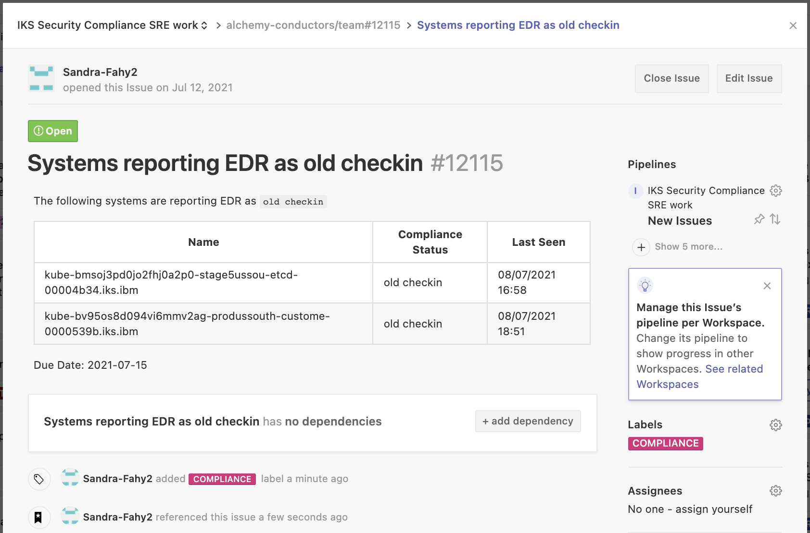

Informational
{: .label }

# Handling team tickets raised by the Compliance squad - ARMADA EDR issues

## Overview

This runbook covers scenario where an ARMADA machine reports EDR issues.

EDR is also referred to as Crowdstrike and is a tool which all of our ARMADA servers are configured to communicate with.

EDR/Crowdstrike is deployed as part of the csutil compliance tooling.

## Detailed Information

SRE will typically be informed of such a problem by a new GHE in the [conductors team repository](https://github.ibm.com/alchemy-conductors/team/issues)

They will usually cover these scenarios

- EDR old checkin
- EDR Reduced Functionality Mode (RFM)

The GHE will typically look like this

### Automation

Automation exists which is designed to process tickets of this nature.  It should be obvious if automation has been attempted on this type of ticket by the labels added to the ticket.

The automation is [compliance-automation in GHE](https://github.ibm.com/alchemy-conductors/compliance-automation) which runs on a schedule in this [jenkins job](https://alchemy-conductors-jenkins.swg-devops.com/job/Conductors/job/SRE%20Automation/job/Scan%20Gap%20Automation/)

For EDR issues on ARMADA servers, the automation will delete the `crowdstrike` pod running on the server which is reporting that EDR is in `reduced functionality mode`.  It will then attempt some data collection to report the EDR status post this service restart.  If automation has executed, then please review the ansible output in the ticket.  This should indicate whether any further actions are needed or if the automation has successfully restarted the process and move the node out of `reduced functionality mode`

### Review EDR status

Regardless of whether automation has executed against this ticket, the following site is a good source of information about the current state of a server and its status.

- Go to [EDR host verification site]

- Select the correct instance.  For EU nodes, select `EU 2DBC46052BDB45839B294BA5FB05418D-7C`.  For Non-EU, select `GovCloud IBM Cloud	080749321C014B58A54CDD95E7F5C166-50`

- Enter the machines you wish to query.

- You should be returned details about the device, including whether it is still running in `RFM`, when it last connected to EDR etc.  This should help you determine the next actions to take or if no actions are now needed if the node is talking to EDR again. (reboots and reloads are happening so often, sometimes these issues are created on slightly out of date data in SOS where-as the data in this EDR website is live)

### Review SOS

- Go to [SOS ARMADA Compliance dashboard](https://w3.sos.ibm.com/inventory.nsf/compliance_portal.xsp?c_code=armada)

- Use the search box to find the machine - this will have details of the last checkin by EDR 

- if this is just a red cross, this indicates the system has never checked into EDR.  

- If this is highlighted red but with a time, this indicates the system has stopped communicating with EDR.  

### Reduced Functionality Mode debug and resolution

**NOTE** Automation may have already addressed this so check the output logged to the ticket.

- Log into the tugboat and check the node status

- Restart any crowdstrike pods that are running but are in a `0/1` container status  
`kubectl get po -n ibm-services-system -l name=crowdstrike | grep 0/1 | grep Running | awk '{print $1}' | xargs -L1 kubectl delete po -n ibm-services-system`

- After restarting the pods, use the [EDR host verification site] to verify the node is no longer in Reduced Functionality mode.

### Old checkin debug and resolution 

- Log into the tugboat and check the node status

~~~
cullepl@prod-dal10-carrier2-worker-1056:~$ invoke-tugboat prod-dal10-carrier117
groups: cannot find name for group ID 20257
Network call kubeconfigsCarrier was successful
Now pointing to /home/SSO/cullepl/prod-dal10-carrier117.yaml, type exit to leave this subshell
[prod-dal10-carrier117] cullepl@prod-dal10-carrier2-worker-1056:~$ kubectl get node 10.185.150.252
NAME             STATUS                        ROLES    AGE    VERSION
10.185.150.252   NotReady,SchedulingDisabled   <none>   129d   v1.18.20+IKS
[prod-dal10-carrier117] cullepl@prod-dal10-carrier2-worker-1056:~$ 
~~~

- If the node is `Critical/NotReady`, check that a reload is not already in progress or a previous one which has failed.
   1. Go to [tugboat-worker-info GHE repository](https://github.ibm.com/alchemy-containers/tugboat-worker-info/issues) and go to `issues`.
   1. Look for the IP address in the list of open issues.
   1. If one exists, review the GHE and if it has completed, but failed, close the GHE out, and request a new reload via `chlorine`

### Never checked in debug and resolution

- This suggests that the node has either been recently ordered or replaced and csutil pods have not started on it.  The dates when workers were created can be seen by using `@xo cluster.Worker <workername>` in the [armada-xo slack channel](https://ibm-argonauts.slack.com/archives/G53AJ95TP)

- You should spend time looking into the status of this node and resolve any issues related to csutil status on the cluster.

- Use chlorine `lookup <clusterid>` to find the cluster and the carrier it is located on, then use [armada-tugboats runbook](https://pages.github.ibm.com/alchemy-conductors/documentation-pages/docs/runbooks/armada/armada-tugboats.html#access-the-tugboats) to gain access to the tugboat to debug the cluster further

-  Display csutil status of the tugboat - this will help review the status of all the components including EDR crowdstrike pods
`kubectl get po -n ibm-services-system -owide`

## Escalation

A good source of help can be found by speaking to the crowdstrike team in [#EDR-Support Slack channel](https://ibm-argonauts.slack.com/archives/CKZ7TFA78)

The EDR installation and debug guide also contains helpful information - this can be found [here](https://ibm.ent.box.com/s/hklcaobadkp0xlrf81k5orcz7sxn503e)

If you are unsure what to do, or have exhausted all the invesigation steps detailed in this runbook, then reach out to the wider SRE squad for further help.

Consider reaching out to the SRE Security Compliance Lead to help investigate this further.

If you are unsure about running any of these steps, don't! Seek help and guidance.

[EDR host verification site]: https://host-verification-prod.dal1a.cirrus.ibm.com/lookup/