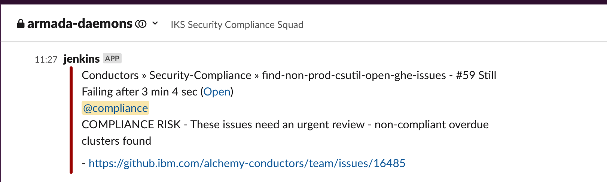

Informational
{: .label }

# Compliance: Automated cluster removal of non-compliant clusters

## Overview

The runbook provides an overview on tooling which assists with the compliance of IKS/ROKS clusters deployed in the following non-production accounts

- DEV_CONTAINERS - 1186049
- ALCHEMY_STAGING - stage account in `test.cloud.ibm.com`

The tooling is designed to delete non-compliant clusters that have been approved in an appropriate GHE issue.

## Detailed Information

Since the introduction of FS-Cloud rules, non-production account compliance status is just as important as the status of our production environments.

Our non-production pipeline accounts are not monitored (via prometheus and pagerduty) as closely, therefore, many issues are being raised by the Compliance team very close to the due date/time.

As a result, the compliance automation team have generated tooling which will help remove clusters which do not have csutil deployed to them and are posing a possible risk to compliance status for SOC2 or FS-Cloud.

The tooling relies on issues previously opened by the [non-production cluster check code](./compliance_non_production_csutil_cluster_checks.html) and once reviewed by an appropriate SRE/member of the compliance squad, if the `approved_for_removal` label has been added, the code will remove the cluster referenced in the issue.

Only the accounts in the `overview` section are approved for this automation as these are the only two accounts approved for the IKS Tribe to spin up test, development and demo clusters.

## Being alerted to non-compliant clusters that need review

The [find open GHE tooling](./compliance_find_open_GHE_cluster_checks.html) runs each day and reports all the open GHEs to several members of the `compliance` squad

This also looks for issues which have exceeded 7 days and csutil has not been deployed.

These issues are also sent as a slack notification to the [Compliance squads automation channel](https://ibm-argonauts.slack.com/archives/C7X2SL6NR)

These should be reviewed by a member of the Compliance squad - see the Rewiewer actions for how to review.

## Reviewer actions

The following persons are approved to review 
- Compliance Squad members
- SRE Squad leads 

Members of the IKS tribe should be well aware of their responsibilities to deploy csutil to clusters as per [compliance documentation](./development_onboard_sos_tools.html)

When reviewing GHEs these checks should be made to determine if an immediate automated removal is the best course of action. 

__WARNING! If you are unsure, do not approve and consult your squad lead or manager__

1. Review outstanding PRs against [csutil-certs-containers-kubernetes-dev](https://github.ibm.com/alchemy-1337/csutil-certs-containers-kubernetes-dev/blob/master/certificate_usage) and [cruiser-onboard-containers-kubernetes](https://github.ibm.com/alchemy-1337/cruiser-onboard-containers-kubernetes/blob/master/certificate_usage) - there could be a request in to reserve a certificate which has been missed.
2. Review the cluster name and resource group - if you want to be careful and reach out to the squad/person who might have created this cluster then do this but please document it in the GHE so it can be tracked.
3. If you are happy that you don't need to contact the owner/owning squad and this can be removed, then add the `approved_for_removal` label to the issue.

## Cluster removal

After a ticket is approved, no further actions should be needed.  The [removal automation Jenkins job](https://alchemy-conductors-jenkins.swg-devops.com/job/Conductors/job/Security-Compliance/view/csutil%20non-production%20compliance%20automation/job/non-production-non-compliant-cluster-removal/) will kick in (it runs on a schedule) and will delete the cluster, and update the GHE with actions taken.  The GHE will then be closed out once the cluster is fully removed from the account.

## Useful links

- [Removal automation GHE Code](https://github.ibm.com/alchemy-conductors/automation-team/blob/master/utils/cluster_checks/cancelClusters.py)
- [Removal automation Jenkins job](https://alchemy-conductors-jenkins.swg-devops.com/job/Conductors/job/Security-Compliance/view/csutil%20non-production%20compliance%20automation/job/non-production-non-compliant-cluster-removal/)
- [GHE issue tracker jenkins job](https://alchemy-conductors-jenkins.swg-devops.com/job/Conductors/job/Security-Compliance/job/find-non-prod-csutil-open-ghe-issues/)
    - This was written to help track and alert the compliance squad on the issues being raised by the tooling.

## Escalation
If you are unsure what to do, or have exhausted all the invesigation steps detailed in this runbook, then reach out to the wider SRE squad for further help or post in the [#iks-sre-compliance](https://ibm-argonauts.slack.com/archives/C02HNQGGM8V) slack channel for assistance.

Consider reaching out to the SRE Security Compliance Squad to help investigate this further.

If you are unsure about running any of these steps, don't! Seek help and guidance.
