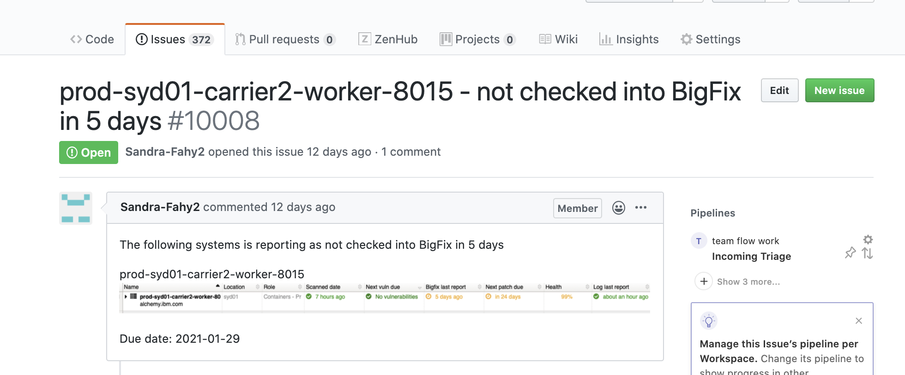

Informational
{: .label }

# Handling team tickets raised by the Compliance squad - machine has not checked into bigfix for several days

## Overview

This runbook covers our control plane and infrastructure machines and **NOT** IKS/ROKS tugboat worker nodes

i.e.
- prod-dal10-carrier2-worker-8001 or
- prod-dal09-infra-apt-repo-mirror-01

To debug issues with bigfix on tugboats [review the bes-local-client section of the debugging csutil runbook](./armada/tugboat_debug_csutil.html)

All of our machines have the bigfix client installed on them during the bootstrap process.  Bigfix is used to report patch and healthcheck status which is displayed on the SOS portal.

If a machine has not checked into the bigfix server for several days, it means we are unable to correctly track the compliance of this server.

This runbook details how to investigate such issues, and take actions to resolve them.

## Detailed Information

SRE will typically be informed of such a problem by a new GHE in the [conductors team repository](https://github.ibm.com/alchemy-conductors/team/issues)

The GHE will typically look like this

<a href="images/compliance_bigfix_checkin.png">
</a>

### Check to see if a recent automated reload or reboot failed

If the node highlighted is a `carrier worker` node, then it's very likely that a previous automated reload via `chlorine` has failed.

If the node is any other node type, e.g. `master`, `ha-proxy` or `infra` then skip this section as the automated reload process is not supported on these node types.

In this example, we'll look at `prod-syd01-carrier2-worker-8015` which was reported in ticket `10008`

- In slack, search for the machine in `#bot-chlorine-logging` channel

- If no entries are found in `#bot-chlorine-logging` channel for this server at around the time when the machine stopped talking to bigfix, continue with the remainder of this runbook.

- If you find an entry which is around the same time the machine stopped checking into bigfix, then review that entry to see if the reload was successful.  In this example, the GHE was raised by the compliance squad on 29th January, and bigfix last checked in 5 days previously (24th Jan), therefore, look for entries around that date. 

<a href="images/compliance_failed_reload.png">
</a>

- If an entry is found (like above) and the reload failed (like above) then issue a new reload request via `chlorine` using the following command:  
    `reload <node> ignoreconflict outage:0`


- Add details to the team ticket and track the reload process to ensure it completes without error.  

- If the reload completes successfully, add a relevant comment and close the GHE - SOS takes several hours to be updated, the compliance team will verify status.

- If the reload fails, investigate further and work with SRE colleagues to get the machine back up.

### Verify the bigfix process is running on the server

Automated reloads do not cover all machine types and if a non-worker node reports bigfix issues then it's typically because the bigfix process has ended abruptly on the server.

#### Automated checks

To validate, execute the [bigfix-check](https://alchemy-conductors-jenkins.swg-devops.com/view/Conductors/job/Conductors/job/Security-Compliance/job/bigfix-check/) jenkins job.

The job uses ansible to run several checks against the machine or set of machines you reference.  The checks are defined in [conductors-tools GHE repo](https://github.ibm.com/alchemy-conductors/conductors-tools/blob/master/ansible-playbooks/validate_bigfix.sh)

- If the job completes with the server reporting `UNREACHABLE`, it is likely the node is down. Issue a reboot of the server and re-run the checks once it is back online.

- If the job reports errors, it can be re-run with the option to restart the bigfix client.
    - If you are unsure how to address the issues identified, go to escalation policy.

- If the job completes with no errors and all the bigfix checks pass then this means either;
    - The problem is resolved or (if there has been a recent reload or reboot then this would usually fix it)
    - There is a reporting issue between the SOS bigfix server and SOS compliance portal

### Checking SOS Bigfix server

- Navigate to [SOS bigfix webUI](https://w3iem-webui.sos.ibm.com/login) and use your SOS ID to login 
    - Details taken from [SOS Bigfix documentation](https://pages.github.ibm.com/SOSTeam/SOS-Docs/bigfix/BigFix_WebUI/bf_webui.html)

- Click on `Devices` and search for the machine with the issue

- You should see communications/bigfix logs from the node within the last few hours.  If this is the case, and the node has not been rebooted or reloaded recently, then there is likely a sync issue from SOS bigfix to SOS compliance portal.  An SOS ticket will need to be raised against `SOS Classic Inventory` - see guidance below

### Manual checks

The following manual checks can be executed instead or the automated jenkins job mentioned above.

- ssh to the machine

- Check the status of the bigfix client on the machine using this command:  
`sudo service besclient status`

- If the process has stopped, it will report `dead` - see an example below

```
root@prod-mex01-carrier11-haproxy-01:/# service besclient status
* besclient.service - LSB: Starts BigFix Agent
   Loaded: loaded (/etc/init.d/besclient; generated)
  Drop-In: /lib/systemd/system/besclient.service.d
           `-restart.conf
   Active: inactive (dead) since Thu 2021-02-04 22:48:26 UTC; 3 days ago
     Docs: man:systemd-sysv-generator(8)
```

- Check the `/var/opt/BESClient/__BESData/__Global/Logs` directory. A broken bigfix would have stopped logging to this directory on the date the process died.

```
root@prod-mex01-carrier11-haproxy-01:/var/opt/BESClient/__BESData/__Global/Logs# ls -lrt
total 372
-rw------- 1 root root  26376 Jan 29 23:48 20210129.log
-rw------- 1 root root  20286 Jan 30 22:46 20210130.log
-rw------- 1 root root  18753 Jan 31 22:34 20210131.log
-rw------- 1 root root  21359 Feb  1 22:34 20210201.log
-rw------- 1 root root  19940 Feb  2 22:35 20210202.log
-rw------- 1 root root 192301 Feb  3 22:36 20210203.log
-rw------- 1 root root  37381 Feb  4 22:48 20210204.log
```

- Attempt restarting the bigfix process using this command;  
`sudo service besclient start`

- Validate the process restarted successfully and a new logfile is created with the current date.  

```
root@prod-mex01-carrier11-haproxy-01:/var/opt/BESClient/__BESData/__Global/Logs# service besclient start 
root@prod-mex01-carrier11-haproxy-01:/var/opt/BESClient/__BESData/__Global/Logs# service besclient status
* besclient.service - LSB: Starts BigFix Agent
   Loaded: loaded (/etc/init.d/besclient; generated)
  Drop-In: /lib/systemd/system/besclient.service.d
           `-restart.conf
   Active: active (running) since Mon 2021-02-08 13:18:25 UTC; 2s ago
     Docs: man:systemd-sysv-generator(8)
  Process: 1248 ExecStart=/etc/init.d/besclient start (code=exited, status=0/SUCCESS)
    Tasks: 1 (limit: 4915)
   CGroup: /system.slice/besclient.service
           `-1259 /opt/BESClient/bin/BESClient

Feb 08 13:18:25 prod-mex01-carrier11-haproxy-01 systemd[1]: Starting LSB: Starts BigFix Agent...
Feb 08 13:18:25 prod-mex01-carrier11-haproxy-01 systemd[1]: Started LSB: Starts BigFix Agent.
root@prod-mex01-carrier11-haproxy-01:/var/opt/BESClient/__BESData/__Global/Logs# ls -lrt
total 372
-rw------- 1 root root  26376 Jan 29 23:48 20210129.log
-rw------- 1 root root  20286 Jan 30 22:46 20210130.log
-rw------- 1 root root  18753 Jan 31 22:34 20210131.log
-rw------- 1 root root  21359 Feb  1 22:34 20210201.log
-rw------- 1 root root  19940 Feb  2 22:35 20210202.log
-rw------- 1 root root 192301 Feb  3 22:36 20210203.log
-rw------- 1 root root  37381 Feb  4 22:48 20210204.log
-rw------- 1 root root   3612 Feb  8 13:19 20210208.log
```

- Check the new log file and scan for any obvious error strings.  If there appear to be communications from the server to bigfix server and the service does not terminate again, then no further actions are likely needed.

- Update the ticket with the steps followed and ask the compliance squad to validate status in 24 hours.

### Further investigation

If reloads or restarting the bigfix client on the server does not resolve the issue then here are some further pointers to other not so typical issues seen or other things that can be considered.

1. Check the status of the `infra-iemrelay-01` machine in the region/environment you are seeing issues in.  Typically, if this server had issues, bigfix issues would be observed over a large number of machines in the same region rather than just a small number of individual machines.

2. Request assistance from other SRE squad members.  Further examples of problems and how they were fixed should be added to this runbook if and when you find them!

3. Engage the SOS team.  See the [SOS docs for bigfix here](https://pages.github.ibm.com/SOSTeam/SOS-Docs/bigfix/BigFix_Health_Patch.html)

### Re-installing bigfix client

If all remediation fails, then one approach is to manually remove the current bigfix install, then re-run the bootstrap to re-install bigfix.  It's surprising how many times this has addressed a problem.

- For `worker` nodes, do this by performing a machine reload via chlorine.

- For `non-worker` nodes, follow this guide to [un-install and cleanup bigfix](https://pages.github.ibm.com/SOSTeam/SOS-Docs/bigfix/BigFix_FAQ/Removing_Bigfix_Client_or_BigFix_Relay_Linux.html)
  - To re-install bigfix client (**NB** Do not follow the manual instructions on the SOS doc pages), execute the [conductors-bootstrap](https://alchemy-conductors-jenkins.swg-devops.com/view/Conductors/job/Conductors/job/Conductors-Infrastructure/job/alchemy-bootstrap/) against the single machine you've removed bigfix from to get it re-installed with our settings.

## Escalation

If you are unsure what to do, or have exhausted all the invesigation steps detailed in this runbook, then reach out to the wider SRE squad for further help.

Consider reaching out to the SRE Security Compliance Lead to help investigate this further.

If you are unsure about running any of these steps, don't! Seek help and guidance.
