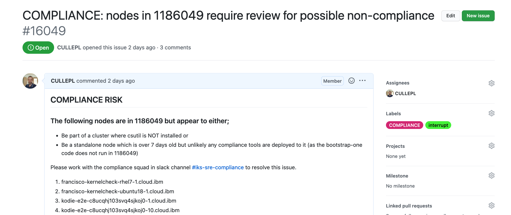

Informational
{: .label }

# Devices check

## Overview

This runbook covers scenario where a possible non-compliant nodes are discovered in 
- `1186049 Dev Containers account` or 
- `1185207 Alchemy Production's Account`

## What the tooling checks

### 1185207 Alchemy Production's Account

This account is used for the `free/trial` offering - internally refered to as `patrols`
We are at risk if these patrols are not automatically cleared out, or if rogue machines/clusters are accidentally created in this account.

- Checks for patrols that have exceeded their month trial
- Checks for clusters that have been deployed here without csutil (Netint run their inquisition clusters here which reap patrols - this should be the only cluster in here)
- Alerts on any other rogue machines

If any machines exceed 31 days in age, they are flagged as a risk.
SRE should investigate the machine and work with netint to determine if the node should be in that account

### Dev Containers 1186049 

This account is used by a range of squads to perform development and test activities.  
It's usually used to create IKS/ROKS clusters to run tests or help develop new features. 

In order to remain compliant, all IKS / ROKS clusters created in our accounts should have csutil deployed to them.  Any other nodes (standalone nodes) should only exist for under 7 days as there is no conductors bootstrap available to apply the security/compliance tooling to non cluster nodes in this account.

This automation checks the devices in the latest version of [1186049 devices.csv file](https://github.ibm.com/alchemy-netint/network-source/blob/master/softlayer-data/Acct1186049/devices.csv) and will report on any it thinks could pose a compliance risk.

The criteria is as follows;

- Any nodes that appear to be IKS/ROKS cluster worker nodes which are part of a cluster which does not have csutil installed.
- Any nodes that are non-cluster worker nodes that are > 7 days in age

The tooling ignores
- VIPs
- Vyatta machines
- machines with a cancellation ticket open (Baremetals can take a while to cancel)

## Detailed Information

The SRE squad will typically be informed of such a problem by a new GHE in the [team repository](https://github.ibm.com/alchemy-conductors/team/issues)

The squad should then review the nodes and take appropriate actions to resolve the compliance risk.

## Actions to take if nodes are found

### For 1185207 Alchemy Production's Account

Review the list of nodes in the generated GHE

If they contain worker node style nodes (`kube-<clusterid>`)then either;

-  `inquistion` code has not cleared out this node/trial cluster.
- Someone in our tribe as incorrectly created a test cluster in this account and it needs removing

In slack, use [armada-xo channel]() to look up the cluster details associated with the node - use these details to work out what scenario has been hit and work with SRE/Netint to get the cluster removed.

### For 1186049 Dev Containers:

Review the list of nodes in the generated GHE.  
If they contain worker node style nodes (`kube-<clusterid>` or `test-<clusterid>`) then the likelihood is a cluster has not had csutil deployed. 

The [cluster check jenkins job](https://alchemy-conductors-jenkins.swg-devops.com/job/Conductors/job/Security-Compliance/job/check-non-prod-clusters-csutil-status/) created by the compliance automation team has likely spotted this already and raised GHEs for squads to action.  
The [find-non-prod-csutil-open-ghe-issues jenkins job](https://alchemy-conductors-jenkins.swg-devops.com/job/Conductors/job/Security-Compliance/job/find-non-prod-csutil-open-ghe-issues/) reports csutil issues to the compliance squad.

The output from [find-non-prod-csutil-open-ghe-issues](https://alchemy-conductors-jenkins.swg-devops.com/job/Conductors/job/Security-Compliance/view/csutil%20non-production%20compliance%20automation/job/find-non-prod-csutil-open-ghe-issues/) in jenkins will indicate whether GHEs are already open to chase development on clusters which are missing csutil.  If there are any issues listed here, please follow this up with the cluster owner (if that can be determined) or with the compliance squad.

This section is constantly evolving but the first steps to the investigation is to try and determine who/what might have created these nodes.  The key here is we need to find the owner and get them to clean-up the nodes created, and ensure that they do not leave non-compliant nodes around in future.

Worker nodes are part of a cluster might be able to be linked back to squad if the cluster name has clues (i.e. `bts` is generally used by the bootstrap squad)

Stand alone nodes can be queried by the slcli using one of two commands (This will require Classic Infrastructure access to run this against 1186049)

- `slcli hardware detail <machine name>` or
- `slcli virtual detail <machine name>`

This should output the userid used to provision the machine so can help lead you to the person/squad who can help clean up these nodes.

If any nodes are found, do take care deleting nodes.  If in doubt, check with your squad lead before removing any nodes.

Document all the actions taken in the GHE issue that was raised by the automation.

### For SRE team:

#### Follow the below steps for removing any nodes,
- Raise a train and identify the correct level of approval from [approval list box note](https://ibm.ent.box.com/notes/772700662990).

- Refer `Step 3: Delete VSI Resources` section  in the [runbook](https://pages.github.ibm.com/alchemy-conductors/documentation-pages/docs/runbooks/decomission_legacy_carrier.html) 

- Refer `Deprovisioning Steps` section  in the [runbook](https://pages.github.ibm.com/alchemy-conductors/documentation-pages/docs/runbooks/deprovision_machines.html)

- `Note:` The VSI with -btsstagebar- or bootstrap machines should not be following delete process.

#### Follow the below steps, when removing a node is not an option,
- Please check with your squad lead, also reach out to the owner of the cluster and request to make the node(s) compliant.
- Update all actions taken in the GHE issue and ensure that the nodes are compliant.

## Useful links

- The automation code is [here](https://github.ibm.com/alchemy-conductors/automation-team/blob/master/utils/cluster_checks/devicesCheck.py)
- The jenkins job which runs this process is [here](https://alchemy-conductors-jenkins.swg-devops.com/job/Conductors/job/Security-Compliance/job/check-iaas-compliance-status/)

## Escalation
If you are unsure what to do, or have exhausted all the invesigation steps detailed in this runbook, then reach out to the wider SRE squad for further help or post in the [#iks-sre-compliance](https://ibm-argonauts.slack.com/archives/C02HNQGGM8V)

Consider reaching out to the SRE Security Compliance Squad to help investigate this further.

If you are unsure about running any of these steps, don't! Seek help and guidance.
