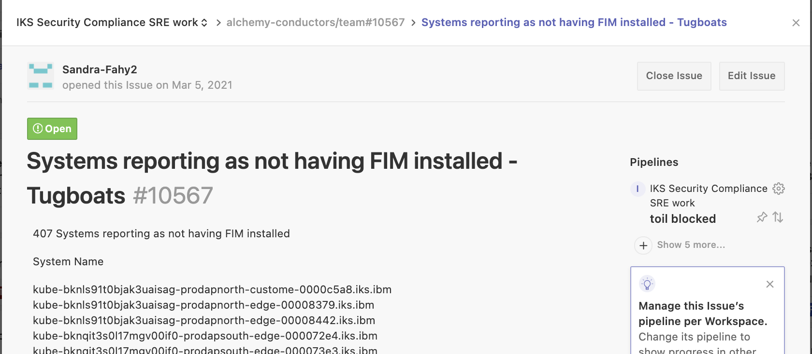

Informational
{: .label }

# Handling FIM issues

## Overview

This runbook covers scenario where machines are offline or report out of date in FIM

FIM is handled by Uptycs as of June 24.

FIM is installed as part of the conductors bootstrap on ALC servers, and as part of csutil deployment on IKS worker nodes (tugboat nodes/satellite nodes etc.)

## Detailed Information

SRE will typically be informed of such a problem by either;

- a new GHE in the [conductors team repository](https://github.ibm.com/alchemy-conductors/team/issues)
- A PD alert titled `10.3.4.5_has_change-tracker_pod_in_restart_loop`


The GHE will typically look like this

<a href="images/compliance_fim_issue.png">
</a>

### Common checks

Reasons we see machines listed as offline - go through the listed machines and check if any of these reasons are valid.  If they are, comment in the issue and no further actions are needed against machines which fall into any of these states.

1. The machine is powered off in IaaS ready to be cancelled.  
    - _Check conductors team tickets for references to the machine to validate this_

2. The machine has recently been cancelled
    - _Pass the machine to netmax bot and if nothing is returned it is likely the machine has recently been deleted/replaced_


### ALC checks

**NB**: ALC covers our control plane machines such as our carriers and infra servers.

**Uptycs Dashboard**
login to https://armada.uptycs.io/ui/dashboards/overview using your W3 login.  
[how to get access to Uptycs Dashboard](https://github.ibm.com/alchemy-conductors/team/wiki/Guide-for-Compliance-issues:-ALC-ALC_FR2--Patching-or-Local-Scan-Gaps#access-to-uptycs-dashboard)

From Dashboard left hand side icons select `Uptycs Extended Detection & Response` > `Assets & Insights`
Enter the machine name in the search. Is there a result? If yes, running `sudo systemctl restart osqueryd` on the offending machine will most likely fix the issue. if no, proceed to `Jenkins`

**Jenkins**

Run the [get compliance logs jenkins job](https://alchemy-conductors-jenkins.swg-devops.com/job/Conductors/job/Conductors-Infrastructure/view/Compliance/job/getComplianceLogs) selecting just the `UPTYCS` option.
    - _NB: You can pass multiple machine names to this job at once_

This will check the status of the Uptycs install and return the contents of `/var/log/osquery/osqueryd.worker.log`.  This log will show comms to armada.uptycs.io

If the log file is not found, this indicates that the machines bootstrap has failed to complete.  Investigate and re-run the bootstrap to install Uptycs.

If the machine is unreachable, then investigate further. As per the section above, has the machine been powered off ready for cancellation?  Or is the machine dead and needs a reboot/reload? 

Review `/var/log/osquery/osqueryd.worker.log` for any errors. Are 200's being returned between the machine and armada.uptycs.io? And are the entries recent? 

**Escalation**

Quick support can be found via slack [edr-support](https://ibm.enterprise.slack.com/archives/CKZ7TFA78)

If errors continue to occur for the node, raise an SOS Ticket asking for assistance debugging the problem.

### Other issues

If any other errors are occurring, then you will need to raise an issue with SOS - see section below


### ARMADA checks

Tugboat / Satellite workers are harder to validate as we don't have direct SSH access to the servers.  This is a guide for the checks made by myself recently, when debugging these tickets.

Two common issues are usually observed.

#### Many restarts of the change-tracker pod and FIM reporting out of date

- If alerted via a PD, use the included prometheus link to view more details about the node and number of restarts

- If informed via a GHE, use `chlorine` lookup to find the tugboat having issues and open prometheus for the tugboat via the [conductors dashboard](https://alchemy-dashboard.containers.cloud.ibm.com/) and use this query to view the nodes having issues with FIM installs looping.  The query to run is:  
`(kube_pod_container_status_restarts_total{namespace="ibm-services-system", pod=~"change-tracker.*"} * on(namespace,pod) group_left(node) kube_pod_info{} > 100) and on(node) (kube_node_status_condition{condition="Ready",status="true"} == 1)`

- If prometheus cannot be reached, locate and login to the tugboat which is related to the node with the issue 

- Check the status of the `change-tracker` POD in the `ibm-services-system` namespace.
    - For example: `kubectl get po -n ibm-services-system  -owide | grep <IP OF NODE>`

- On the tugboat, check the pod status and review the logs.

- There may be many restarts (over 100) of the `change-tracker` pod. If you see `Previous install in progress` in the logs: attempt the following to clear the temporary file, and then restart the pod:
    ~~~
    export NODE=CHANGE_TRACKER_NODE_IP 
    kubectl get pod -n ibm-services-system -o wide | grep -w $NODE | grep change-tracker | awk '{print $1}' | xargs -L1 kubectl delete po -n ibm-services-system
    ~~~

- Other log entries might look like the following:

    ~~~
    --> Running transaction check
    ---> Package nnt-changetracker-gen7agent.noarch 115:7.0.0.39-115 will be installed
    ---> Package nnt-mono.x86_64 0:5.0.1.1-5 will be installed
    ---> Package sysdig.x86_64 0:0.26.7-1 will be installed
    --> Processing Dependency: dkms for package: sysdig-0.26.7-1.x86_64
    --> Processing Dependency: gcc for package: sysdig-0.26.7-1.x86_64
    --> Finished Dependency Resolution
    Error: Package: sysdig-0.26.7-1.x86_64 (/sysdig-0.26.7-x86_64)
            Requires: gcc
    Error: Package: sysdig-0.26.7-1.x86_64 (/sysdig-0.26.7-x86_64)
            Requires: dkms
    **********************************************************************
    yum can be configured to try to resolve such errors by temporarily enabling
    disabled repos and searching for missing dependencies.
    To enable this functionality please set 'notify_only=0' in /etc/yum/pluginconf.d/search-disabled-repos.conf
    **********************************************************************
    Error: Package: sysdig-0.26.7-1.x86_64 (/sysdig-0.26.7-x86_64)
            Requires: gcc
    Error: Package: sysdig-0.26.7-1.x86_64 (/sysdig-0.26.7-x86_64)
            Requires: dkms
    
    You could try using --skip-broken to work around the problem
    You could try running: rpm -Va --nofiles --nodigest
    2021-07-05 12:44:37 change-tracker-wfnsg Agent ID: fb7848ef-8312-58c1-84c4-23280eaf715a 
    2021-07-05 12:44:37 change-tracker-wfnsg Configure 
    nsenter: failed to execute /opt/nnt/gen7agent/configure-gen7agent.sh: No such file or directory
    2021-07-05 12:44:37 change-tracker-wfnsg Start service 
    Redirecting to /bin/systemctl restart nntgen7agent.service
    Failed to restart nntgen7agent.service: Unit not found.
    Unit nntgen7agent.service could not be found.
    2021-07-05 12:44:37 change-tracker-wfnsg <<<install_changetracker 
    ...wait_for_ever
    ~~~

- If the above steps to remove the temporary file and restart the pod didn't succeed, then reload the node using the `chlorine` bot in slack.

#### change-tracker pod running but FIM reporting offline

This usually happens when there is a broken connection between the machine and FIM server for several weeks and the machine gets marked as deleted by FIM.

This needs SOS FIM team to fix but SRE need to gather logs from the node to pass back to FIM.

The following commands should be used to gather debug to pass back to SOS FIM team.

```
export POD=<pod name>
# Get rolling-log from pod 
kubectl -n ibm-services-system exec -t $POD cmd get-logs
# Check FIM Agent Connectivity:
kubectl -n ibm-services-system exec -t $POD cmd check-connect
# Check if FIM service is alive:
kubectl -n ibm-services-system exec -t $POD cmd alive
# Get HubDetails.xml:
kubectl -n ibm-services-system exec -t $POD cmd get-config
```

Or alternatively, use the [armada-run-commands-on-workers runbook](./armada/armada-run-commands-on-workers.html) to access the worker node and review  `/var/nnt/gen7agent.service/rolling-log.txt` 

If there are errors in the `/var/nnt/gen7agent.service/rolling-log.txt` log then an SOS ticket is likely required to help us understand the correct actions to address the problem - see below for details

### Reload the node

The majority of issues are resolved by reloading the node - certainly, this is the case for ARMADA nodes and carrier worker nodes, so consider this as an initial first fix for that node type.

This isn't usually the case for other ALC nodes, (i.e. masters / infrastructure / ha-proxy), so **DO NOT** revert to reloading non-carrier worker nodes, instead, collect the logs and raise an SOS ticket to ask for further guidance.

## Raising an SOS ticket

- Go to [SOS ticket portal](https://ibm.service-now.com/nav_to.do?uri=%2Fsn_vul_sos_service_request_list.do%3Fsysparm_query%3Dactive%3Dtrue%5EEQ%26sysparm_userpref_module%3D0e6f99efdb384c10c717e9ec0b96194f%26sysparm_clear_stack%3Dtrue)
- Raise a ticket against `SOS FIM`
- Severity 2
- Add details about the server and attach `/var/nnt/gen7agent.service/rolling-log.txt` log output and any other relevant details

## Escalation

If you are unsure what to do, or have exhausted all the invesigation steps detailed in this runbook, then reach out to the wider SRE squad for further help.

Consider reaching out to the SRE Security Compliance Lead to help investigate this further.

If you are unsure about running any of these steps, don't! Seek help and guidance.
