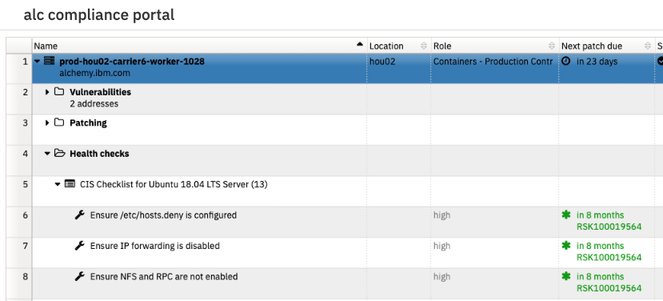
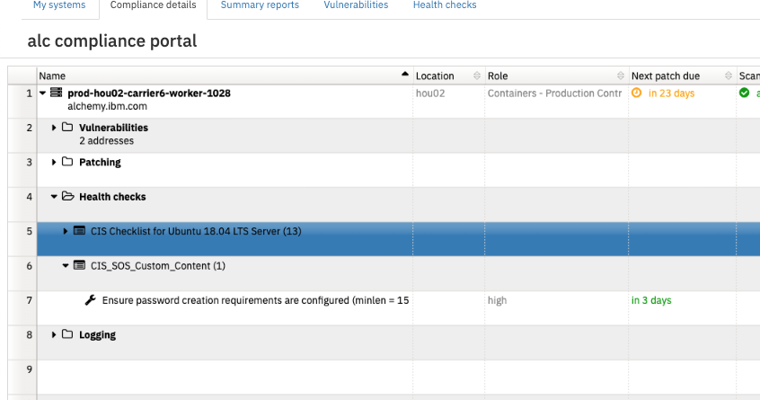
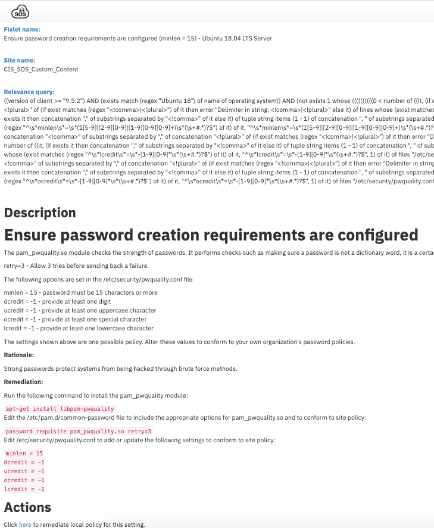

Troubleshooting
{: .label .label-red}

# GAP Alert - No Bigfix healthcheck results

## Overview

This runbook details how to deal with SOS reporting that a machine has a healthcheck score below 100%.

## Background

As part of security compliance of Armada systems, it is a requirement that SOS Bigfix is installed.  This is a tool which applied either to `kube` machines via the `csutil` tool, or all other machines, via the `condutors-bootstrap` process.

This check will report any systems which are registered under ALC c_code which are reporting a healthcheck score below 100%.

The GHE issues and any alerts for this process are generated in this [jenkins job](https://alchemy-conductors-jenkins.swg-devops.com/view/Conductors/job/Conductors/job/Security-Compliance/job/compliance-bigfix-health-check-score-below-100/)

## Example alert(s)

A GHE issue will be created in [github alchemy-conductors/team](https://github.ibm.com/alchemy-conductors/team) titled `GAP ALERT - XX - machines with Bigfix healthcheck score below 100% ` where `XX` is the number of machines.

No pagerduty alerts are generated by this monitoring.

## Typical reasons why healthchecks are reporting under 100%

1.  A healthcheck has changed criteria and the setting on our machines is no longer valid
1.  A machine has been reloaded and a bootstrap has not fully completed, therefore all settings are not correct.
1.  A process has been run against a machine, or someone has manually changed the settings on a machine causing healthchecks to fail.
1.  A new healthcheck has been released and our settings are incorrect.

## Investigation and Action

Navigate to [SOS Compliance portal for ALC](https://w3.sos.ibm.com/inventory.nsf/compliance_portal.xsp?c_code=alc)

Find the machine with the issue  
_NB: Use the search box in the top right corner_
_NB: If you do not have access, speak to your SRE lead - AccessHub request will be required to gain access to this_

Expand the twisty next to the machine and expand the twisties against `Healthchecks` and the sections within.  
Ignore any healthchecks which have risks associated with them  
_i.e. `in 8 months RSK100019564`  
_This means that the Security and Compliance squad have reviewed this healthcheck and have decided the problem does not need remediating._

For any healthchecks which do not have a risk associated with them, further investigation is needed.  

Double click on the healthcheck to discover more details on the healthcheck  

All hardening of machines is performed in the bootstrap process.  
Review the bootstrap code in the following repositories to determine if this is enforced.  

- [bootstrap-one GHE](https://github.ibm.com/alchemy-conductors/bootstrap-one)

Depending what is discovered, take one or more of the actions detailed below.

### Healthcheck criteria change example

_For the above mentioned `Ensure password creation requirements are configured (minlen = 15) - Ubuntu 18.04 LTS Server` healthcheck failure_

The healthcheck has failed because `minlen = 15` is incorrect on this server  
A review of the bootstrap code shows it is being enforced [here](https://github.ibm.com/alchemy-conductors/bootstrap-one/blob/f7662a3cbbfd866a63a5be537d47d4687ea99731/playbooks/roles/login-security/tasks/pam.yml) with the value being set in variables [here](https://github.ibm.com/alchemy-conductors/bootstrap-one/blob/20a5de510563620f7e1ae74c516126ec7cfa9153/playbooks/roles/login-security/vars/main.yml) however, it was being set to `14` causing this healthcheck failure.

In this instance, the following steps should be followed:

1.  Raise an issue in the  [bootstrap-one GHE](https://github.ibm.com/alchemy-conductors/bootstrap-one) describing the problem.
1.  If you can, issue a PR against the bootstrap code to correct the failing healthcheck.
1.  Inform the US SRE Squad in [#conductors-bootstrap](https://ibm-argonauts.slack.com/messages/CCFDY4HDZ) who can then review the issue and get the code promoted through the environments to fix the healthcheck.

### Brand new healthcheck

If the healthcheck cannot be found in the bootstrap repositories, then raise a GHE issue in [bootstrap-one GHE](https://github.ibm.com/alchemy-conductors/bootstrap-one) referencing the conductors team ticket where the failures are being reported and ask for the healthcheck to be added.

Post to [#conductors-bootstrap](https://ibm-argonauts.slack.com/messages/CCFDY4HDZ) channel details of the issue.

### Machine is reporting failures for healthchecks that exist

If you can see the healthchecks in the bootstrap code, but the settings on the machine are incorrect, execute a bootstrap against the server in question.  
It is possible that something/someone has inadvertantly changed these settings.  A weekly automatic bootstrap should take care of this, or, you could re-run the `bootstrap_weekly` set of playbooks using [the bootstrap jenkins job](https://alchemy-conductors-jenkins.swg-devops.com/job/Conductors/job/Conductors-Infrastructure/job/alchemy-bootstrap/)

### Handling the team ticket

If you believe you have corrected the issue, then close out the team ticket(s) created.  

### Escalation

If you have exhausted all of the lines of investigation, then consult with the SRE leads what to do next.

## Escalation Policy

[Conductors](https://ibm.pagerduty.com/escalation_policies#PZRV4HB)
