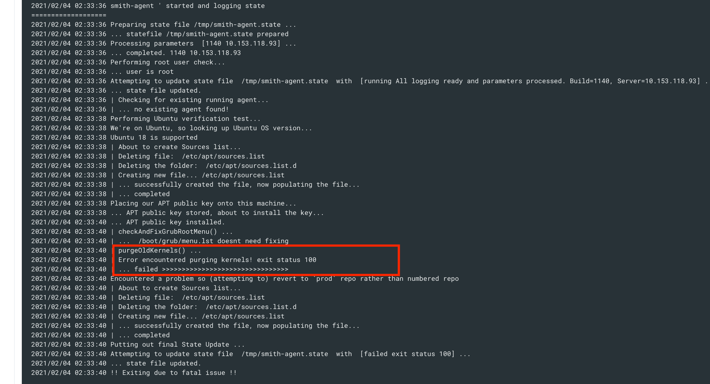
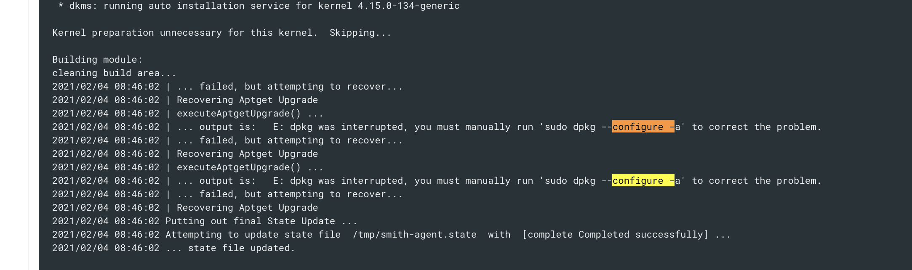

Informational
{: .label }

# Handling GHE compliance issue: Ensure permissions on bootloader config are configured failing health check

## Overview

SRE are sometimes alerted to this healthcheck failing on some machines.  

This healthcheck ensures that the `/boot/grub/grub.cfg` are set to `0400`

The usual reason this healthcheck starts reporting a failure is because a `smith patching` run has failed to complete successfully and has left this file with incorrect permissions.

When anything to do with kernels is changed on a node, this file gets re-generated by the system, but gets created with `0444` permissions.  The `smith` patching process (smith-agent code) should correct this at the end of its execution, however, if the patching process fails during execution, then the code to change permissions is not run.

The most common issues are, `purge old kernels` code is run, which removes any old kernels and causes `/boot/grub/grub.cfg` to be regenerated, but the patch process fails with an apt error meaning smith never corrects the file permissions on exit.

Follow this runbook to debug the problem further and fix.

## Detailed Information

First, gather data about the machines failing this healthcheck

Execute this [jenkins job](https://alchemy-conductors-jenkins.swg-devops.com/view/Conductors/job/Conductors/job/Conductors-Infrastructure/view/Smith%20Patching/job/PatchFailedMachineHealthReport/) to gather patch related information about the servers which are reporting this healthcheck failure.  This will help determine the next steps

Once the job has complete, review the output to determine what actions to take

### Check the file permissions

Review the section titled: `--- SECTION : Showing /boot/grub/grub.cfg details`

If the permissions are `0400` then no further actions are required.  Update the ticket to state the permissions are now correct and move onto reviewing the next machine.

### Last patch failed to run

Review the section titled: `--- SECTION : Smith agent log [/opt/smith-agent.log]`

Typical errors are

- Error with `Error encountered purging kernels! exit status 100`

- Error with `dpkg`

- For the `dpkg` error, ssh to the server and execute the suggest command `sudo dpkg --configure -a`

- For the `purgeOldKernels` error, re-try a patch request for the server.

### Re-running patching

The patch process should be used to not only correct the permissions of these files, but as the patch process appears to have failed, a re-run will apply the latest patches.

- A patch request should be submitted via `chlorine` using this command:  
`smith-patch prod machines: <node name> outage:0`

### Unable to fix the problem?

For a carrier `worker` node, if these steps do not resolve the issues seen, the easiest solution for this case is to reload the node using `chlorine`.  This will reload and re-install the server and fixes most issues seen.

For other node types, i.e. `master` , `haproxy` and `infra`, then further debug why the apt commands are not working and if required, seek assistance from the wider SRE squad.
Reloads for these node types are not as simple and should be considered a last resort to fix this issue.

## Escalation

If you are unsure what to do, or have exhausted all the invesigation steps detailed in this runbook, then reach out to the wider SRE squad for further help.

If you are unsure about running any of these steps, don't! Seek help and guidance.