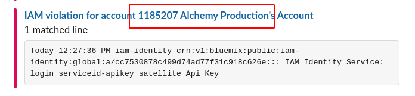
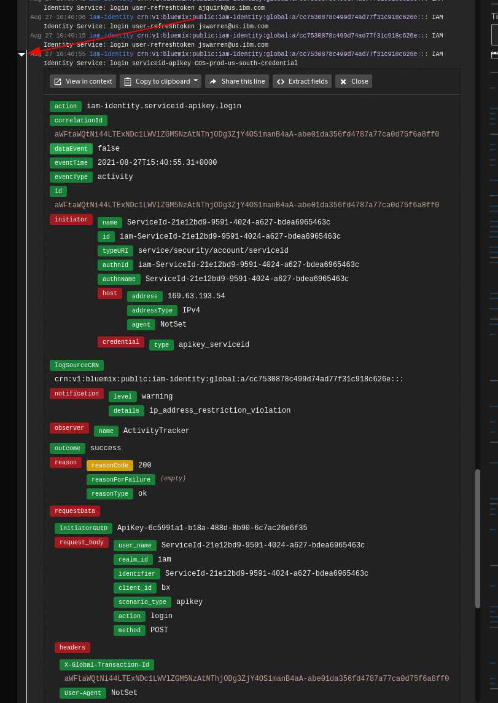
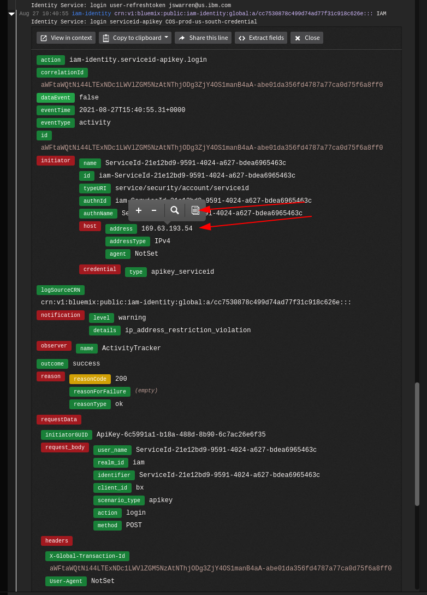

Informational
{: .label }

# Handling IAM account alerts for activity from IPs or subnets not allowed

## Overview

For fscloud, we are required to monitor IAM login activity to our production accounts.  We have [allow lists](https://github.ibm.com/alchemy-conductors/compliance-iam-account-allowlist/tree/master/addresses) defined for common services including Jenkins, Travis, Global Protect and more.  We also have lists that are automatically updated when the [network-source](https://github.ibm.com/alchemy-netint/network-source) repository is updated.

## Detailed information

There is a [Jenkins job](https://alchemy-conductors-jenkins.swg-devops.com/job/Conductors/job/Security-Compliance/job/compliance-iam-account-allowlist/) setup to apply/update or delete the IP/subnet allow lists from our various accounts.

Alerts are setup with Activity Tracker instances in Frankfurt (see https://ibm.box.com/s/rwdmnklew8iaf0i8e3ilbf16gefwj66j for more details).  In Activity Tracker, we created views specifically for `ip_address_restriction_violation` and configured alerting to Slack via webhook.  The steps are documented [here](https://github.ibm.com/alchemy-conductors/team/issues/10420#issuecomment-35008013).

## Handling an alert

Alerts are posted in the [sre-cfs-notifications](https://ibm-argonauts.slack.com/archives/G01MDB16W4A) channel.  There are alerts for different types of activity.

### login user-refreshtoken

These are actual users logged in from an IP that is not on the allow list.  These users should be using the Global Protect VPN or one of the OpenVPN servers with the default gateway feature set so they can access the production accounts without problems.  These are commonly used for access LogDNA or other dashboards.    An example alert will look like:

```
Today 12:26:17 PM iam-identity crn:v1:bluemix:public:iam-identity:global:a/47998ac029ed4ca69cf807338b7dbd2e::: IAM Identity Service: login user-refreshtoken example.user@ibm.com
```

### login serviceid-apikey

These are, in almost all cases, services using an API key to access the production account.  In this case we are to track down the source IP and find out if it needs to, or can be, added to the allow list.  An example alert looks like:

```
Today 12:27:52 PM iam-identity crn:v1:bluemix:public:iam-identity:global:a/cc7530878c499d74ad77f31c918c626e::: IAM Identity Service: login serviceid-apikey satellite Api Key
```

In order to track these down in more detail, you have to log in to the Activity Tracker instance specified in Slack.  You can find the account here:



We need to find the IP and determine if it's legitimate or not. IPs or subnets that are legitimate will need to be added to a new or existing [lst file](https://github.ibm.com/alchemy-conductors/compliance-iam-account-allowlist/tree/master/addresses).  Once that's done, we can re-run the [Jenkins job](https://alchemy-conductors-jenkins.swg-devops.com/job/Conductors/job/Security-Compliance/job/compliance-iam-account-allowlist/) using the `UPDATE` option.

If the IP is bad and not from a valid service, we need to work on replacing the API key.  That will involve coordination with the team who uses the API key, generating a new credential and then revoking the old credential once the new team is ready.

You can view the IAM event details in Activity Tracker for various alerts:



You can find the IP for the alert here:



## Escalation

If you are unsure what to do, or have exhausted all the invesigation steps detailed in this runbook, then reach out to the wider SRE squad for further help.
