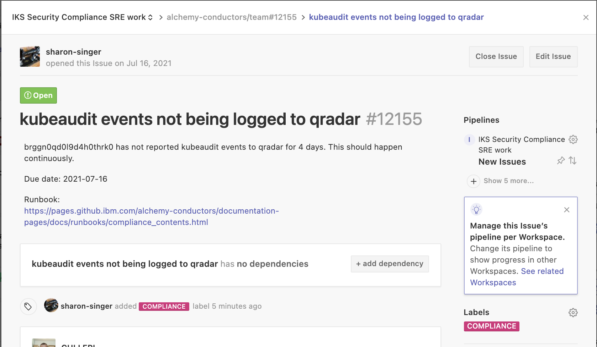

Informational
{: .label }

# Handling team tickets raised by the Compliance squad - kubeaudit event issues

## Overview

This runbook covers scenario where a tugboat has kubeaudit event issues.  

## Detailed Information

SRE will typically be informed of such a problem by a PD alert so we should have very few compliance tickets being raised for this.

If the problem does not get resolved by the interrupt pair, a GHE in the [conductors team repository](https://github.ibm.com/alchemy-conductors/team/issues) will typically look like this

### Addressing the issue

- Find details of the tugboat - use `lookup <clusterid>` in `chlorine-bot`

- Log into the tugboat with the issue - [tugboat login details are available here](./armada/armada-tugboats.html#access-the-tugboats)

- Query the `kubeauditlog` POD in `ibm-services-system` namespace.
    - `kubectl get po -n ibm-services-system -l app=kube-auditlog-forwarder`

~~~
[prod-dal10-carrier113] cullepl@prod-dal10-carrier2-worker-1056:~$ kubectl get po -n ibm-services-system -l app=kube-auditlog-forwarder
NAME                                       READY   STATUS                       RESTARTS   AGE
kube-auditlog-forwarder-565b6796f7-jl2gl   0/1     CreateContainerConfigError   0          3d12h
~~~

- If the POD is in a non-running state, then delete the POD so it restarts
   - `kubectl delete po -n ibm-services-system -l app=kube-auditlog-forwarder`

- Monitor the POD to verify it comes up into a running state.

- If the POD enters a running state, close out the GHE raised with details

- If the POD fails to start, then work with the SRE squad to investigate this further 
    - Grab POD logs
    - Describe POD
    - Work with SRE who have knowledge of csutil to investigate further

## Escalation

If you are unsure what to do, or have exhausted all the invesigation steps detailed in this runbook, then reach out to the wider SRE squad for further help.

Consider reaching out to the SRE Security Compliance Lead to help investigate this further.

If you are unsure about running any of these steps, don't! Seek help and guidance.
