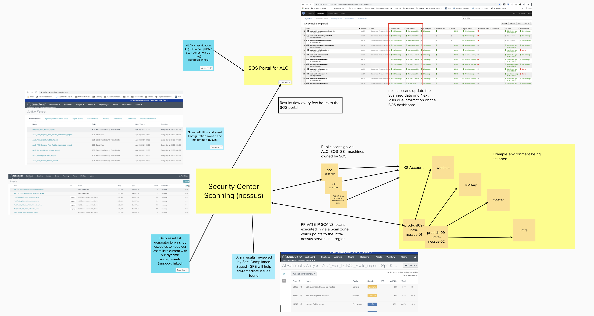

Informational
{: .label }

## Overview

This document details SRE use of Nessus and Security center

## Detailed information

These sections detail our use of the Nessus security scanning tooling provided by SOS

## Useful links

- [SOS Vulnerability scanning documentation]
- [SOS ticketing system]

## Scan types

We have two scan types that we run on a regular basis

- `CM7 all-ports scan` - also known as [Least functionality scan](https://pages.github.ibm.com/ibmcloud/Security/architectural_review/least-functionality.html)
- `Network vulnerability scanning` - [SOS Vulnerability scanning documentation]

## Architecture

The following diagram helps visualise the architecture we have in place to perform scans

Private (Backend and IPMI) addresses of our ALC/ALC_FR2 machines are scanned via SRE owned `infra-nessus` servers.  These are located in what are usually referred to as our main environments (Dal09/Lon02/Tok02).  We may also class this as `infrastructure` environments - where shared infrastructure is located to perform actions against machines across nearby geographical locations (i.e. Lon02 will be used for scanning European based machines too)
We do not spin up infrastructure machines everywhere due to costs, instead, we usually have a set of infrastructure machines that span several different geographical regions.

Our private scanners are located in the following regions, with details of which geographical locations they scan

- prod-dal09-infra-nessus - US South and br-sao
- prod-wdc06-infra-nessus - US East and ca-tor
- prod-lon02-infra-nessus - UK South and EU Central
- prod-tok02-infra-nessus - AP North, AP South, jp-osa
- prodfr2-par04-infra-nessus-01 - EU-FR2 region

One or more `infra-nessus` servers will be associated to scan zones in SOS security center (The SOS team administer this).

Scanzones can be viewed here:
- [ALC scanzones](https://w3.sos.ibm.com/inventory.nsf/security_center.xsp?c_code=alc)
- [ALC_FR2 scanzones](https://w3.sos.ibm.com/inventory.nsf/security_center.xsp?c_code=alc_fr2)

## Asset lists

We create asset lists in Security Center based on the machines we have in our IaaS accounts.  There is automation which updates the asset lists we have defined.
The asset lists are then used within a scan definition - these will be the machines targetted by the scan.

Asset lists are initially, manually, setup in Security center, but should never be manually maintained.

Asset lists should be named in a specific way

- `<environment>_<team>_<region>_<public or private>_Automated_Servers`

Details of the naming convention;
- `<environment>` has been set to something like, `Dev`, `Prestage` or `Prod`
- `<team>` - is sometimes used to show what squad/team a set of machines belongs to - we split out `registry` and `eu-fr2` from the `alc` machines this way.
- `<region>` is optional and depends whether the environment gets further split down into regional lists.  In production, we do this. For example, we set `AP` for all of the Asia Pacific machines which are scanned from the Tokyo scanner.
- `public` or `private` - this relates to whether the set of VLANs/IPs is for public or backend interfaces.

Some examples:
- `Dev_Private_Automated_Servers` - all Dev assets from 659397
- `Prod_AP_Private_Automated_Servers` - All AP Region assets to be scanned by the tok02 scanner

Asset lists should be populated using the following [asset list go code](https://github.ibm.com/alchemy-conductors/compliance-nessus-scan-asset-list-generator) and should **NOT** be manually maintained

## Scan definitions

### Public scanning
For public IP address vulnerability scanning, a single scan definition called `ALC_all_envs_public_import` exists.
For CM7 scanning, a single scan definition called `ALC_CM7_all_envs_public_import` exists.

These definition will target all ALC and Registry machines in a single execution.  The idea behind this is to then let the scan spread evenly across the available scanners in the public scan zone (ALC_SOS_SZ), rather than have many individual public scan definitions and having to manage when they all start across a 24 hour period.  Overlapping scans were causing many issues with firewalls which is why we moved to a single public scan definition.

We only ever had one public ALC_FR2 scan definition anyway - this is called `FR2_Prod_EU_Public_Automated_import` which also has a separate scan zone which means no clashing with ALC scans.

### Private scanning

We name our scans in the following way

- `<Offering>_<environment>_<scanner-location>_private_import`

- Offering will be set of `ALC`, `Registry` or `ALC_FR2`
- Environment will usually be set to `Dev`, `prestage`, `stage` or `prod`
- Scanner-location will be set to the datacenter where the scanner is located, i.e. `DAL09` - the location doesn't correspond to where the machines are, its the scanners location.

The scan definitions always need to end with `import` or the results of the scan will not be recorded in SOS and be visible on the [SOS Compliance Dashboard](https://w3.sos.ibm.com/inventory.nsf/compliance_portal.xsp?c_code=alc).

## infra-nessus server details

Details of how to order/reload/maintain [infra-nessus server can be found here](./sre_nessus_scanner.html) 

## Escalation Policy

There is no formal escalation policy.

Reach out to the IKS SRE Security Compliance Lead in one of the channels below to ask further questions

- `#conductors` if you are not a member of the SRE Squad.
- `#sre-cfs` or `#conductors-for-life`  if you are a member of the SRE squad (these are internal private channels

[SOS Vulnerability scanning documentation]: https://pages.github.ibm.com/SOSTeam/SOS-Docs/sca/Security-Vulnerability-Scanning.html
[SOS ticketing system]: https://ibm.service-now.com/nav_to.do?uri=%2Fsn_vul_sos_service_request_list.do%3Fsysparm_query%3Dactive%253Dtrue%255EEQ%26sysparm_userpref_module%3D0e6f99efdb384c10c717e9ec0b96194f%26sysparm_clear_stack%3Dtrue
