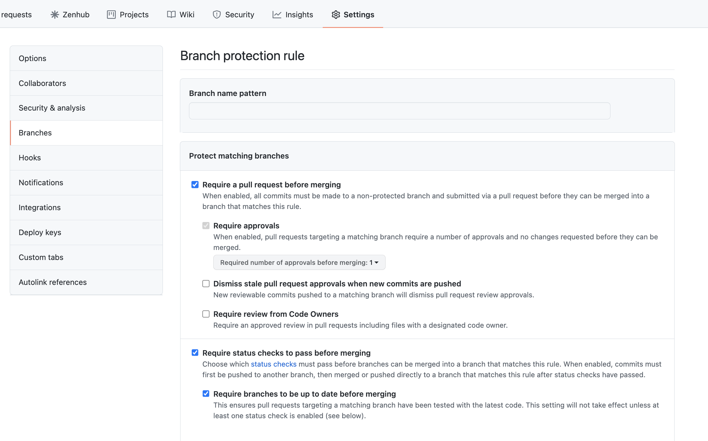

Informational
{: .label }

## Overview
This runbook holds information on how to set permissions for a new repo created in either `alchemy-conductors` or `alchemy-containers`

## Detailed Information

- The required branch protection rules for the repos are set in the config file [here](https://github.ibm.com/alchemy-conductors/git-inspector-config/blob/master/config.yaml). The following are the default protections which needs to be set for a repo

```
default-branch-protection-rules:
        prs:
          approving-reviews: 1
          dismiss-stale-approvals: ignore
          owner-review: ignore
        status-checks:
          allow-other-checks: true
          up-to-date: ignore
        include-admins: true
```

If for any reason you want to have a different set of protection for one or more repos, an exception can be specified in the config file under `exceptions`. The repo name should be specied between the symbols `^` and `$` example exception for `inventory-tools` repo shown below

```
description: Default with travis checks. No up to date branch
    match:
    - ^inventory-tools$
    branch-protection-rules:
    master:
        prs:
        approving-reviews: 1
        dismiss-stale-approvals: ignore
        status-checks:
        allow-other-checks: true
        up-to-date: ignore
        checks:
        - continuous-integration/travis-ci
        include-admins: true
```

- The branch protection can be set manually by going to repo `Settings -> Branches` and checking the required protections as shown below  
<a href="images/repo_protection.png">
</a>  

-  Or can be done using this [automation](https://alchemy-conductors-jenkins.swg-devops.com/job/Conductors/job/Security-Compliance/job/fix-repo-protection/). Refer to the
[documentation](https://github.ibm.com/alchemy-conductors/repo-protection) for more info


## Example alert
- `Alchemy-containers/conductors repo permissions checker failed <jenkins_output> <runbook_url>`
