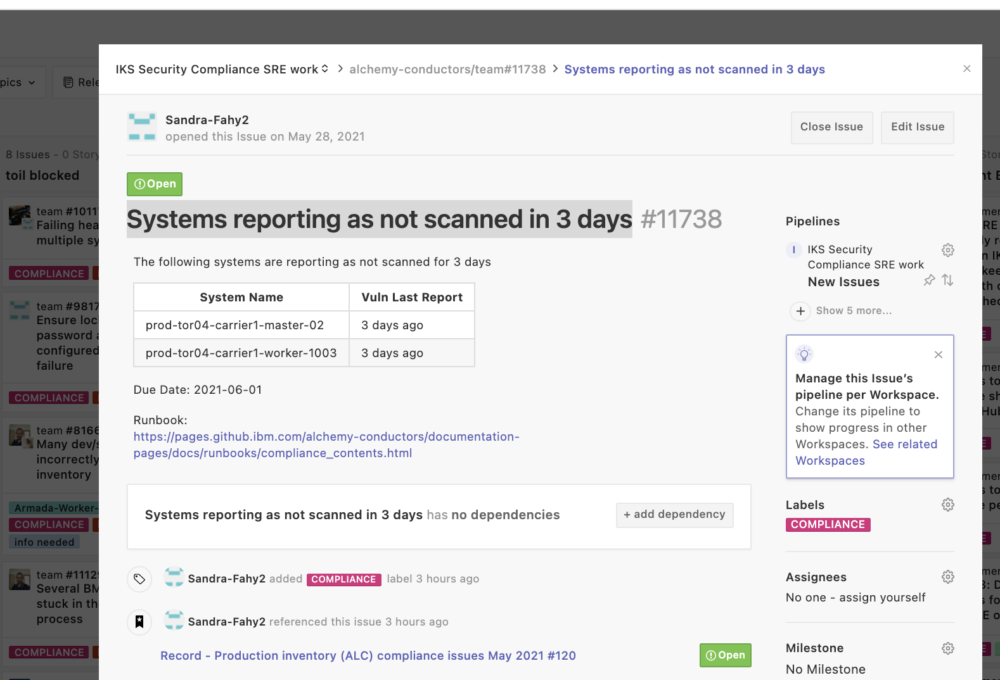
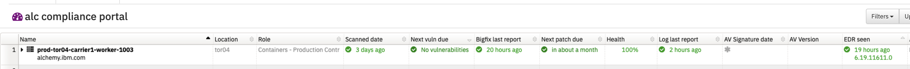
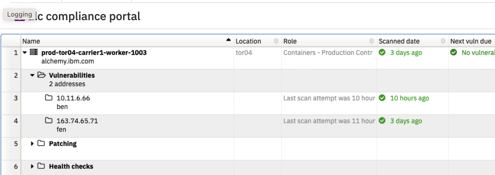
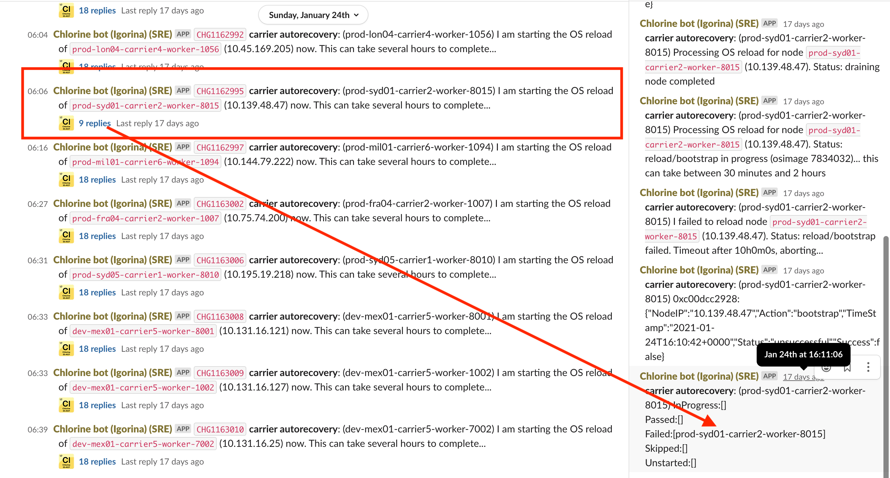

Informational
{: .label }

# Handling team tickets raised by the Compliance squad - machine has not been scanned for several days

## Overview

This runbook covers both our control plane and infrastructure machines (i.e. prod-dal10-carrier2-worker-8001 or prod-dal09-infra-apt-repo-mirror-01) and IKS/ROKS worker nodes in tugboats

All of our machines have get scanned by nessus and results published to the SOS dashboard

If a machine has not been scanned for vulnerabilities for several days, it means we are risking SOC2 compliance.

This runbook details how to investigate such issues, and take actions to resolve them.

## Detailed Information

SRE will typically be informed of such a problem by a new GHE in the [conductors team repository](https://github.ibm.com/alchemy-conductors/team/issues)

The GHE will typically look like this

## Review SOS

- Go to SOS ALC Compliance dashboard
    - [For ALC go here](https://w3.sos.ibm.com/inventory.nsf/compliance_portal.xsp?c_code=alc) - this is where all our control plane and infra machines report
    - [For ARMADA go here](https://w3.sos.ibm.com/inventory.nsf/compliance_portal.xsp?c_code=armada) - this is where tugboats and satellite reports can be viewed after csutil has been installed.

- Use the search box to find the machine

- Review all colums reporting compliance status of the machine as other problems on the machine may determine the next steps to take.

In the above example, all other compliance tools appear to be working - i.e. bigfix report is within the past 24 hours, last log report is within last few hours.
If other issues are seen, such as bigfix last report also being several days old, go to the next section

In this example, `scanned date` appears to be the only issue.
Expand the twisty next to the machine, then expand the twisty next to `Vulnerabilities`

This shows that the public IP has not been scanned for 3 days.

For ALC, the public scanning runs via SOS owned scan zones. All scanning for ARMADA goes through SOS owned devices. 

As a result, the best we can do at a first fix, is to reboot the devices as it's possible that these interfaces are troubled in some way.

Use `chlorine` to reboot, and ensure that the reboot completes end-to-end.

Update the team ticket with the actions you've taken.  To be able to verify if this has worked, you will have to check the SOS dashboard on the following day.  All our nessus vuln scans run overnight so results will not be immediate.

If the scan does fail to run on a further day, continue with the further debugging steps.

### Is the machine down?

If the node highlighted is a `carrier worker` node or an IKS worker node in a tugboat, then it's very likely that a previous automated reload via `chlorine` or jenkins has failed and SREs have not noticed this.

If the node is any other node type, e.g. `master`, `ha-proxy` or `infra` then skip this section as the automated reload process is not supported on these node types.

- In slack, search for the machine in `#bot-chlorine-logging` channel

- If no entries are found in `#bot-chlorine-logging` channel for this server at around the time when the machine stopped being scanned, continue with the remainder of this runbook.

- If you find an entry which is around the same time the machine stopped checking into bigfix, then review that entry to see if the reload was successful.  In this example, the GHE was raised by the compliance squad on 29th January, and bigfix last checked in 5 days previously (24th Jan), therefore, look for entries around that date. 

- If an entry is found (like above) and the reload failed (like above) then issue a new reload request via `chlorine` using the following command (including tugboats):  
    - `reload <node> ignoreconflict outage:0`
    NB: You can find tugboat names/details using `lookup <tugboat clusterid>` in chlorine.

- Add details to the team ticket and track the reload process to ensure it completes without error.  

- If the reload completes successfully, add a relevant comment and close the GHE - SOS takes several hours to be updated, the compliance team will verify status.

- If the reload fails, investigate further and work with SRE colleagues to get the machine back up.

### IPMI interface failing to scan

A common problem with baremetal servers is with their IPMI interface

The problem is likely to be a broken IPMI instance. Double check that the IP is not pingable from the appropriate nessus machine (see below), and if it is not pingable then raise a [IBM Infrastructure ticket](https://cloud.ibm.com/unifiedsupport/supportcenter).  Example request

~~~
Hi Support,
Our security scanner is currently unable to scan the IPMI interface of <machine>
We have seen many instances of this before and these issues have been previously resolved by refreshing the switch configuration for the IPMI and then verifying that the IPMI then responds correctly
Please can you action this asap
~~~

This should then resolve the problem with scanning and the next scheduled scan should work.

### Checking SOS security center

This step is only applicable for ALC machines (control plane and infrastructure)

- Navigate to [Security Center](https://w3sccv.sos.ibm.com/)

- Go to `Scans` -> `Scan Results`

- The scans are split by region - details of which scanner scans which regions is documented [in the nessus overview runbook](./compliance_nessus_overview.html)

- Open the scan results for the correct scan - i.e. public results if the public interface has failed to scan

- Search for the IP address of the machine which is failing to scan

- If the IP address is not found, seek assistance from the Security Compliance SRE lead as it is likely a configuration issue.

- If the IP address is found, it is likely that the scan attempt failed - this will be shown with a ping failure attempt for that IP.  If you see this, then a reboot or reload of the failing system will be needed or the scanner will continue to fail to scan the device.

### Further investigation

If reloads or reboots does not resolve the issue then here are some further pointers to other not so typical issues seen or other things that can be considered.

1. Request assistance from other SRE squad members.  Further examples of problems and how they were fixed should be added to this runbook if and when you find them!

2. Engage the SOS team.  See the [SOS docs for vuln scan](https://pages.github.ibm.com/SOSTeam/SOS-Docs/sca/Security-Vulnerability-Scanning.html) for details of this service and how to engage SOS.

## Escalation

If you are unsure what to do, or have exhausted all the invesigation steps detailed in this runbook, then reach out to the wider SRE squad for further help.

Consider reaching out to the SRE Security Compliance Lead to help investigate this further.

If you are unsure about running any of these steps, don't! Seek help and guidance.
