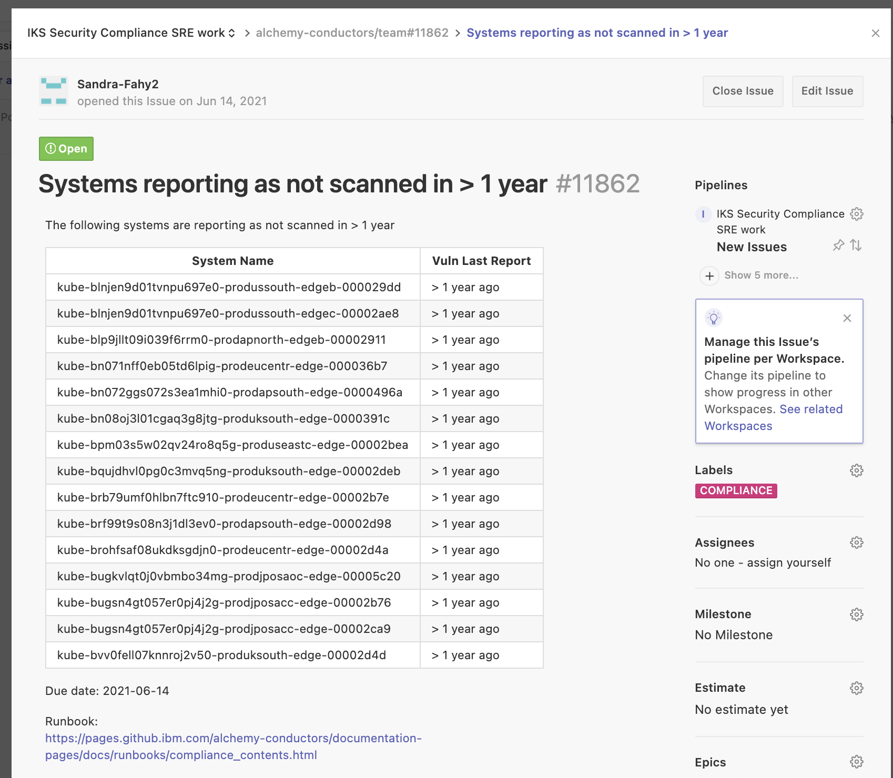

Informational
{: .label }

# Handling team tickets raised by the Compliance squad - machine has not been scanned for over a year

## Overview

This runbook covers scenario where a machine reports as not scanned for over a year

All of our machines have get scanned by nessus and results published to the SOS dashboard

If a machine has not been scanned for vulnerabilities, it means we are risking SOC2 compliance.

This runbook details how to investigate such issues, and take actions to resolve them.

## Detailed Information

SRE will typically be informed of such a problem by a new GHE in the [conductors team repository](https://github.ibm.com/alchemy-conductors/team/issues)

The GHE will typically look like this

### Review SOS

- Go to [SOS ALC Compliance dashboard](https://w3.sos.ibm.com/inventory.nsf/compliance_portal.xsp?c_code=alc)

- Use the search box to find the machine

- Expand the twistie next to the machine 

- Expand the twistie next to `vulnerabilities` to see which address has been reported as not scanned.

- Query the address in netmax

### If the address is a VIP or Gateway IP address 

If the address returned by netmax is not associated to the machine, i.e it is a VIP such as `prod-lon05-tugboat106-loadbalancer-vip` or `Gateway IP address for: prestage-mon01-firewall-vyattaha1-01` then this will need marking as n/a in the portal.

In this case, the SOS tooling, for some reason, has associated a VIP for the tugboat with this device.  These addresses do not get scanned so end up showing red in the portal.

Sometimes this error is corrected automatically by SOS but often not.

To apply a manual override so it no longer reports as a failure in the portal follow these steps.

1. Click on the address to highlight the row

2. Right click on the address and select `Add scan exclusion` 

3. Fill in the reason as `Address not associated with the machine` and click ok

### If no issues are reported

Sometimes, SOS sorts itself out and the addresses, such as VIPS and gateway IP addresses get de-associated from the machines automatically
If you find the machine, and it now reports green for vulnerabilities no actions are required.  

Update the GHE raised to state you've reviewed the machines and no issues were found.

## Escalation

If you are unsure what to do, or have exhausted all the invesigation steps detailed in this runbook, then reach out to the wider SRE squad for further help.

Consider reaching out to the SRE Security Compliance Lead to help investigate this further.

If you are unsure about running any of these steps, don't! Seek help and guidance.
