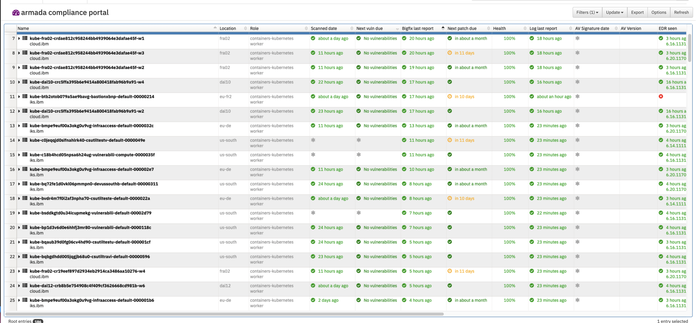

Informational
{: .label }

## Overview
The worker node versions on clusters in the following accounts get updated automatically every week.  This is executed by a Jenkins jobs

1. Alchemy Support account (278445) 
2. Dev containers (1186049)
3. Prod EU-FR2 (2051458)
4. Dev (659397)

## Limitations

1. This process will only reload IKS or ROKS worker nodes.

2. VPC worker replace is not supported - these nodes need manually actioning from the IBM Cloud UI or cmd line.

## Detailed information

SREs are responsible for keeping all of the SRE owned kube clusters in the above accounts up-to-date with worker node version updates.

The following Jenkins Jobs have been created to assist with this process and they execute automatically every Tuesday to check for worker node updates.

- [`worker-reloads-support-acct-278445`](https://alchemy-conductors-jenkins.swg-devops.com/job/Conductors/job/Conductors-Infrastructure/view/Compliance/job/worker-reloads-support-acct-278445/) 
- [`worker-reloads-devContaintersAccount-1186049`](https://alchemy-conductors-jenkins.swg-devops.com/job/Conductors/job/Conductors-Infrastructure/view/Compliance/job/worker-reloads-devContaintersAccount-1186049/)
- [`worker-reloads-iks-eufr2-prod-2051458`](https://alchemy-conductors-jenkins.swg-devops.com/job/Conductors/job/Conductors-Infrastructure/view/Compliance/job/worker-reloads-iks-eufr2-prod-2051458-SRE-clusters/)


### Reviewing worker node status

- Got to [SOS inventory for ARMADA](https://w3.sos.ibm.com/inventory.nsf/compliance_portal.xsp?c_code=armada)

- Filter by `Application` -> `containers-kubernetes`

- Sort by `Bigfix patch due` to show when patches are due.

Example screen shot

<a href="images/sos-armada-compliance-dashboard.png">
</a>


### GHE Code

Ghe Repo Link for source code - [cstuils-supportacct-updates](https://github.ibm.com/alchemy-conductors/cstuils-supportacct-updates)

### How it works

Jenkins job is written in a way that it triggers automatically on weekly basis.  It goes through all the clusters based on the account name set in the Jenkins job variable `ACCOUNT` - this should match a json file name in the GHE source.  i.e.

- [`278445 support account cluster info`](https://github.ibm.com/alchemy-conductors/cstuils-supportacct-updates/blob/master/SupportAccount.json)
- [`1186049 dev containers cluster info`](https://github.ibm.com/alchemy-conductors/cstuils-supportacct-updates/blob/master/devContainersAccount.json)
- [`2051458 eu-fr2 cluster info`](https://github.ibm.com/alchemy-conductors/cstuils-supportacct-updates/blob/master/eufr2Account.json)


Once update is completed for a cluster, it waits for all Containers in the Pods to come up. If they come up successfully it proceeds with next cluster or else it waits for 15 min for the containers to come up. If they dont come up, a pagerduy duty incident is raised with the failed cluster details in it.

### Managing the clusters SRE look after

These repos are designed to look after the long term clusters that the SRE squad own and have to look after and keep patched and compliant.  
Maintaining these repositories in the responsbility of SRE and any new clusters needing managing need to be added to the config.


An example entry in the account .json file:
```
    {
      "cluster_name": "bots",
      "pipeline_env": "prod",
      "region": "us-east",
      "crn_service_name": "containers-kubernetes",
      "cluster_id": "d34580e8ca3a47939515766ff7d9d515",
      "csutil_update": "auto",
      "worker_update": "auto"
    },
```

The values and options are as follows:
- `cluster_name` - Name of the cluster
- `pipeline_env` - `prod` or `stage` depending on what the cluster is used for, prod is only used for clusters that have access to production IKS environments 
- `region` - IKS region
- `crn_service_name` - the service name to register the cluster against, 
- `cluster_id` - numerical clusterid
- `csutil_update` - auto or manual - depends whether you want automation to re-install csutil or not - usually set it to auto unless the cluster is part of csutil development then it might be set to manual and the owner will need to manually manage the csutil insall.
- `worker_update` - these config files are also used to reload worker nodes.  Set to auto or manual depending whether automation should manage the worker reloads.


### Running the jenkins jobs manually

Jenkins job can also be triggered manually by providing cluster id parameter. In that case it updates csutils only on provided cluster id.

## Escalation Policy

Reach out to the IKS SRE Security Compliance Lead if you have any issues with this process