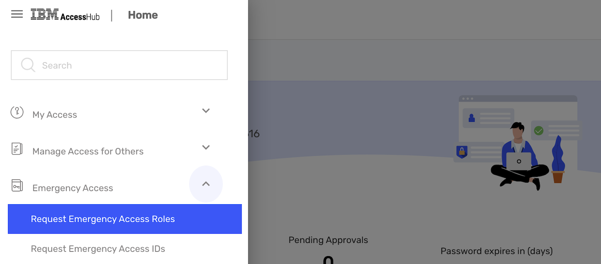
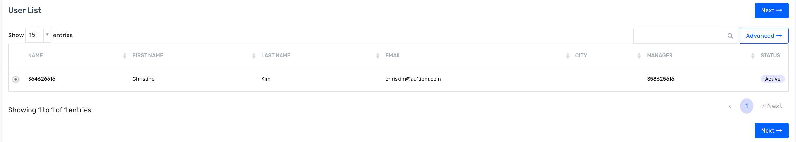
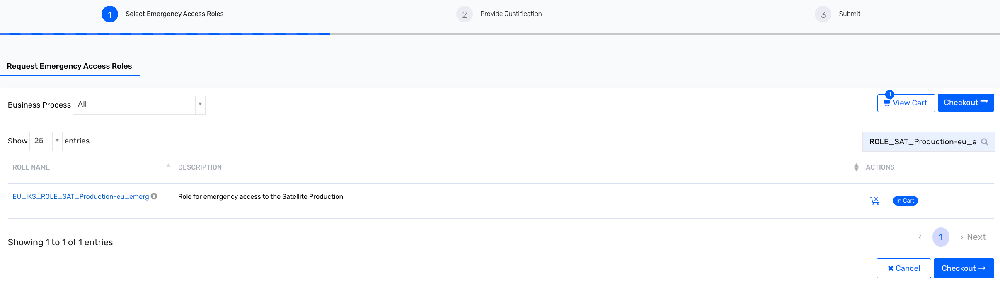

Ops
{: .label .label-green}

## Overview

The EU Managed Cloud requires that there is no access by IBM to client-owned
data from *outside* of the EU.

Non-EU engineers (including non-EU conductors) will not have access to: 

## Detailed Information

The systems and credentials for EU Managed cloud environments are restricted
to only be accessible by engineers located in the EU. 
Separate AccessHub groups are used to restrict access to these machines.
In an emergency there are two alternatives for gaining access. 
See Detailed Procedure below.

## Detailed Procedure
 

Two alternatives for access are available:

- Use Chlorine commands including `interactive` mode.
- Request an exception for emergency access to allow non-EU engineers access
  to the restricted EU Managed Cloud machines.

## Chlorine

Chlorine has the capability to assist with troubleshooting EU hosts.

Using the `interactive` mode, a user can run specific `kubectl`, `kubx-kubectl`, docker, `service`, `netstat`, `calicoctl` and some other commands which don't expose customer data.

Interactive mode requires [prod-trains](https://ibm-argonauts.slack.com/messages/C529CCTTQ) approval and opens up a 30 minute session for the user to fix the issue.

Syntax required: `interactive <machine> outage:<outage duration>`  
_To get more detais, use:_  
_`help interactive`_

After submitting a command and when your train is approved, you will get a variety of commands able to be run.

**NB.** You can only have access to **one host at a time** and each subsequent machine request requires a unique prod-train approval.

Access will expire after 30 minutes, and can be ended early running:  
`interactive stop`

If you cannot run the desired command, then it is either restricted or not implemented correctly  
_(if the latter, please raise an [issue](https://github.ibm.com/sre-bots/sodium/issues) and continue to the next section.)_

Any commands that allow non-EU citizens access to EU client information are restricted, which is why the below are not permitted.

Restricted commands: `kubectl get secrets`, `kubectl get configmap`, `kubectl get nodes; sudo rm -rf /*` etc.

## Request EU emergency access for Satellite SRE

This can be used by SRE or development squad members.

Note - Once a user completes the below steps and access is granted, the access will be automatically removed by AccessHub after 9 hours. If access is required for more than 9 hours, you will need to go through the process again to request access after the initial 9 hours has lapsed.

**Request Steps Checklist**

- [ ] In case of revoked CBN, please refer to this [wiki](https://github.ibm.com/alchemy-conductors/team/wiki/Revoked-CBN-recovery) for recovery.
- [ ] Request an access in AccessHub
- [ ] Your ID is added to corresponding team in emerg group in https://github.ibm.com/orgs/argonauts-access/teams?query=emerg
- [ ] Execute Jenkins job to self-onboard the ID to IAM group in Cloudd account 

Steps:
1. In [AccessHub](https://ibm-support.saviyntcloud.com/ECM/workflowmanagement/requesthome) select `Emergency Access` -> `Request Emergency Access Roles` on the left side menu, or `Manage Emergency Access Roles` box menu.
   <a href="images/EU_access_AccessHub_menu.png"></a>

2. Select User in the User List, then `Next`.
   <a href="images/EU_access_AccessHub_user_selection.png"></a>

3. Search the emergency access role. (Example: for Satellite EU emergency access, search `ROLE_SAT_Production_eu_emerg`)
   <a href="images/EU_access_AccessHub_role_selection.png"></a>

4. For the group that you want temporary access, select the access role and `Add to Cart`, then `Checkout`. 

5. For each role, specify `START DATE` and `END DATE`, and write the business justification.
   <a href="images/EU_access_AccessHub_justification.png"></a>

6. Its mandatory to complete the business justification. The business justification for emergency access must follow the rules described in the Exception process - business justification page, otherwise the request will be rejected by the approvers. See details at: [https://pages.github.ibm.com/ibmcloud/Security/guidance/AccessHub-EUCloud-business-justification.html](https://pages.github.ibm.com/ibmcloud/Security/guidance/AccessHub-EUCloud-business-justification.html).

   AccessHub Business Justification - Template

   ```
   url:       <The URL of the Incident or Update, PD alert or Service Now>
   type:      <Incident or Update>
   id:        <The record ID  (from PageDuty, etc) of the Incident or Update>
   severity:  <The Type: the Incident (blocking or non-blocking) of CIE or Update (normal or emergency) of Customer Case >
   text:      <Incidents Only - Remove the text field if the request is for an Update - Business justification text. Copy and paste from one of the templates above and change your service or component.>
   ```

   Example
   ```
   url:       https://ibm-argonauts.slack.com/archives/C54G8PWUF/p1692282420010729
   type:      Update
   id:        CS3523754
   severity:  Emergency
   text:      BNPP is experiencing an outage and as the SRE on call I need access to the environment to assist with recovery.
   ```

7. Finally select `Submit`, the request will be sent to the EU Approver team. If you have any questions on the request you can contact them in Slack on [#eu-emerg-approvers](https://ibm-argonauts.slack.com/archives/C7MCSQ7C3).

8. Check #eu-emerg-approvers to see the status of AccessHub request
9. Check GHE group to confirm you are added to ROLE_IKS_<request role>_eu_emeg
10. Run Jenkins Job based on role 
  
    1. **ROLE_SAT_Production_eu_emerg**
  
    You can see you were added to the [git team](https://github.ibm.com/orgs/argonauts-access/teams/role_sat_production-eu_emerg/members). 
    Run the Jenkins job [satellite-eu-de-all-eu-emergency](https://alchemy-conductors-jenkins.swg-devops.com/job/Conductors/job/Security-Compliance/job/eu_emergency_access/job/satellite-eu-de-all-eu-emergency/). This will grant you the correct IAM access. Ensure that `SAVE_REPORT_TO_GHE` is set to true.

  
{{ eu_cloud_procedure }}

## Break glass
In case of PAG outage or access issues please refer to the [break the glass runbook](https://pages.github.ibm.com/alchemy-conductors/documentation-pages/docs/runbooks/pag/pag_break_the_glass_scenarios.html)

## Automation

To avoid needed to page out the EU SRE squad please use the following tools:

- Jenkins or Razee for deploys and redeploys
- Chlorine
