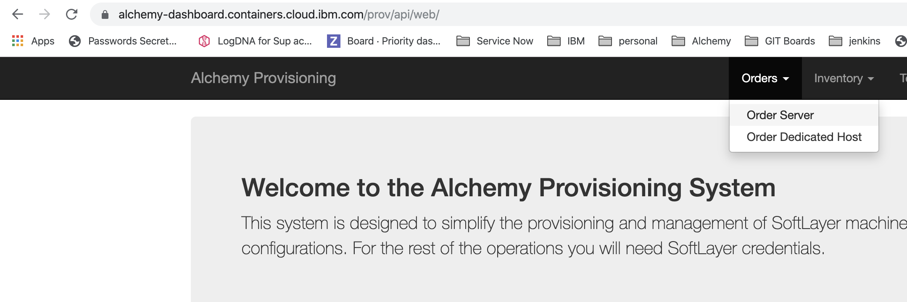
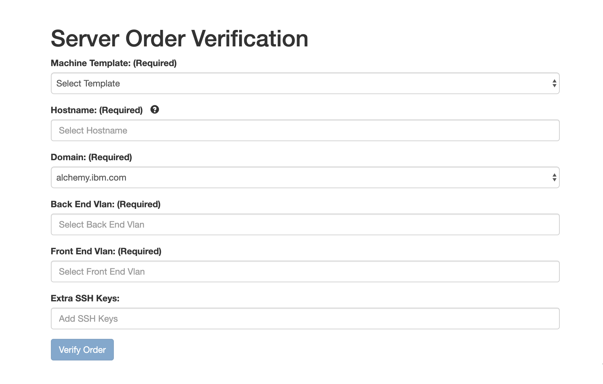
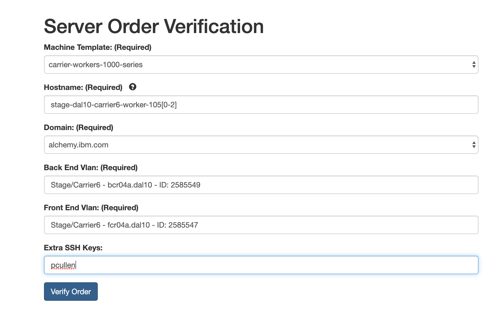
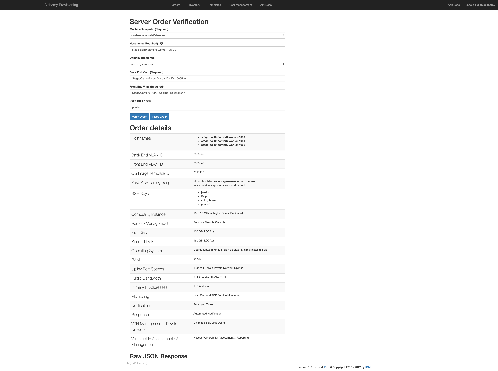
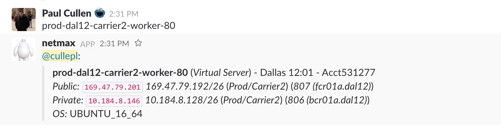
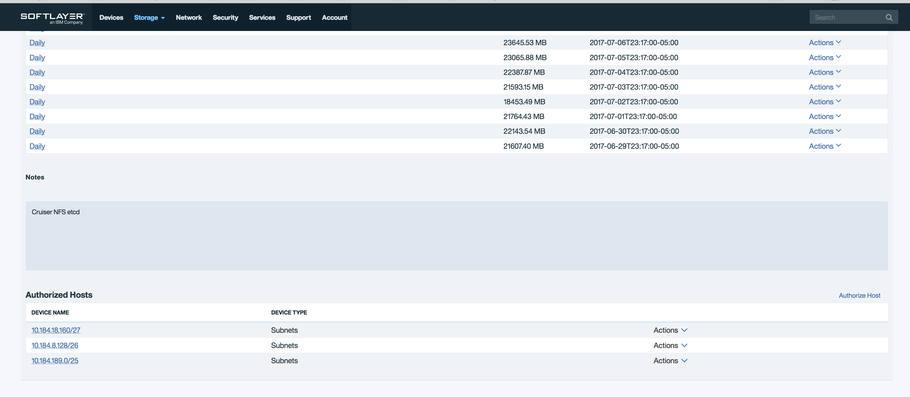

Informational
{: .label }

## Overview

This runbook details the list of extra steps needed to order carrier worker machines.  
We order our worker nodes via the [provisioning app]

An approved [Conductors team ticket](https://github.ibm.com/alchemy-conductors/team/issues) should exist for every machine order.  If one does not exist, then please do not continue with the order.  
All orders cost the department money.  These all need approval from one of the SRE leads or management team.

## Detailed Information

Please be extremely careful when ordering carrier worker nodes as many mistakes have been made in the past.  
This runbook was last updated in November 2019.

### Which templates to use

Templates are stored in the [provisioning app] under `Templates -> Full List`

We use templates to order the different machine types

The following runbook contains the current list we use to [order carrirer worker nodes](./sl_provisioning.html#provisioning-machines-needed-for-a-carrier)

### Ordering a machine

- Navigate to the [provisioning app] and login with the API key for the IBM Cloud Infrastructure account where the nodes are to be ordered.

- Once logged in, select `Orders -> Order Server`

- A blank order page will be displayed

- The GHE accompanying this request should contain all of the details about what machine to order.  Here is an example order.
  - `Template` - Select the appropriate template from the drop down list
  - `Hostname` - Fill in the hostname - you can order multiple of the same type at once using the `[]` wildcard option.  For example: `stage-dal10-carrier6-worker-105[0-2]` would allow you to order 3 servers named `stage-dal10-carrier6-worker-1050 to stage-dal10-carrier6-worker-1052`.
  - `Domain` - leave as default
  - `Backend VLAN` - For carrier worker nodes, use the auto completion to find the correct VLAN - _NB: be careful when selecting the VLAN as it needs to match where the machine is intended to be located_ 
  - `Frontside VLAN`  - For carrier worker nodes, use the auto completion to find the correct VLAN - _NB: be careful when selecting the VLAN as it needs to match where the machine is intended to be located_ 
  - `Extra SSH keys` - Add in any required keys

- Click `verify order` to validate the template.

- This should return an order summary.  Review this to ensure it will order the machines you are expecting it to on the correct VLANs 

- If correct, click `Place order` to submit the request to IBM Cloud Infrastructure.

- The order will take anywhere up to several hours to complete.  Orders can be tracked in the [IBM Cloud Classic Infrastructure] portal.

## Post actions

Once the order in [IBM Cloud Classic Infrastructure] is complete, follow these steps to complete the machine setup and get it deployed into a carrier.

### Verify bootstrap has completed

Once a machine has been provisioned by IBM Cloud Infrastructure, a post provision bootstrap should execute
Upon successful completion, a message will be posted to the [`#bootstrap-bot-alerts` slack channel](https://ibm-argonauts.slack.com/archives/C53PSDQUC)

Monitor this channel for a message.

If this message does not appear, consult the [debugging bootstrap failures documentation]

### Wait until armada-envs is updated

When adding a new machine, if it is being ordered to be part of an existing carrier, then we need to wait until the machine is up and running, and the relevant `carrier.workers` file is updated in [armada-envs GHE repo]

If after several hours of waiting, the machine still does not appear in the [armada-envs GHE repo], then speak to the armada-deploy squad in slack. Do not continue with any further steps until the machine can be found in the armada-envs repo.

### Patch the machine

Issue a [patch request](./sre_patching.html) for the newly ordered machine using the details in the linked runbook.

### Reboot the machine

Once the patch request completes successfully, log into the node and issue a reboot  
Use `sudo shutdown -r now` to complete a reboot.

This will reboot the machine and complete any patching requirements which require a system restart. (such as booting into a newly installed kernel)

###  Deploy Armada on the new machines

_*Important pre-req:*_  Before continuing with this step, ensure that the newly ordered machines appear in the relevant `<carrier>.hosts` file in the [armada-envs GHE repo]  
If the machine is not defined here, it will fail to deploy into the carrier.

Execute the [armada-carrier-deploy](https://alchemy-containers-jenkins.swg-devops.com/job/Containers-Runtime/job/armada-carrier-deploy/build?delay=0sec) jenkins job

    - Keep defaults for everything except for the fields below
    - Environment: select the desired environment from the drop down
    - Carrier: select the desired carrier number from the drop down
    - WORKERS: worker private IPs ordered from the previous step, comma-separated.
    - RUN_CARRIER_POSTCHECK: `checked`

### Authorizing subnets for NFS shares

If the new carrier workers end up on new subnets, the subnets must be authorized to use the required NFS shares.

To authorize the new subnet follow these steps:

1. Go to the SL portal then select `Storage` -> `File Storage`
1. Tip:  Use netmax to find the private subnet name where the host is located:

1. Filter on the location where you are allocating carrier workers
1. The armada carrier storage details can be found for the environment that the machines are being ordered for [here](https://github.ibm.com/alchemy-containers/armada-envs) - all these need to be checked to ensure the subnet these machines are on is listed as authorized.
1. Click on the volume name, and that page will include the currently authorized subnets.

1. Click on Authorize Host and select Subnets to add

## Escalation Policy

There is no formal escalation policy for this process.

SREs should work with; 
- IBM Cloud Infrastructure support if machine order problems are occurring. 
- Armada-deploy squad if deployment issues are occurring.
- SRE squad if bootstrap or patching issues are occurring.

[provisioning app]: https://alchemy-dashboard.containers.cloud.ibm.com/prov/api/web/
[armada-envs GHE repo]: https://github.ibm.com/alchemy-containers/armada-envs
[debuging bootstrap failures documentation]: https://github.ibm.com/alchemy-conductors/bootstrap-one/blob/master/README.md
[IBM Cloud Classic Infrastructure]: https://cloud.ibm.com/classic
