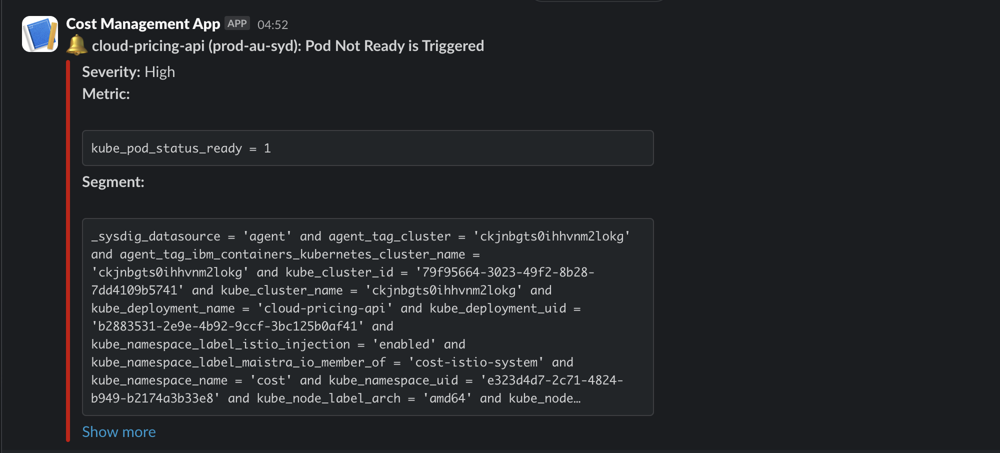

Alert
{: .label .label-purple}

## Overview

This runbook is used when a pod is not in a running state. The alert will appear in the Slack channel [`#cost-management-alerts`](https://ibm.enterprise.slack.com/archives/C066ZTSDN5S). The Slack alert will contain a link to Sysdig for more details.

There are a variety of reasons for pods to fail, so this runbook will describe general steps to narrow down a cause of the failure.

## Example Alerts



## Actions to Take

### Connection Errors

Check [IBM CLoud Logs](https://cloud.ibm.com/observability/logging), filtered by the `cost` namespace. Connection errors to external services such as Postgres can be resolved by restarting the pod.

Once the pod has successfully restarted, [make a test call to the graphQL API](../test-call-graphql-api.html) to ensure the service is running as expected.

### Configuration Errors

Configuration errors such as missing environment variables that a service needs can be resolved by updating the Helm chart for the subsystem and deploying the new configuration through the Cost Management CI. See [runbook for escalating to Cost Management SREs](../escalate-to-cost-management.html).

### Healthcheck Errors

Some errors may be specific to the subsystem due to a bug and will require the owners of the subsystem to investigate and recover. See [runbook for escalating to Cost Management SREs](../escalate-to-cost-management.html).

### Openshift Errors

Errors specific to OpenShift may require investigating services and operators, which may involve restarting worker nodes.

## Example Resolution

In the event of a `cloud-pricing-api (<REGION>): Pod Not Ready is Triggered` alert caused by the following error:

```
Unable to retrieve pull secret kube-system/bluemix-default-secret-international for kube-system/ibm-vpc-block-csi-controller-0 due to secret “bluemix-default-secret-international” not found. The image pull may not succeed.
```

It can be resolved by soft-rebooting the affected node in the cluster:

1. Identify the affected cluster. You will find the name of the cluster in the `body` > `segment` > `kubernetes.cluster.name` in the PagerDuty alert.
1. Identify the affected node. You can determine the affected node via LogDNA.
1. [Escalate to the Dreadnought SRE team](../../dreadnought/dn-escalation.html) for restarting worker nodes.

## Escalation Policy

[Escalate to Cost Management](../escalate-to-cost-management.html)

## Further Information

* [Cost Management internal team documentation](https://github.ibm.com/dataops/cost-management-docs-internal)
