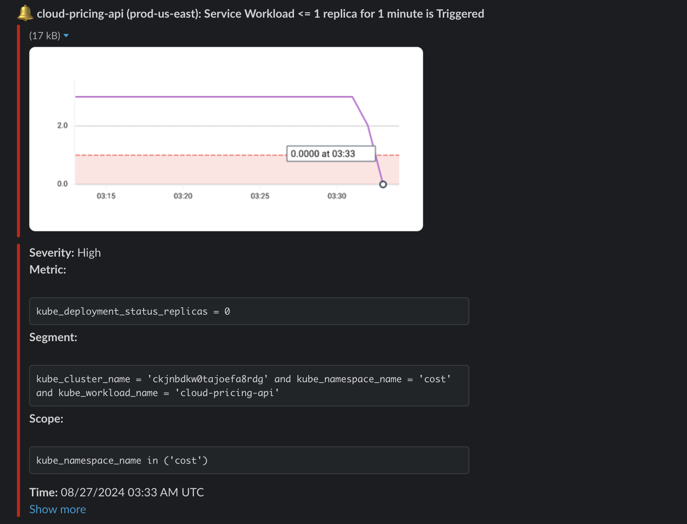

Alert
{: .label .label-purple}

## Overview

This runbook is used when the pod count is less than the target expected. The alert will appear in the Slack channel [`#cost-management-alerts`](https://ibm.enterprise.slack.com/archives/C066ZTSDN5S). The Slack alert will contain a link to Sysdig for more details.

## Example Alerts

## Actions to Take

1. Check whether there is a cluster update currently in progress. This information will be posted on Slack in channel [#dn-s-cpapi-extended-compliance-monitoring](https://ibm.enterprise.slack.com/archives/C06DEFEU21Z) or [#dreadnought-users](https://ibm.enterprise.slack.com/archives/C03G356K11N). If there is, then the error should resolve itself within ~15 minutes.
1. Check [IBM CLoud Logs](https://cloud.ibm.com/observability/logging), filtered by the `cost` namespace.
    * Connection errors to external services such as Postgres can be resolved by restarting the pod.
    * Once the pods have successfully restarted, test the corresponding endpoint by [making a test call to the graphQL API](../test-call-graphql-api.html) to ensure the service is running as expected.
1. If necessary, a [region can be taken out of rotation](../disable-region-cis.html) by escalating to the CPUX SRE team.
1. [Escalate to the Cost Management SRE team](../escalate-to-cost-management.html)

## Escalation Policy

[Escalate to Cost Management](../escalate-to-cost-management.html)

## Further Information

* [Cost Management internal team documentation](https://github.ibm.com/dataops/cost-management-docs-internal)
* [Dreadnought runbook on Low Service (cabin) workload pod counts](../../dreadnought/dn-service-workload-pods-low.html)
