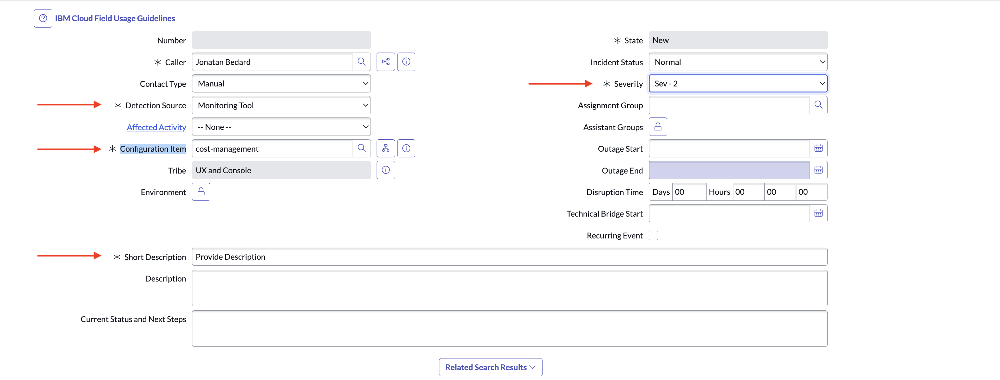

Ops
{: .label .label-green}

## Overview

If an issue with Cost Management is suspected or has occurred, there are various ways in which the Cost Management SRE team can be contacted.

## Detailed Information

An issue can be raised to Cost Management by either creating an incident on ServiceNow, on PagerDuty, or posting on the appropriate Slack channel.

## Detailed Procedure

### ServiceNow

1. Create a new incident in [ServiceNow](https://watson.service-now.com/now/nav/ui/classic/params/target/incident.do%3Fsys_id%3D-1%26sysparm_query%3Dactive%3Dtrue%26sysparm_stack%3Dincident_list.do%3Fsysparm_query%3Dactive%3Dtrue).
2. Fill in the mandatory fields:
  - `Detection Source`
  - `Configuration Item` = `cost-management`
  - `Severity`
    - `Sev-1`: For **Critical** customer impacting issues
    - `Sev-2`: For time-sensitive important issues; 8AM-6PM support (EST- daylight hours) 5 days a week.
  - `Short Description`
  

### PagerDuty

> Reserved for high-priority calls only

Create an incident against the [Cost Management PagerDuty team](https://ibm.pagerduty.com/service-directory/P9LM9ZI).

| Escalation Group                         | Sev   |
| ---------------------------------------- | ----- |
| `CPUX - Cost Management`                 | Sev-1 |
| `CPUX - Cost Management Escalation SEV2` | Sev-2 |

### Slack

Reach out to the Cost Management team on Slack channel [`#cost-management-issues`](https://ibm.enterprise.slack.com/archives/C04BG69V61Z). Ping `@cost-management-team`.

## Further Information

* [Cost Management internal team documentation](https://github.ibm.com/dataops/cost-management-docs-internal)