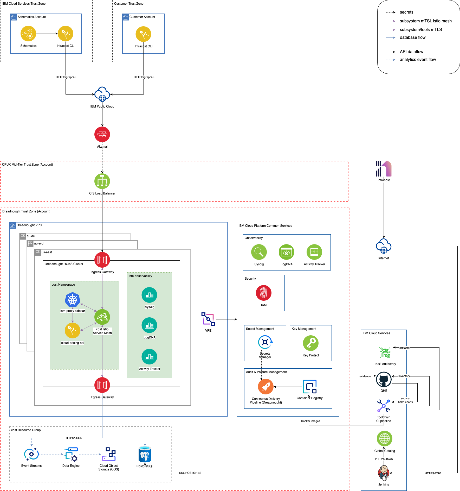

Informational
{: .label }

## Overview

The Cost Management service is responsible for providing a costs breakdown of all components using an IaC configuration in Terraform.

## Detailed Information

### Architecture

The service is comprised of a microservice that offers a graphQL API endpoint, a proxy that relies on IAM for authorization and routes to the microservice over the Istio service mesh, and a SaaS Postgres database, which contains pricing information scraped from Global Catalog. A failure with any of these components will result in a failed health check which will trigger fail over.

The Infracost CLI parses Terraform plan files for products and queries for pricing from the graphQL API mentioned previously.

### Team Members

| Name           | Slack Handle                                                      | Role           | Responsibilities                        |
| -------------- | ----------------------------------------------------------------- | -------------- | --------------------------------------- |
| Hilton Lem     | [@hlem](https://ibm.enterprise.slack.com/archives/D020EQCE7S6)    | Team Lead      | Infracost CLI, Pricing services, DevOps |
| Luisa Rojas    | [@luisa](https://ibm.enterprise.slack.com/team/U01KR7CMDFS)       | Developer      | Infracost CLI, DevOps                   |
| Yu Chin Koo    | [@Yu Chin Koo](https://ibm.enterprise.slack.com/team/U01HVBZNW3F) | Developer      | Pricing Services, DevOps                |
| Jonatan Bedard | [@Jo](https://ibm.enterprise.slack.com/team/U028PAJQVK3)          | Security Focal |                                         |
| Nathalie Masse | [@nmasse](https://ibm.enterprise.slack.com/team/W4EBQMEN8)        | Manager        |                                         |

## Further Information

* [Escalate to Cost Management SRE](./escalate-to-cost-management.html)
* [TRI](https://github.ibm.com/ibmcloud/CostEstimation/blob/master/Architecture/TRI-PlatformNext.md)
* [Cost Management internal team documentation](https://github.ibm.com/dataops/cost-management-docs-internal)
