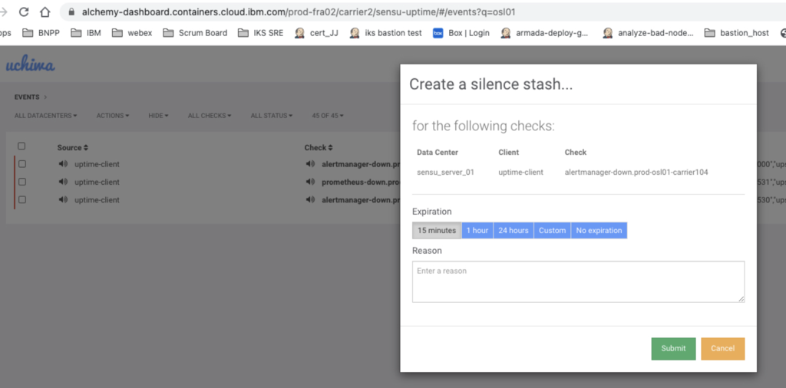

Informational
{: .label }

# Decomission a Legacy Carrier

## Overview
These steps ensure the proper decommissioning of a legacy carrier in a SZR or MZR. If you have landed to this page without a GHE issue, all decommissions should be tracked via an approved conductors team ticket - [alchemy-conductors](https://github.ibm.com/alchemy-conductors/team)

## Detailed Information
We need to identify active resources on legacy carrier and decomission in the following order. Suggesting to follow the `Steps` given below sequentially.

Step 1. If there are tugboat carriers running on the carrier, go to [Delete tugboat resources](#step-1-delete-tugboat-resources)

Step 2. Each service teams need to delete team's clusters before IKS SREs start deleting control plane, go to [Delete repo resources](#step-2-delete-repo-resources)

Step 3. Delete VSI Resources, go to [Delete VSI resources](#step-3-delete-vsi-resources)

Step 4. Delete Bare Metal (and dedicated) Resources, go to [Delete bare metal](#step-4-delete-bm-resources)

Step 5. Delete Network Resources, go to [Delete network resources](#step-5-delete-network-resources)

Step 6. Delete IaaS Storage, go to [Delete IaaS storage](#step-6-delete-iaas-storage)

Step 7. Delete SRE Resources, go to [Delete SRE resources](#step-7-delete-sre-resources)

Step 8. Delete Conductors Dashboard Resources, go to [Delete conductors dashboard resources](#step-8-delete-conductors-dashboard-resources)

Step 9. Final Checklist


### Step 1: Delete Tugboat Resources
We need to de-provision tugboat resources first which would be running on legacy carrier.

1. Customer Success Manager (CSM) makes an [announcement](https://cloud.ibm.com/docs/containers?topic=containers-regions-and-zones) for deprecating the region or datacenter.

2. Identify number of `customer` clusters on the tugboats running ontop of the carrier. Use xo to check what carrier the tugboats live on.

   a. identify all tugboats in the same datacenter for all pipeline levels (pre-prod and prod) by executing `@xo cluster $CLUSTER_ID`

   - To get information for all tugboats in the same datacenter for all pipeline levels (pre-prod and prod) execute `@victory tugboat-list`
   - Make a list of all tugboats on the legacy carrier

   - SREs would plan to shutdown the control plane ( lead time 7 days)

   b. Disable new provisions on the tugboat and carrier - Update `datacenters.json` file. example for [us-south datacenter](https://github.ibm.com/alchemy-containers/armada-config-pusher/blob/master/json-templates/us-south/datacenters.json) and promote the changes to the to-be-ecommisioned region(s). 
   
   **Important Note:**
   The plan is to give few days after promoting the [armada-config-pusher](https://github.ibm.com/alchemy-containers/armada-config-pusher/) and verify by manually creating a cluster and confirm that new deploys are NOT targetting the `to be decommisioned` region(s). This is very important as it may create inconsistency. - Do not delete the entry, but instead set `"enabled": "false"`in the to-be-decommisioned region block in `datacenters.json` file.. If you delete the entry it will be assumed to be enabled. For [more info](https://github.ibm.com/alchemy-containers/armada-config-pusher/issues/1094#issuecomment-28064619)

   c. Scale down all customer masters on the tugboats via `kubectl scale deploy -n $NAMESPACE $DEPLOY --replicas=0`

   d. Notify support ACS that we have done this so that we can try to catch any support tickets.
      Support engineers need to advise them that XXXXX (location) is being decommissioned and point them to [DOC](https://cloud.ibm.com/docs/account?topic=account-migrate-data-center)

   e. Scale down alertmanager instances in the region to turn off PD for the carrier
      - log into carrier to scale down
         ```
         [prod-mel01-carrier101]$ kubectl scale -n monitoring --replicas=0 deploy/armada-ops-alertmanager

          deployment.apps/armada-ops-alertmanager scaled
         ```

    - Silence Sensu Uptime
      - Conductors dashboard --> region --> carrier xx --> sensu uptime --> search for the carrier to decomission --> click speaker icon --> silence --> Select `Custom` option to expiry in 2 weeks

    <a href="images/silencesensu.png">
    </a>
    <br />

      **Note:**
        Please pair up with a SRE to silence the tugboats and carrier. This is due to the impact of silence can be easily done on unwanted carriers.

    - Silence Carrier
      - Search for a carrier to be decomissioned and silence the carrier
      - example : https://github.ibm.com/alchemy-conductors/sensu-uptime/pull/1140

3. Delete clusters on the carrier(s) and tugboat(s)

   Customers should all issue delete action to clean up if advised. If customers are not deleting (or not responding) SRE should take the following steps
   
   a. This process involves first to identify the clusters like;
      - Clusters with workers in the to-be-decommisioned DC, but Cluster masters elsewhere
      - Cluster masters and workers in the to-be-decommisioned DC.
      
      To get the list of clusters matching the above two catogories needs different `XO` queries. Sample query and further steps ( partially automated ) can see [here](https://github.ibm.com/alchemy-containers/containers-requirements/issues/525#issuecomment-35570475) to refer as an example
      
   b. After collecting the cluster list, we have a partial automation in place. Partial in the sense that the cluster lists feed into the script as a file 
      (one cluster per line) and run the [Jenkins Job](https://alchemy-containers-jenkins.swg-devops.com/job/Containers-Runtime/job/Decommision%20Region/). 
      For detailed steps of how to run, please refer [decommission-region](https://github.ibm.com/alchemy-conductors/decommission-region) repo. After a successful
      execution of the [Jenkins Job](https://alchemy-containers-jenkins.swg-devops.com/job/Containers-Runtime/job/Decommision%20Region/) ensures complete 
      removal of the provided clusters Control Plane resources. As a precaution, run the Jenkins Job with a single cluster and verify the results 
      by checking XO output. If the removal is confirmed proceed with the bulk list of of clusters as input. If any issues encounted during the run, 
      please raise an [issue](https://github.ibm.com/alchemy-conductors/decommission-region/issues) or notify in #sre-cfs and tag @conductors-in

   c. Make sure your virtual machine instances are all cleaned up and not in a delete failed state.  If they are not properly deleted, either open a ticket or work with the armada-cluster squad to ensure the instances are deleted prior to decommissioning any carriers or tugboats.

4. Remove tugboat(s)

   Using IBM Cloud CLI
   
      ```
      ibmcloud ks cluster rm --cluster <tugboat name>
      ```

### Step 2: Delete repo Resources

**Note:**
        Step 2, can perfom in parallel as the respective changes are bound to different repositories.

1. [Armada Secure](https://github.ibm.com/alchemy-containers/armada-secure/)
   - Remove any cluster references from repo
   - examples:
      - [update DOC](https://github.ibm.com/alchemy-containers/armada-secure/pull/2946)
      - [remove kubeconfig secret](https://github.ibm.com/alchemy-containers/armada-secure/pull/3035)
      - [remove carrier resources](https://github.ibm.com/alchemy-containers/armada-secure/pull/320200)
      - [remove NFS storage](https://github.ibm.com/alchemy-containers/armada-secure/blob/2fb6a38475f054c429f3d32b3e75dedefc819794/secure/armada/eu-central/spokes/prod-osl01-carrier104/armada-ops-config.yaml#L30)


2. [Armada env](https://github.ibm.com/alchemy-containers/armada-envs/)
   - Check any to-be-decommissioned DC reference in the repo
   - example:
      - https://github.ibm.com/alchemy-containers/armada-envs/pull/1461
      
3. [Cruiser-onboard-containers-kubernetes](https://github.ibm.com/alchemy-1337/cruiser-onboard-containers-kubernetes/)
   - Check any to-be-decommissioned DC reference in the repo
   - example:
      - https://github.ibm.com/alchemy-1337/cruiser-onboard-containers-kubernetes/pull/279

4. [Tugboat-cluster-update-monitor](https://github.ibm.com/alchemy-containers/tugboat-cluster-update-monitor/)
   - Check any to-be-decommissioned DC reference in the repo
   - example:
      - https://github.ibm.com/alchemy-containers/tugboat-cluster-update-monitor/pull/565

5. [Certificate-usage](https://github.ibm.com/alchemy-1337/cruiser-onboard-containers-kubernetes/blob/master/certificate_usage)
   - example:
      - https://github.ibm.com/alchemy-1337/cruiser-onboard-containers-kubernetes/commit/3d4a90464cb204a6a48724eb44e50aaa2743ea38

6. [Tugboat-worker-info](https://github.ibm.com/alchemy-containers/tugboat-worker-info)
   - Repo to be changed: https://github.ibm.com/alchemy-containers/tugboat-worker-info
   - delete $CLUSTER_NAME folder and $CLUSTER_NAME branch. This folder/branch will not be regenerated once the cluster is deleted

7. SRE-BOTs
   - victory : remove deleted clusters from config
   
6. SOS Dashboard
   - This should happen automatically when systems start being removed from our IaaS accounts

### Step 3: Delete VSI Resources

1. Follow runbook on [how to deprovision machines](https://pages.github.ibm.com/alchemy-conductors/documentation-pages/docs/runbooks/deprovision_machines.html)
2. If SoftLayer template is created for the carrier workers and masters, remove the templates from provisioning app

### Step 4: Delete BM Resources
1. Bare Metal removals would include haproxy and vyatta
2. Follow runbook on [how to deprovision machines](https://pages.github.ibm.com/alchemy-conductors/documentation-pages/docs/runbooks/deprovision_machines.html)
3. For `dedicated hosts`, SRE can run a query like;
      ```
      slcli dedicatedhost list -d <decommisioned region - eg: osl01>
      ```
   Raise a SL ticket to cancel those found hosts.
   
### Step 5: Delete Network Resources
1. VLAN/VIP removal
   - No machines should be on VLANS in order to proceed to Netint firewall request
   - example : https://github.ibm.com/alchemy-netint/firewall-requests/issues/3811

2. DNS removal
   - Remove a carrier reference or a region reference if all region is decommissioned
   - example  : https://github.ibm.com/alchemy-netint/firewall-requests/issues/3711

3. CSE removal

   - Netint request: Raise a firewall request to remove DNS entries
   - CSE request: Raise an issue in [carrier-service-endpoints](https://github.ibm.com/alchemy-conductors/carrier-service-endpoints/issues/new) with SE-SRE to remove DNS entries
   
4. Request #netint to remove (or rename) the region references in their [repo](https://github.ibm.com/alchemy-netint/network-source)

### Step 6: Delete IaaS Storage
1. Storage set up by SRE needs to be deleted - i.e. prometheus [storage shares](https://github.ibm.com/alchemy-containers/ansible-deploy/blob/d9039292679a3e959bb8d3fd0d61508248c4fe55/site-inventories/prod-eu-central/group_vars/carrier7-master#L5)

2. Go to cloud.ibm.com --> infrastructure --> storage --> file storage --> search for relevant File Storage Objects

### Step 7: Delete SRE Resources
1. CFS-Inventory
      - delete resources from [dir](https://github.ibm.com/alchemy-conductors/cfs-inventory/tree/master/inventory)

      - delete resources from [device_parser.py](https://github.ibm.com/alchemy-conductors/cfs-inventory/blob/master/lib/devices_parser.py)

2. user_vars
      - delete resources from [dir](https://github.ibm.com/alchemy-conductors/bootstrap-one/tree/master/playbooks/user_vars/)

3. group_vars
      - delete resources from [dir](https://github.ibm.com/alchemy-conductors/bootstrap-one/tree/master/playbooks/group_vars)

4. bootstrap-one-server
      - submodule bootstrap-one to bootstrap-one-server to promote the change to environment
      
5. Jenkins parameter
      - delete resources - [example](https://github.ibm.com/alchemy-conductors/conductors-jenkins-jobs/pull/166/files)
      
6. Patching
   - The change may not be necessary
   - check resources and delete if needed from [dir](https://github.ibm.com/alchemy-1337/smith-red-pill-creds/tree/master/smith-red-pill-test/smith-red-pill-test-configurations)
   - delete resources from [dir](https://github.ibm.com/alchemy-conductors/smith-trigger-service/tree/master/phases)

### Step 8: Delete Conductors Dashboard Resources
- Remove carrier links from [alchemy dashboard](https://alchemy-dashboard.containers.cloud.ibm.com) after removing from the two repos, namely [nginx-dashboard](https://github.ibm.com/alchemy-conductors/nginx-dashboard/) and [alchemy-dashboard](https://github.ibm.com/alchemy-conductors/alchemy-dashboard/)
   - Here are few examples PR for reference:
     - [Ngnix dashboard PR](https://github.ibm.com/alchemy-conductors/nginx-dashboard/pull/457)
     - [Alchemy dashboard PR](https://github.ibm.com/alchemy-conductors/alchemy-dashboard/pull/436)
     - [Nginx dashboard PR](https://github.ibm.com/alchemy-conductors/nginx-dashboard/pull/458)
     - [Nginx dashboard PR](https://github.ibm.com/alchemy-conductors/nginx-dashboard/pull/459)
 
 ### Step 9: Final Checklist
 - This is a re-validation of Step 3 above [Delete VSI resources](#step-3-delete-vsi-resources) , but needs to re-confirm any resources ( _like_ baremetals or network devices ) left out by manually checking the decommisioned region(s) and [device lists](https://cloud.ibm.com/gen1/infrastructure/devices). If any resources listing here can be removed manually.
