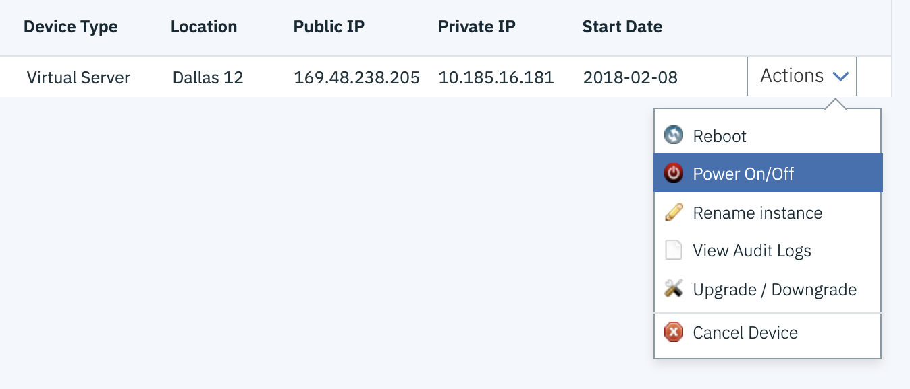

Informational
{: .label }


## Overview

These steps ensure the proper decommissioning of a Carrier Worker and Master that is no longer needed or required.  

This includes how to properly remove it from the kubernetes cluster it is part of and ensure it is safe to power-off and continue to deprovisioning of the machine.

All decommissions should be tracked via a approved [conductors team ticket](https://github.ibm.com/alchemy-conductors/team/issues)

## NEW - Please Read First
Decommissions of any workers MUST follow proper processes.  This means we do not skip the 5 day wait period before cancelling the systems in SL.  We do 
not deleted them from the kubernetes clusters until the 5 days are up.   All commands must be listed in the GHE tickets listing the specific machines to be 
deleted.  The GHE must also be approved by another SRE for deletion.  By listing the exact machines in the GHE with the specific command to remove it will limit 
chances of mistakes. NO for loops or mass removals.  Only specific commands for specific machines for deletions. 


## Steps to follow

- For decommissioning a worker follow all steps below
- For decommissioning a master (for example: `stage-dal10-carrier5-master-01`) start at [Review Calico Node Data](#review-calico-node-data) section and follow the remainder of the steps 

## Deprovisioning Steps 

There are helper scripts which assist with this process.  These are available on the carrier masters.
To discover which carrier a worker node is part of, and what master to log into, use `chlorine`` to lookup the machine.

For example:

```
Paul Cullen (IKS SRE UK Lead)
lookup prod-dal10-carrier2-worker-1001

Chlorine bot (SRE)APP
Name: prod-dal10-carrier2-worker-1001 IP: 10.171.78.72  IsMaster: false IsWorker: true
SL Account: Acct531277 ID: 62603497 Type: Virtual Server
Carrier: prod-dal12-carrier2 Zone: dal10 Masters: prod-dal12-carrier2-master-01.alchemy.ibm.com(10.184.18.164) prod-dal10-carrier2-master-02.alchemy.ibm.com(10.94.217.160) prod-dal13-carrier2-master-03.alchemy.ibm.com(10.209.54.137)
List of ongoing/unstarted actions for prod-dal10-carrier2-worker-1001 (10.171.78.72):: no ongoing/pending actions
```


### Check for taint

The machine that is to be removed must not be one that is tainted for a specific purpose.  To do this run the following command:

~~~
for i in $(kubectl get node -o name); do echo -n $i\ ; kubectl describe $i | grep ^Taints:; done | grep -vE '<none>|dedicated=armada|multi-az-worker=true'
~~~

This will show all Kubernetes taints for this environment.  Make sure that the machine you are removing is not a part of this listing.

```
pcullen@prod-dal12-carrier2-master-01:~$ for i in $(kubectl get node -o name); do echo -n $i\ ; kubectl describe $i | grep ^Taints:; done | grep -vE '<none>|dedicated=armada|multi-az-worker=true'
node/10.171.78.77 Taints:             dedicated=master-8d09fb54743a40d8bc37bf19639c0f22:NoSchedule
node/10.185.16.139 Taints:             dedicated=master-490a9876244f43899590474bf0937960:NoSchedule
node/10.185.16.170 Taints:             dedicated=prometheus:NoSchedule
node/10.185.16.173 Taints:             dedicated=prometheus:NoSchedule
```
The only taints we need to worry aboout are nodes that are dedicated to a master node or for prometheus.

These would have been identified as processes which need to run on their own VSI due to their consumption of CPU/Memory

For masters , we've only dedicated nodes to a small number of internal IBM Teams ; for example: Watson.

We need to ensure, that if we are decomissioning a dedicated node, the taint is replicated else where.  If in doubt at this point, seek assistance.

For reference, the following runbook exists for [dedicating a node for a specific master pod](./armada/armada-dedicate-worker-node-for-master-pod.html)

### Cordon the nodes

From the carrier master, review the carrier for cordoned nodes using the `armada-get-cordoned-nodes` tool

For example:
```
pcullen@prod-dal12-carrier2-master-01:~$ armada-get-cordoned-nodes 
NODE             node.cordon.reason
10.171.78.83	 2019-11-21T11:27:54+00:00 by 'igorbot'. Chlorine OS reload requested by:carrier autorecovery on 2019-11-21T11:27:52Z
10.185.16.156	 2019-11-21T05:46:02+00:00 by 'ramjsunk'. high cpu
10.73.111.174	 2019-11-20T08:20:38+00:00 by 'igorbot'. Chlorine rebooting on behalf of Naren(IKS SRE)
10.73.111.189	 2019-11-20T08:18:20+00:00 by 'igorbot'. Chlorine rebooting on behalf of Naren(IKS SRE)

NODE             node.drain.reason
```

If there are cordoned nodes make sure that they can be safely uncordoned and then proceed.  

The  [armada carrier cordoned node runbook](./armada/armada-carrier-high-number-cordoned-nodes.html) may assist with determining if nodes can be safely uncordoned.

If you are removing multiple nodes from the same carrier, please cordon all nodes before draining to be removed first.

~~~
armada-cordon-node --reason "Being decommissioned" <node>
~~~

### Drain the node(s)

Once all nodes are cordoned, drain each node in series using the `armada-drain-node` script.

~~~
armada-drain-node --reason "Being decommissioned" <node ip address>
~~~

After each drain completes, review the pod status on the carrier to ensure no master or etcd pods are in a bad state (i.e. CrashLoopBackOff or init). 

Only when all pods are back running, then proceed to the next node.  If problems are hit, work with the SRE squad to fix the problems.

The following command will help check the status of kubx-masters and etcd pods which are not running.
~~~
kubectl get pod --all-namespaces|grep -ivE 'Running|Completed|DeadlineExceeded|Evicted' | grep -E 'kubx-masters|etcd'
~~~


### Rename and Power-off the node(s)

Once the machines have been drained and cordoned.  Power off the machines with the slcli commands using the specific machines listed and approved in the 
GHE.  Machines must stay powered off for 5 days.  Then and only then can they be deleted.  PD alerts will trigger for the machines not ready, SRE
will have to set these to ignore. 

Go to [IBM Cloud Classic Infrastructure](https://cloud.ibm.com/classic)
Switch to the correct account
  _TIP: Use netmax to look-up the machine to find the account it is in_

Find the device under `Devices -> Device List` menu.

Use the drop-down menu next to the device rename the device.

{:height="75%" width="75%"}

When renaming the device, append `cancel` to the hostname.
_NB: This is needed in order for our sos-inventory-manager tool to properly identify machines that are pending deletion and will exclude them from security scans_

{:height="75%" width="75%"}

Once renamed, issue a power-off from the drop down menu.


### Delete nodes from cluster 

Once the 5 day grace period is over, the machines can be removed from the cluster.

The following command must be set to each specific IP address and must have been put into the GHE for approval. 

~~~
kubectl delete node <ip address>
~~~

### Review calico node data

The `kubectl delete node` command should remove all traces of the node, however, sometimes calico data is left behind.

Review calico information by  running the `/opt/bin/calicoctl get node` command :

For example:
~~~
pcullen@prod-dal12-carrier2-master-01:~$ sudo /opt/bin/calicoctl get node
NAME                                              
prod-dal10-carrier2-master-02.alchemy.ibm.com     
prod-dal10-carrier2-worker-1001                   
prod-dal10-carrier2-worker-1002        
~~~

If the node you have just removed is not listed, skip to the next step in this runbook.

If a calico entry is returned for the node you have just removed, delete it using the `/opt/bin/calicoctl delete node` command

For example:
~~~
sudo /opt/bin/calicoctl delete node prod-dal12-carrier2-worker-1099
~~~


### Update the GHE tracking this request

Keep the GHE up-to-date with the steps taken.

Once nodes are removed, put a note in the GHE to follow-up and submit cancellation requests in 5 days.

We wait a period of time to ensure that the removal of the nodes has not caused any issues.  
If no complaints, proceed to the next step. 

NOTE: If issues do arise and a node needs to be added back to a carrier, rename the machine and remove `cancel` from it's name, power the machine back on and execute the [armada carrier deploy jenkins job](https://alchemy-containers-jenkins.swg-devops.com/job/Containers-Runtime/job/armada-carrier-deploy/) to add the node back into the carrier.


### Deprovision the machine.

If no issues are reported in the 5 days after power off, the machine can be cancelled.  Follow the instructions in the [deprovision machines runbook](./deprovision_machines.html)

## Detailed Information

The waiting between removal is essential to keeping our environments healthy.  Since we have no way of really testing the removal of these systems without actually removing them, it is important to go slowly.

## Automation

None


