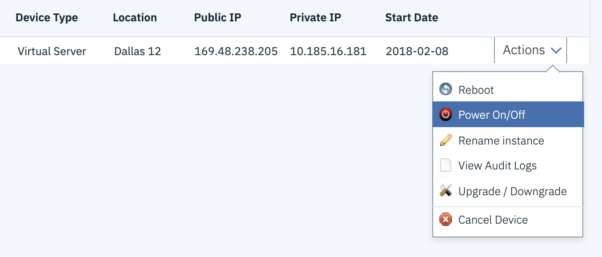
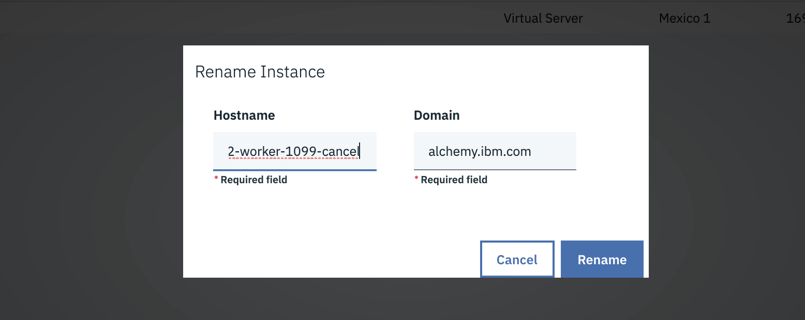
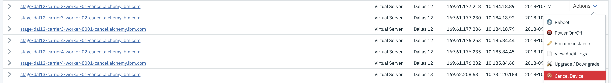
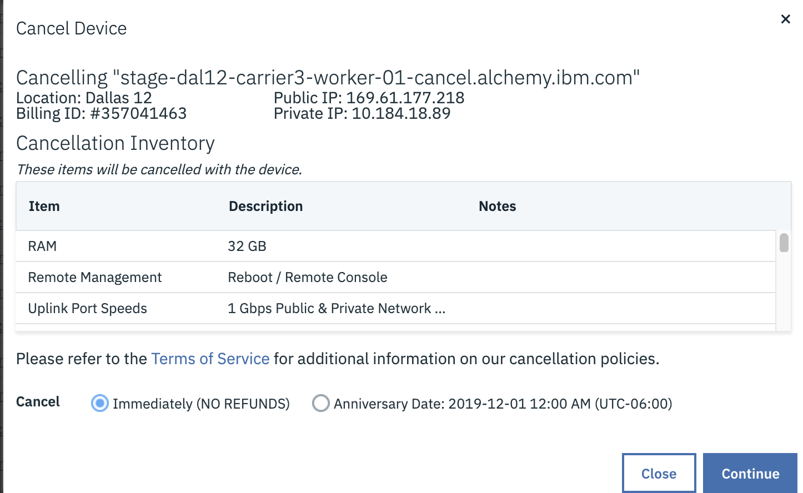
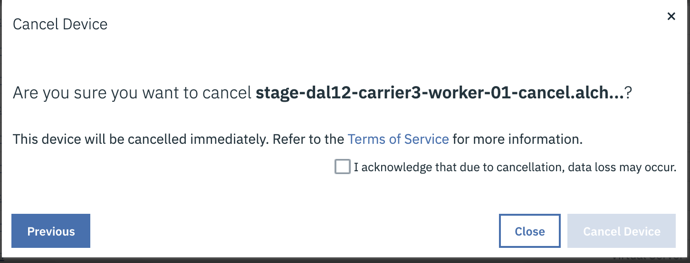
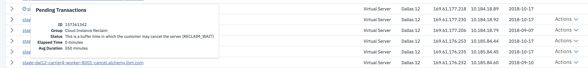

Informational
{: .label }

## Overview

These steps ensure proper deprovisioning of a machine that is no longer needed and/or required.  Please note that once a machine has been cancelled through IBM Cloud Infrastructure, there is no way to recover it. Properly following this runbook will ensure that a machine isn't cancelled by accident and/or there hasn't been a change in plans about its cancellation.

## Deprovisioning Steps 

The following sequence is the agreed upon process to properly shutdown a machine that is no longer needed:  

*NOTE: All deprovision requests require a GHE issue AND approval befoe proceeding further with this runbook*

1. Ensure all services/monitoring/tools have been removed from the machine(s).  This includes all Armada microservices, Prometheus, Alert Manager, etc.
2. Rename all machines that are to be deprovisioned by appending `cancel` to the hostname.
   - Ex: If `prod-dal10-carrier3-worker-44` is being deprovisioned, rename it to `prod-dal10-carrier3-worker-44-cancel`
   - This is needed in order for our sos-inventory-manager tool to properly identify machines that are pending deletion and will exclude them from security scans.
3. Power off the machine(s) and leave powered down for at minimum a week to ensure machine is ready to be deprovisioned.  If it has been determined that deprovisioning can proceed, the week long holding period can be foregoed.
4. If after a week, no objections and/or complaints have been raised about the machine being powered off, proceed with cancellation. *Once this step has been completed, there is no going back. Please be absolutely sure this machine is ready to be cancelled before proceeding with this step.*

## Detailed Information

This section contains further information

### Renaming and powering off a server

Go to [IBM Cloud Classic Infrastructure](https://cloud.ibm.com/classic) 
Switch to the correct account  
  _TIP: Use netmax to look-up the machine to find the account it is in_ 
  
Find the device under `Devices -> Device List` menu.

Use the drop-down menu next to the device rename the device, for example: 

{:height="75%" width="75%"}

When renaming the device, append `cancel` to the hostname.
_NB: This is needed in order for our sos-inventory-manager tool to properly identify machines that are pending deletion and will exclude them from security scans_

{:height="75%" width="75%"}

Once renamed, issue a power-off from the drop down menu.

### Cancelling a server

Go to [IBM Cloud Classic Infrastructure](https://cloud.ibm.com/classic) 
Switch to the correct account  
  _TIP: Use netmax to look-up the machine to find the account it is in_ 
  
Find the device under `Devices -> Device List` menu.

Use the drop-down menu next to the device to cancel the device for example: 

{:height="75%" width="75%"}

On the following pop up menus, review the cancellation request and confirm this is the correct machine.

For example:

{:height="75%" width="75%"}
{:height="75%" width="75%"}

Once the cancellation is confirmed, the device will appear with a transaction icon next to it which shows a cancellation request has been initiated.
{:height="75%" width="75%"}

## Automation

None
