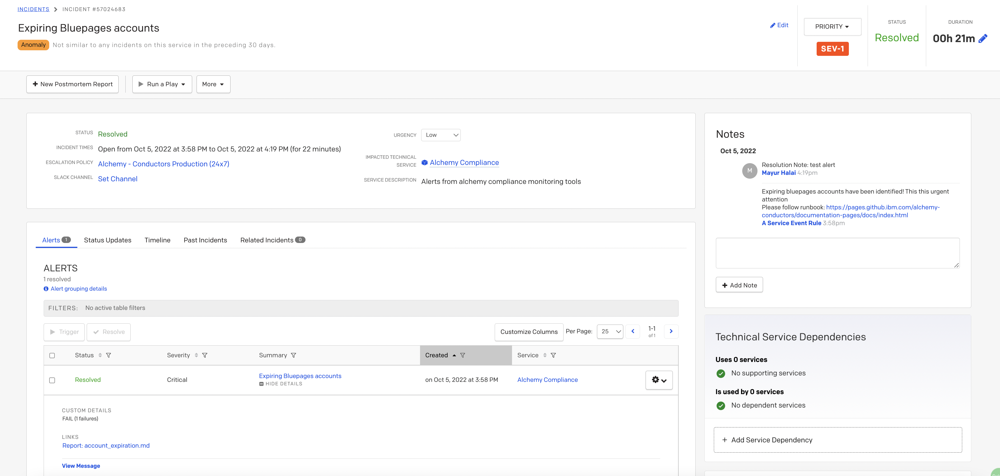
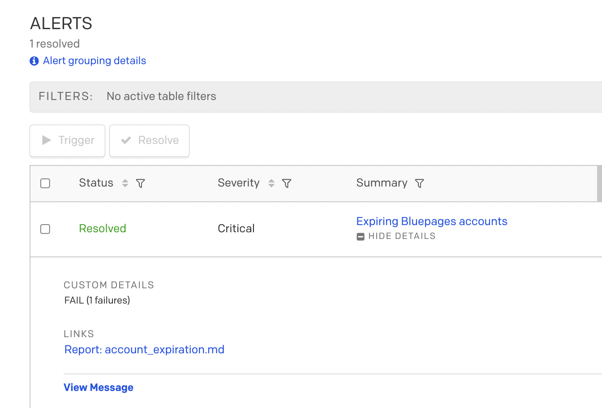
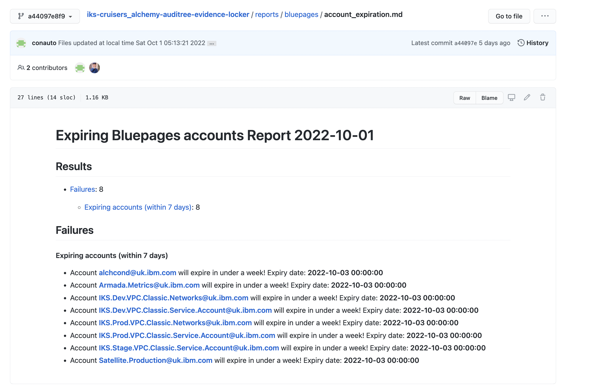

Alert
{: .label .label-purple}

## Overview

This alert informs SRE that one or more functional userids is about to expire.
This is a **HIGH** severity alert and needs immediate action as there could be major issues hit with internal tooling if functional ids such as `alchcond@uk.ibm.com` are not renewed.

The alert was created in auditree, in the [iks-cruisers auditree configuration](https://github.ibm.com/alchemy-auditree/iks-cruisers_alchemy-auditree-config)

On each auditree run, a check is performed by a predetermined list of important userids. This produces a [report](https://github.ibm.com/alchemy-auditree/iks-cruisers_alchemy-auditree-evidence-locker/blob/master/reports/bluepages/account_expiration.md) which if any failures are spotted, a PD alert is fired to SRE.

The users that are checked are detailed in the [bluepages section]

## Example alert(s)

Here is an example incident in pagerduty:

## Automation
There is no automation for error recovery, manual review and intervention is required.

## Actions to take

- In the firing incident, follow the link named [Report: account_expiration.md](https://github.ibm.com/alchemy-auditree/iks-cruisers_alchemy-auditree-evidence-locker/blob/master/reports/bluepages/account_expiration.md) 

- This report will list out all of the accounts that are about to expire and when.  For example:

- Raise an issue in the [Conductors team GHE repository](https://github.ibm.com/alchemy-conductors/team/issues/new) for tracking purposes and add the GHE link to the PD alert.

- Use [w3 people](https://w3.ibm.com/#/people/) to look up each of the IDs which are about to expire.  This will detail the owning manager. The owning manager should have been informed around 14 days before expiry, this alert will start firing around 7 days before expiry.

- Reach out in slack to the owning manager.  If they are in the `#conductors-for-life` channel, use this, referening the GHE.   Please also tag your squad lead and Colin Thorne in this thread.  It is critical that the owning manager acknowledges this message - **DO NOT ASSUME** actions will be taken here. 

- The PD alert should not be resolved, instead, the issue should be passed between squads in the handover to ensure that the owning managers action these requests.

## Escalation Policy
- Raise the issue with your Squad Lead who can escalate this in the SRE Leads private channel.

- If any changes are required to the auditree config for this alert, please reach out to the `@iks-compliance-dev` squad in slack