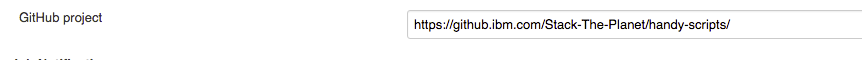
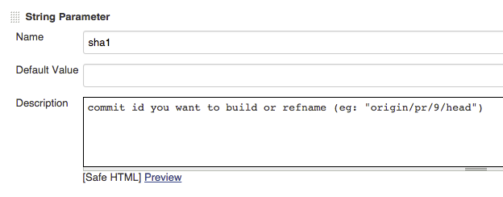
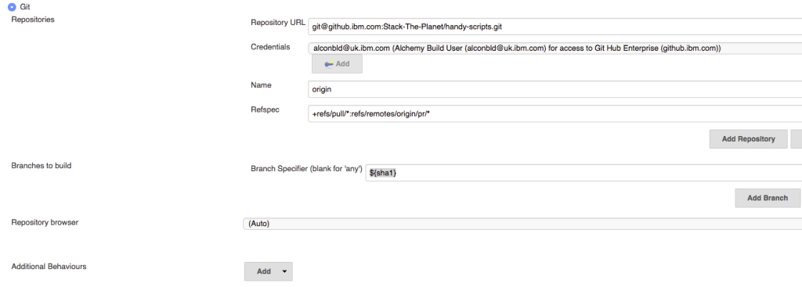
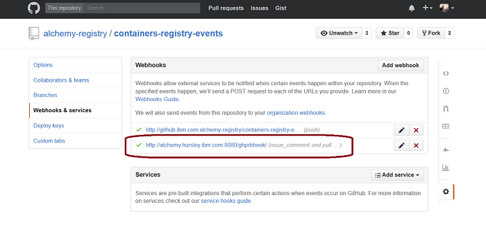
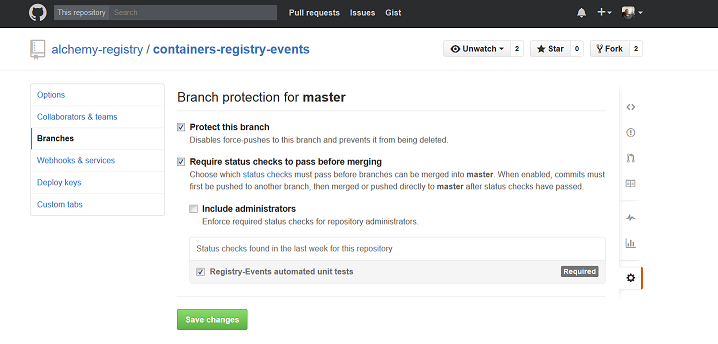

Ops
{: .label .label-green}

# Setting up Github Pull Request Builder - Jenkins Plugin

### In Github
Add the Alchemy functional ID (AlConBld) as a user to your Github org. Give them owner privileges.

### In Jenkins
1. Add your github project url to "GitHub Project". Note - this must be the https link to the project, 
as per the screenshot below. Do not use the repository url with .git at the end.
 

2. Add a string parameter (under "Job Notifications") to your build named `sha1` which refers to your commit hash.
 

3. Add your git project (in the section "Source Code Management").
     1. Use the git style repo url. E.g.: `git@github.ibm.com:Stack-The-Planet/handy-scripts.git`.
     2. Use the `alconbld@uk.ibm.com` user for your credentials.
     3. Click on Advanced. Add `origin` to the name.
     4. Use `+refs/pull/*:refs/remotes/origin/pr/*` in Refspec.
     5. Set branch specifier to `${sha1}`.
     

4. Under "Build Triggers" add the "GitHub Pull Request Builder". Do not use "Build when a change is pushed to github".
     1. Set the github api credentials to `https://github.ibm.com/api/v3`.
     2. Click "Use github hooks for build triggering".
     3. Click on Advanced then select "Build every pull request automatically without asking".
     4. Optional - Also under advanced, add a trigger phrase (for example "retrigger"). If you use this word or phrase in a comment on your merge pull request, it will cause the jenkins job to trigger again.

5. Click on Trigger Setup under "Build Triggers".
     1. Click "update commit status during build".
     2. Add whatever you want your build name to be in the "commit status context".
     3. For example, "Jenkins Build Tests" or something along those lines. It will show up in the pull request.

### Additional steps in Github
1. Verify that the "GitHub Pull Request Builder" defined in Jenkins has created the expected webhook in your Github project. Go to your project settings, Webhooks & services should contain a webhook named ghprbhook.
 

2. If you wish to enforce that the Jenkins job succeeds before a pull request can be merged, this is configured in project settings->Branches. You need to protect the master branch, and select "Require status checks to pass before merging". Your Jenkins job should appear in the list of available status checks.

 

### Useful Links
* [Here](https://alchemy-conductors-jenkins.swg-devops.com:8443/job/Conductors/job/Conductors-Jenkins/job/Github_Pull_Request_Builder_Template/configure) is an example of a jenkins job we have created which uses the builder tool. You can use it as a template.
* [Here](https://ibm.app.box.com/notes/42760994473?s=qfv4vrc2qhr5od1954em6jwrgfbao7qt) is the guide I used to create this guide!

###### If you have any improvements/suggestions please add them or contact Eleanor Kelly, UK Conductors (ekelly@uk.ibm.com).
