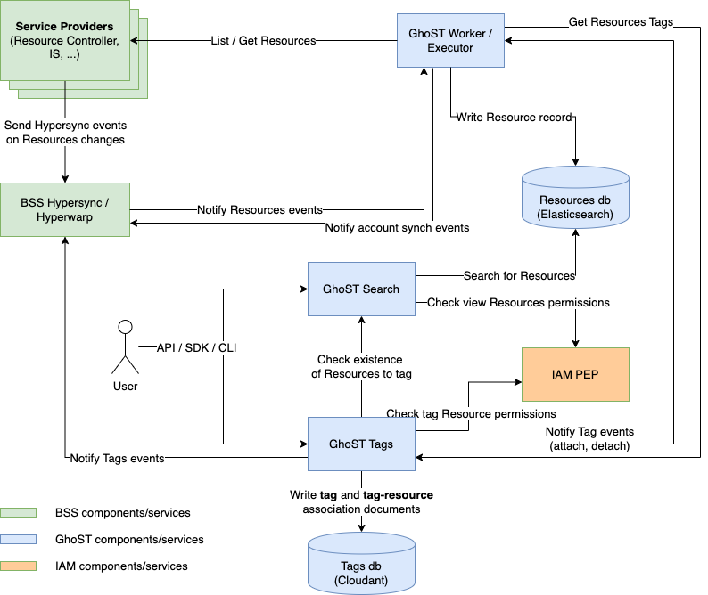
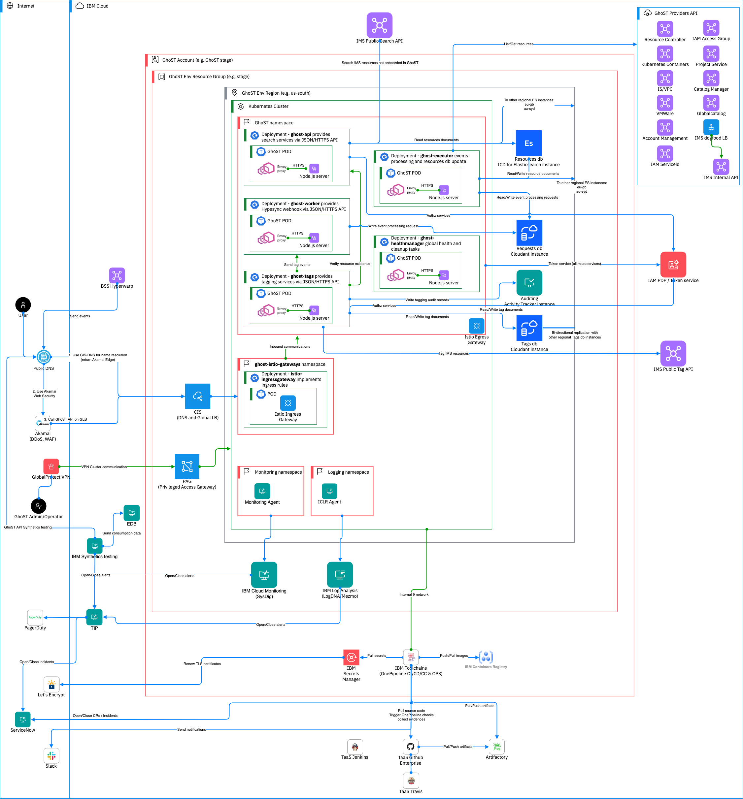

Informational
{: .label }

## Overview

Global Search and Tagging is an IBM Cloud core platform service. It allows searching across regions and datacenters for resources provisioned in the IBM Cloud and it allows to attach/detach tags to them. Moreover it provide search capability into IBM Cloud Documentation.

## Detailed Information

### Architecture

The picture below shows the GhoST logical architecture.

- The **Worker/Executor** microservice is responsible for keeping the Resources db up to date by means of Hyperwarp events and API calls to the respective sources of truth.
- The **Search** microservice provides the search API to end users.
- The **Tags** microservice is responsible of managing resource tags for the entire IBM Cloud Platform. It works with the Search microservice to check resource existence and permissions to tag. It notifies the Worker/Executor about tags attached and detached on a resource so it can update the Resources db record.
- The **Tags** microservice is the resource tags provider for the **Worker/Executor**.

The picture below shows the GhoST deployment diagram, including dependent services and deploying infrastructure.

- Each GhoST environment (stage, and production) is deployed in multiple regions for
  high availability, performances, and disaster recovery. The picture shows one region deployment.  
  - GhoST uses three redundant `Resources db` instances in `us-south`, `eu-gb`, and `au-syd`. The `ghost-executor` writes to all the instances. `ghost-api` is configured to read from the closest instance, and to move to the next ones in case of errors.  
  - GhoST uses one `Tags db` instance per deployment region. `ghost-tags` microservice only knows about its regional instance. The databases are kept in sync by the mean of `continuous Cloudant replication processes`.  
- All outbound communications from `GhoST namespace` happen through the `Istio Egress Gateway` component. Keep that in mind while reading the picture.  
- All inbound communications to `GhoST namespace` happen through the `Istio Ingress Gateway`.  
- Operator access to `GhoST Kubernetes Cluster` is regulated by `PAG (Privileged Access Gateway)` solution, which is deployed using the GoldenEye Deployable Architecture.
- All GhoST microservices leverage `IAM PDP` for token validation (not all the connections shown in the picture). `ghost-api` and `ghost-tags` also make use of `/authz` requests.
  All `IAM` interactions happen through the `PEP Node.js client library`.  
- The `ghost-healthmanager` microservice communicates internally with all the other microservices to provide global health to `CIS-GLB`. Those communications are not shown in the picture.  
- GhoST uses one instance of `IBM Log Analysis` and one instance of `IBM Cloud Monitoring` per environment, actually deployed in `eu-de`.  
  `Cloudant` and `ICD for Elasticsearch` instances come with their own regional platform monitoring and logging instances.  
- TaaS services access the GhoST Kubernetes clusters via internal 9 network.  
- GhoST Kubernetes Clusters are SOS compliant, so they have `csutil` installed.  

### Team Members

| Name                   | Slack Handle                                                               | Role                 | Responsibilities         |
| ---------------------- | -------------------------------------------------------------------------- | -------------------- | ------------------------ |
| Alessandro Chiantera   | [@a.chiantera](https://ibm.enterprise.slack.com/archives/DNVR2T9RQ)        | Manager              | Project mgmt             |
| Michele Crudele        | [@Michele Crudele](https://ibm.enterprise.slack.com/archives/D52B4H1LH)    | Architect            | Architecture             |
| Francesca De Cicco     | [@Francesca de Cicco](https://ibm.enterprise.slack.com/archives/DC4RB2K8Q) | Senior Developer     | Full stack dev leader    |
| Andrea Innocenti       | [@Andrea Innocenti](https://ibm.enterprise.slack.com/archives/DC4GQLW3H)   | Sec/compliance focal | DevSecOps SF, BCDR, SR   |
| Luca Ioffredo          | [@Luca Ioffredo](https://ibm.enterprise.slack.com/archives/DTBTGBYKB)      | Senior Developer     | DevSecOps, BCDR, SRE     |

## Further Information

* [Architecture: SSAD](https://github.ibm.com/cloud-governance-framework/services-governed-content/blob/main/arch-design/ssad/global-search-tagging/global-search-tagging-ssad.md)
* [Docs: Getting started with GhoST](https://test.cloud.ibm.com/docs/get-coding?topic=get-coding-gs-ghost)
* [Docs: CLI Search](https://cloud.ibm.com/docs/cli?topic=cli-ibmcloud_commands_resource#ibmcloud_resource_search)
* [Docs: CLI Tagging](https://cloud.ibm.com/docs/cli?topic=cli-ibmcloud_commands_resource#ibmcloud_resource_tags)
* [Docs: API Search](https://cloud.ibm.com/apidocs/search)
* [Docs: API Tagging](https://cloud.ibm.com/apidocs/tagging)
* [Git: Backend-API and models](https://github.ibm.com/global-search-tagging/ghost-for-resources)
* [Git: Issue tracking](https://github.ibm.com/global-search-tagging/zenhub)
* [Git: Service Framework compliance](https://github.ibm.com/global-search-tagging/ServiceFramework-CatMin-Workflow)
* [Runbooks](https://github.ibm.com/global-search-tagging/runbooks/)
* [Alerts](https://pages.github.ibm.com/global-search-tagging/zenhub/operations/monitoring/all_alerts_list.html)
