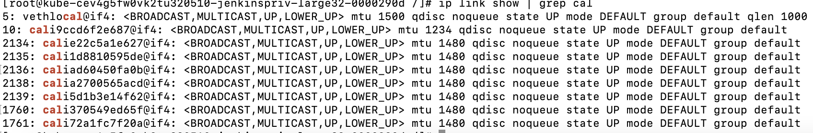

Informational
{: .label }

## Overview

This document is a guide for Jenkins on Kubernetes (Jonk) for IKS Jenkins. It includes JonK configurations, new labels creation, Jenkins Cluster info and troubleshoorting etc. 

### Background
The TaaS Squad has migrated the Jenkins environment from Docker Swarm environment to Kubernetes, called as Jenkins on Kubernetes (JonK). This caused IKS Jenkins to be migrated to JonK as well. <br>
[Announcement with details](https://taas.cloud.ibm.com/guides/jenkins-taas-swarm-shutdown.md) <br>
[Basics on JonK](https://taas.cloud.ibm.com/blog/2022-11-28-jenkins-docker-swarm-sunset.md)
  
Check `#References` section for more details.

## Detailed Information
### `Jenkins high level diagrams`
#### Jenkins Docker Swarm
<a href="../images/conductors/jonk/JonK-image-1.png">
</a>
  
#### Jenkins on Kubernetes
<a href="../images/conductors/jonk/JonK-image-2.png">
</a>


### IKS Jenkins Clusters details
Account: `Alchemy Support Account 278445` <br>
Frankfurt Jenkins Cluster name: `jenkins-privileged`; Cluster ID: `ccrfe9qf0i5no3ufe40g` <br>
US-East Jenkins Cluster name: `jenkins-privileged-us-east`; Cluster ID: `cev4g5fw0vk2tu320510` 

#### Labels
Below JJs can be used to query image, CPU & Memory resource setting details for all labels <br>
- [Testing Jenkins](https://alchemy-testing-jenkins.swg-devops.com/view/Conductors/job/Conductors/job/Lists%20all%20the%20labels%20and%20the%20associated%20Docker%20images%20configured%20in%20Jenkins/)
- [Conductors Jenkins](https://alchemy-conductors-jenkins.swg-devops.com/job/Conductors/job/Conductors-Jenkins/job/List%20labels%20and%20docker%20images/)
- [Containers Jenkins](https://alchemy-containers-jenkins.swg-devops.com/view/Conductors/job/ConductorTestFolder/job/Lists%20all%20the%20labels%20and%20the%20associated%20Docker%20images%20configured%20in%20Jenkins/)
### Monitoring
##### [Frankfurt Jenkins Cluster Sysdig Dashboard](https://cloud.ibm.com/observe/embedded-view/monitoring/24687c5e-67f5-4089-9f10-10e1eb61cb68)

##### [US-East Jenkins Cluster Sysdig Dashboard](https://cloud.ibm.com/observe/embedded-view/monitoring/dfe1f6a5-cd54-4c8c-b643-5a75ac60a8e4)

 
### Configurations
#### 1. Steps to create a cloud in Conductors Jenkins Server for Jenkins Frankfurt Cluster [repeat it for Jenkins US-East Cluster]
[Note: same steps applicable for Testing and Containers Jenkins]
<a href="../images/conductors/jonk/JonK-image-4.png">
</a>

1. Create a new cloud with name **jenkins-privileged-kube-cluster** in [Kubernetes Jenkins configuration](https://alchemy-conductors-jenkins.swg-devops.com/configureClouds/) under `Kubernetes Cloud details`
<a href="../images/conductors/jonk/JonK-image-5.png">
</a>

2. The cluster "Public service endpoint" is used in [Kubernetes Jenkins configuration](https://alchemy-conductors-jenkins.swg-devops.com/configureClouds/) under `Kubernetes Cloud details` for "Kubernetes URL"
     ```Public Service endpoint URL: https://c106.eu-de.containers.cloud.ibm.com:32453```
<a href="../images/conductors/jonk/JonK-image-6.png">
</a>

3. The configuration details for Conductors Jenkins: <br>
`Namespace`: kube-conductors-jenkins  <br>
`Rolebinding`: pod-access-control-kube-conductors-jenkins  <br>
`Secret`: secret-kube-conductors-jenkins <br>
`Credential to pull Jenkins image`: secret-kube-conductors-jenkins-on-cluster-frankfurt-new  <br>

  Refer to below GHE Issues for Testing & Containers Jenkins configuration details: <br>
   [GHE Issue used for Frankfurt cluster configuration](https://github.ibm.com/alchemy-conductors/team/issues/18201#issuecomment-48995903) <br>
   [GHE Issue used for US-East cluster configuration](https://github.ibm.com/alchemy-conductors/team/issues/18897)  <br>
- Create Namespace: kube-conductors-jenkins  `kubectl create namespace kube-conductors-jenkins` 
- Create the Role Binding **pod-access-control-kube-conductors-jenkins** on Frankfurt Jenkins Cluster <br>
  `kubectl apply -f FILE`
  
Example: FILE
```
apiVersion: rbac.authorization.k8s.io/v1
kind: RoleBinding
metadata:
  name: "pod-access-control-kube-conductors-jenkins"
  namespace: "kube-conductors-jenkins"
roleRef:
  apiGroup: rbac.authorization.k8s.io
  kind: ClusterRole
  name: edit
subjects:
- kind: ServiceAccount
  name: default
  namespace: "kube-conductors-jenkins"

```

``` 
epradeepkumar@Es-MacBook-Pro scripts % kubectl get rolebinding -n kube-conductors-jenkins
NAME                                          ROLE               AGE
pod-access-control-kube-conductors-jenkins   ClusterRole/edit   30m
```
  

  - Secret: secret-kube-conductors-jenkins <br>
  `kubectl apply -f SECRET-FILE` <br>

Example: SECRET-FILE
```
apiVersion: v1
kind: Secret
metadata:
  name: secret-kube-conductors-jenkins
  namespace: kube-conductors-jenkins
  annotations:
    kubernetes.io/service-account.name: default
type: kubernetes.io/service-account-token
```

 - Read the secret token using below command and add it to [Kubernetes Jenkins Credentials](https://alchemy-conductors-jenkins.swg-devops.com/credentials/). Use it for "Credentials" in the configureCloud UI page:
```
 kubectl -n kube-conductors-jenkins get secret/secret-kube-conductors-jenkins -o json | jq -r '.data.token' | base64 --decode
```
  
Example: For Containers Jenkins, the Frankfurt Jenkins Cluster secret is generated using above command and it is added to [Containers Jenkins Credentials ](https://alchemy-containers-jenkins.swg-devops.com/credentials/) as `Kubernetes Jenkins JNLP Token For Containers`. It is used in [Containers Jenkins Configuration](https://alchemy-containers-jenkins.swg-devops.com/configureClouds/) for Frankfurt Cluster "jenkins-privileged-kube-cluster" as "Credentials".
<a href="../images/conductors/jonk/JonK-image-7.png">
</a>

<a href="../images/conductors/jonk/Jonk-image-8.png">
</a>


- Run below command and paste it into the "Kubernetes server certificate key" field in [Jenkins Configure Clouds](https://alchemy-conductors-jenkins.swg-devops.com/configureClouds/)
``` 
kubectl -n kube-conductors-jenkins get secret/secret-kube-conductors-jenkins -o json | jq -r '.data["ca.crt"]' | base64 --decode
```
<a href="../images/conductors/jonk/JonK-image-9.png">
</a>

- Create **Image Pull Secret** that is used in all labels to pull Jenkins image
<a href="../images/conductors/jonk/JonK-image-10.png">
</a>

1. [Create Jenkins Artifactory token](https://taas.cloud.ibm.com/guides/artifactory-authentication-access-tokens.md#creating-an-access-token-via-the-ui) for `NA Artifactory` using the user alconbld@uk.ibm.com (use [Thycotic to get password](https://pimconsole.sos.ibm.com/SecretServer/app/#/secret/49968/general) - refer to [documentation](https://pages.github.ibm.com/alchemy-conductors/documentation-pages/docs/runbooks/shared_user_ID_login.html#making-use-of-a-shared-user))
2. To generate `validity token`, locally clone the Git Repo on Mac: `curl -s https://s3.us.cloud-object-storage.appdomain.cloud/armada-build-tools-prod-us-geo/build-tools/build-tools.tar.gz |tar -xvz` and run `./build-tools/install.sh`. Refer to [documentation](https://github.ibm.com/alchemy-containers/build-tools/blob/master/docs/ArtifactoryTokenSetup.md#functional-id-owners). 
3. On Mac, go to build-tools/JFrong directory and edit setJfrtToken.sh and disable the expiry date. <br>
4. Run `source ./build-tools/JFrog/setJfrtToken.sh` (input Jenkins Artifactory token). It generates a `validity token` name it as `ARTIFACTORY_JFRT_TOKEN`
5. Use the `validity token` ARTIFACTORY_JFRT_TOKEN generated in step#4 to create image pull secret `secret-kube-conductors-jenkins-on-cluster-frankfurt-new`: <br>
  `kubectl create secret docker-registry secret-kube-conductors-jenkins-on-cluster-frankfurt-new --namespace=kube-conductors-jenkins --docker-server="*.artifactory.swg-devops.com" --docker-username=alconbld@uk.ibm.com --docker-email=alconbld@uk.ibm.com --docker-password=ARTIFACTORY_JFRT_TOKEN --dry-run=client -o yaml --save-config | kubectl apply -f - `
6. Fill the `image pull secret` field with the name `secret-kube-conductors-jenkins-on-cluster-frankfurt-new` in [Jenkins Configure Clouds](https://alchemy-conductors-jenkins.swg-devops.com/configureClouds/)
 
  
#### 2. Steps to create a new “label/pod template” for Conductors Jenkins
[Note: same steps applicable for Testing and Containers Jenkins] <br>
**`WARNING`** Be cautious while creating new labels or updating/saving [Jenkins Configure Clouds](https://alchemy-conductors-jenkins.swg-devops.com/configureClouds) as it often resets the `scroll down` option such as `Credentials` in `Kubernetes Cloud details` to `none` causing all Jenkins Jobs to stuck in `Build Queue`. More details of this issue and resolution available in `#Troubleshooting` section `Known Issues`.
  
1. Goto web page https://alchemy-conductors-jenkins.swg-devops.com/configureClouds
2. Navigate to Frankfurt cluster which is named as “jenkins-privileged-kube-cluster” <br>
<a href="../images/conductors/jonk/JonK-image-11.png">
</a>

3. Open the tab “Pod Templates”
<a href="../images/conductors/jonk/JonK-image-13.png">
</a>


4. Click on “ADD POD TEMPLATE” button which is available at the bottom of all existing "Pod Templates"
<a href="../images/conductors/jonk/JonK-image-14.png">
</a>

5. Fill in the details of the new Label [except the fields mentioned below, keep all other fields empty]
<a href="../images/conductors/jonk/JonK-image-15.png">
</a>
  
    1. Open the tab `Pod Template details`
    2. `Pod Template Name`: Name of the new label
    3. Fill the details in below fields
        1. Labels: Name of the new label[same name as above step#5.2]
        2. Usage: Select `Only build jobs with label expressions matching this node`
        3. Containers: Create a new entry and enter “jnlp”
        4. Docker Image: The Jenkins image path <br> `Example: docker-na.artifactory.swg-devops.com/alchemyconductors-jenkins-docker-local/dockerbuild-registry:latest`
        5. Tick `Always pull image`
        6. Working directory: “/home/jenkins”
        7. Delete any content in the fields “Command to run” and “Arguments to pass to the command”
        8. Create two `Environment Variables`: 
            1. Key: “START_DIND”, Value: “true”
            2. Key: “JENKINS_JAVA_OPTS”, Value: “-Xmx512m -XX:+UnlockExperimentalVMOptions -XX:+UseContainerSupport”
        9. Open `Advanced`
            1. Tick “Run in privileged mode”
            2.  Request CPU: set value as per label requirement
Example: “300m”
            3.  Request Memory: set value as per label requirement
Example: 2Gi
            4. Limit CPU: set value as per label requirement
Example: 4
            5. Limit Memory: set value as per label requirement
Example: 5Gi
            6.  Liveness Probe:
                1.  Initial Delay Seconds: “60”
                2. Timeout Seconds: “5”
                3.  Failure Threshold: “5”
                4.  Period Seconds: “30”
                5.  Success Threshold: “1”
        10. Create `Environment variables`
            1.  Key: “JENKINS_DIRECT_CONNECTION”,  `Value` : “166.9.58.88:31934” - for `Conductors Jenkins` <br>
                                                   `Value` : "166.9.58.88:32042" - for `Testing Jenkins` <br>
                                                   `Value` : "166.9.58.88:30905" - for `Containers Jenkins` <br>
        11.  Concurrency Limit: “30”
        12.  Pod Retention: “Never”
        13.  Time in seconds for Pod deadline: “36000”
        14.  Timeout in seconds for Jenkins connection: “1000”
        15.  Yaml merge strategy: “Override”
        16.  Tick `Show raw yaml in console`
        17.  Create `ImagePullSecrets` <br>
            a.  Name: “secret-kube-conductors-jenkins-on-cluster-frankfurt-new”


### Troubleshooting
#### How to debug Jenkins Job pods
A Jenkins Job(JJ) will be executed as a pod on IKS Jenkins Cluster. Login to IKS Jenkins cluster to debug the issues with the Jenkins pods. <br>
###### Below are the steps:
1. Login to ibmcloud using CLI <br>
   `ibmcloud login --sso`
2. Select Alchemy Support Account 278445
3. Access the IKS Jenkins cluster <br>
   `ibmcloud ks cluster config -c <CLUSTER-ID>` <br>
   Example: To access Frankfurt Jenkins cluster: <br>
            `ibmcloud ks cluster config -c ccrfe9qf0i5no3ufe40g`
4. Get the list of JJs pods <br>
   `kubectl get pods -A -owide | grep kube-cluster`
5. Get a JJ specifc pod: Goto the JJ's "Console Output" and get it's pod name. <br>
   Example: [JJ console output](https://alchemy-containers-jenkins.swg-devops.com/job/Containers-Runtime/job/kube-e2e-pvg/88665/consoleFull) <br>
            JJ pod name: dockerbuild18-deploy-squad-base-kube-cluster-large-tfvx8 <br>


             11:26:19 kind: "Pod"
             11:26:19 metadata:
             11:26:19   labels:
             11:26:19     jenkins: "slave"
             11:26:19     jenkins/label-digest: "337854765e0b62a2850b3cf618177a7ca6893f8e"
             11:26:19     jenkins/label: "dockerbuild18-deploy-squad-base-kube-cluster-large"
             11:26:19   name: "dockerbuild18-deploy-squad-base-kube-cluster-large-tfvx8"
             11:26:19   namespace: "kube-containers-jenkins"

  6. Run kubectl commands 
  

#### Known issues
This [GHE Issue](https://github.ibm.com/alchemy-conductors/team/issues/19220#issuecomment-52924973) is used to summarise the Jenkins Cluster issues that were encountered so far. Below table contains details about the current known issues: <br>


S.L.No |  Issue  |  Resolution
-- | -- | -- 
1 | A large number of Jenkins Jobs stuck in Build Queue | Probable cause: This could happen due to UI bug with [Jenkins Server ConfigureClouds web UI](https://alchemy-containers-jenkins.swg-devops.com/configureClouds/). Check if the `Credentials` value of the failing Jenkins Instance is set to "None". If yes, modify it to the correct value and save it. <br> ** The valid `Credentials` values: <br> **IKS Frankfurt Cluster/jenkins-privileged-kube-cluster**: <br> [Conductors Jenkins ConfigureClouds](https://alchemy-conductors-jenkins.swg-devops.com/configureClouds/): the value is `Kubernetes Jenkins JNLP Token For Conductors`  <a href="../images/conductors/jonk/JonK-image-16.png"> </a>  [Containers Jenkins Configureclouds](https://alchemy-containers-jenkins.swg-devops.com/configureClouds/): the value is `Kubernetes Jenkins JNLP Token For Containers` <br> <a href="../images/conductors/jonk/JonK-image-17.png"> </a>  <br> **IKS US-East Cluster/jenkins-privileged-us-east**: <br>[Conductors Jenkins ConfigureClouds](https://alchemy-containers-jenkins.swg-devops.com/configureClouds/): the value is `Kubernetes Jenkins JNLP Token For Conductors - US-East Cluster` <br>   <a href="../images/conductors/jonk/JonK-image-18.png"> </a> <br> [Containers Jenkins ConfigureClouds](https://alchemy-containers-jenkins.swg-devops.com/configureClouds/): the value is `Kubernetes Jenkins JNLP Token For Containers - US-East Cluster` <br> <a href="../images/conductors/jonk/JonK-image-19.png"> </a> <br>
2 | Auditree mtu issue | [Some of the Auditree JJs](https://alchemy-conductors-jenkins.swg-devops.com/view/Conductors/job/Conductors/job/Security-Compliance/view/Auditree%20Production%20runs%20/job/iks-auditree-automation/job/iks-auditree-prod/job/iks-carriers-prod/job/master/) doesn't work if mtu is set > 1400. By default the value is set to 1480. <br> To fix it and permenantly set it to 1400: <br> (1) Check the existing mtu value: <br> (a) ibmcloud login to the IKS Jenkins Frankfurt Cluster (where the Auditree JJ runs):<br> (b) Run `kubectl get pods -A -owide` & grep for calico-node pods <br> (c) Login to any calico-node pod.<br>Note: in IKS 1.29 and above, calico-node is running in the `calico-system` namespace<br> `kubectl exec -it -n kube-system calico-node-<POD-VALUE> bash`<br>or<br>`kubectl exec -it -n calico-system calico-node-<POD-VALUE> bash`<br> (d) Get the mtu value: Run command `ip link show` & grep for cal <br> <a href="../images/conductors/jonk/JonK-image-20.png"> </a>  <br> (e) If the mtu value is not 1400 then proceed to step#2 to permenantly set it to 1400 <br> (2) Follow the [IBM Cloud document](https://cloud.ibm.com/docs/containers?topic=containers-kernel#calico-cm-mtu-update) to permanantely set the mtu value to 1400. <br>  (a) Note that the guide differs for IKS 1.29 and above versions. <br> (4) For reference (in case of IKS 1.28 or lower version), below are the steps to temporarily set the value: <br> (a) the field `veth_mtu to 1400` in the calico-node configmap ```kubectl edit cm -n kube-system calico-config``` <br> (b) Issue rolling restart ```kubectl rollout restart -n kube-system ds/calico-node``` <br> (c) Monitor the status ```kubectl -n kube-system rollout status ds/calico-node``` <br> (d) Repeat above step#2 <br> [Slack thread#1](https://ibm-argonauts.slack.com/archives/G53NY6QH0/p1678813879092889) <br>


  


## References
[TaaS web page](https://github.ibm.com/TAAS/Jenkins-on-Kubernetes) <br>
[TaaS User Guide]( https://github.ibm.com/TAAS/Jenkins-on-Kubernetes/blob/main/doc/user-guide.md) <br>
[TaaS Runbooks](https://github.ibm.com/TAAS/Jenkins-on-Kubernetes/tree/main/doc/runbooks) <br>
[JonK Architecture](https://github.ibm.com/TAAS/Jenkins-on-Kubernetes/blob/main/doc/reference/system-design.md) <br>

[GHE Issue used for Frankfurt cluster configuration](https://github.ibm.com/alchemy-conductors/team/issues/18201#issuecomment-48995903) <br>
[GHE Issue used for US-East cluster configuration](https://github.ibm.com/alchemy-conductors/team/issues/18897)  <br>
[GHE Issue used to track Jenkins Cluster issues](https://github.ibm.com/alchemy-conductors/team/issues/19220#issuecomment-52924973)  <br>

Jenkins instances:
  * [Conductors Jenkins](https://alchemy-conductors-jenkins.swg-devops.com/)
  * [Containers Jenkins](https://alchemy-containers-jenkins.swg-devops.com/)
  * [Testing Jenkins](https://alchemy-testing-jenkins.swg-devops.com/)
## Escalation

  * @interrupt in #conductors
  * @taas_squad in #taas-jenkins-help
