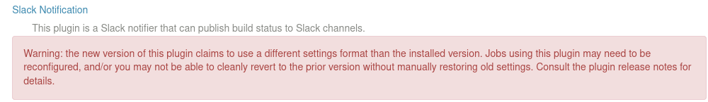
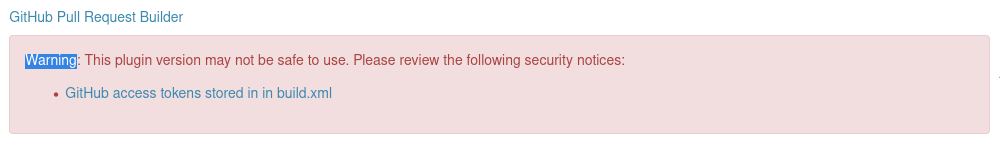
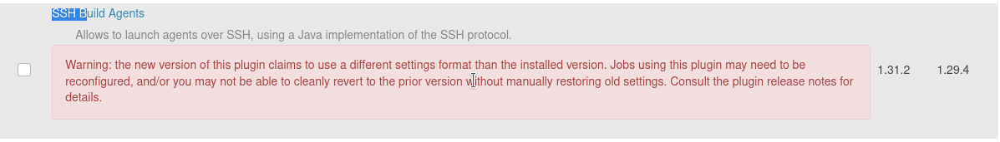
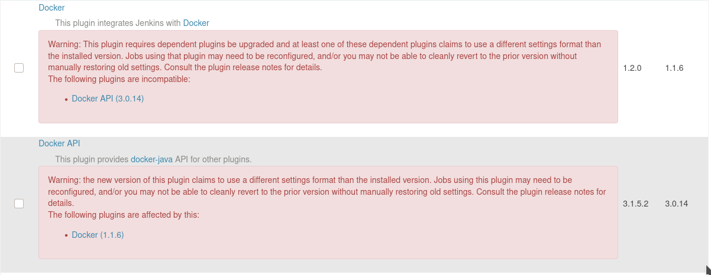

Informational
{: .label }

## Overview

What follows is the process to upgrade Jenkins plugins on each instance

Jenkins uses a plugin achitecture to provide enhanced functionalities. A list can be found [here](https://plugins.jenkins.io/)

### Jenkins instances

At the moment of writing this runbook, we have the following Jenkins instances:

  * [Conductors Jenkins](https://alchemy-conductors-jenkins.swg-devops.com/)
  * [Containers Jenkins](https://alchemy-containers-jenkins.swg-devops.com/)
  * [Testing Jenkins](https://alchemy-testing-jenkins.swg-devops.com/)

## Detailed Information

To upgrade the plugins go to each instance.
1. in the left sidebar of the home page, click on "Manage Jenkins"
1. scroll down to "Manage Plugins"
1. scroll down to the bottom of the page and click "All"
1. **REVIEW** the list of plugins that will be updated. See the Warnings section below if you see any red highlighted plugins **BEFORE** continuing. If in doubt, uncheck that plugin and open a GHE issue for Investigation
1. click on "Download and install after restart"
1. fill in the checkbox for "Restart Jenkins when installation is complete and no jobs are running"

## Warnings
Some plugin updates will come with the "Warning" label.

Steps to identify how to move forward.
1. Get a full list of problematic plugins
1. go to the jenkins instance home page
1. in the left sidebar click on "Plugin usage"
1. search for the problematic plugin(s)
    - **NOTE**: if the plugin is listed in the "Other Plugins" section then the problematic plugin is used by jenkins and not a job and the assumption can be made to upgrade the plugin
1. click on the button called "expand" for that plugin; this will list all jobs using the plugin
    - this list will also include all disabled jobs
    - this list will also include jobs abandoned by disbanded squads but left running
1. identify squad(s) of valid job(s) and contact them in #conductors to inform them of the upcoming upgrade and potential breaking change to their job(s)
    
### different settings

This image shows that by upgrading this plugin, job(s) will need to be reconfigured. Reach out to the squad(s) that own job(s) using this plugin as mentioned above in the Warnings section.

### unsafe plugin
 
This image shows the plugin is unsafe and continuing to use this plugin is a security hazard. This plugin will need to be removed. Open a GHE issue requesting approval. Inform the squad(s) as mentioned above in the Warnings section above. Investigation will need to be made on its replacement.

### different settings for type "other plugins"
 
This image shows a plugin that is widely used and has the potential to make breaking changes as in the previous image. Note however this plugin is listed in the "Other plugins" section. The assumption can be made to upgrade this plugin. Escalate to @taas_squad in #taas-jenkins-help if the assumption turns out to be inaccurate.

### dependent plugins for type "other plugins"

This image shows 2 plugins which are dependent on each other. This sort of plugin is safe to upgrade after verifying there are no jobs dependent on these plugins

## Scheduling

Keep these points in mind when scheduling the plugins upgrades
1. ensure there is a GHE issue open and approval is obtained from the squad leads before beginning
1. ensure there is a Change Request open in #cfs-prod-trains for each instance before beginning
1. always run upgrades on a weekday to ensure quick access to the @taas_squad in #taas-jenkins-help
1. do one instance a day
1. start with the testing instance 
1. upgrade early in the morning before the US squad and the majority of the developers come online
1. always announce in #conductors something similar to  `@here upgrading the plugins on the containers jenkins instance as per CHG0640859. the containers instance **WILL** be restarted as part of the plugins upgrade process`. Note the CR number and the effect of the process is mentioned. This is important in case a user doesnt see this announcement and opens a ticket 

## Escalation

  * @interrupt in #conductors
  * @taas_squad in #taas-jenkins-help
