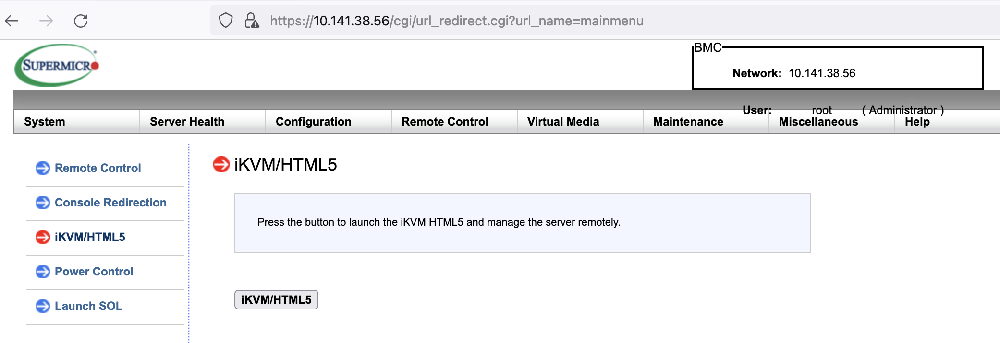

Informational
{: .label }

## Overview

This Document describes the steps to access VSI and BM with Softlayer VPN.

## Purpose

This runbook describes how access the KVM console (think of the physical console) of a virtual or bare metal machine from Softlayer.

---

## Know How

It is sometimes necessary to use the KVM option to connect to our servers (when issues are occurring with standard ssh connections)

## Pre-reqs - Start a vpn connection

### OpenVPN

An [openVPN](vpn.html) connection should work - if it doesn't, then you may have to resort to using the IaaS (Softlayer) VPN - see below.

### Detailed Information

   1. Ensure you have installed the IaaS (Softlayer) VPN Standalone client. MotionPro Plus latest version downloaded from App store is preferred for MAC
   2. Configure the IaaS VPN password in your cloud account if you do not yet have one, per the [Setting the VPN password](https://cloud.ibm.com/docs/iaas-vpn?=iaas-vpn-standalone-vpn-clients#set-vpn-password) guide
   3. Request temporary access to Softlayer VPN by following this runbook section [Enabling SL VPN](https://pages.github.ibm.com/alchemy-conductors/documentation-pages/docs/runbooks/kvm_access.html#managing-your-userid-and-enabling-vpn)
   4. Enable `auto-assign` option for device subnets. Launch the IBM Cloud UI. Click `Manage > Access (IAM) > Users (your ID)`. Open your entry and navigate to the `Classic Infrastructure > VPN subnets`
       
       
   5. Click on Navigation Menu on left side > `Classic Infrastructure > Device List`.
       
   

#### Remote access to VSI
   
   6. Go to the device. Click on `Actions > KVM Console`.
   7. Disconnect GP VPN / Open VPN / Cisco AnyConnect VPN before connecting to VPN using MotionPro Plus using the IaaS VPN password copied from step 2
   8. In the KVM console window, you can restart, power on, and power off the virtual server. To perform these actions, click the overflow icon on the upper right of the console's window, then click the appropriate action.
       
      
   
_For more details please see the [IaaS / Softlayer VPN](https://pages.github.ibm.com/alchemy-conductors/documentation-pages/docs/runbooks/kvm_access.html#iaas--softlayer-vpn)_

#### Remote access to BareMetal

   6. Go to the device and check for `Remote management` section on the left side menu of the instance in IBM Cloud UI. Under `Management details` heading,  note down the `root` username and password needed to connect to the instance.
   7. Click on `Actions > KVM Console`. A browser window will open showing you a IP, port and password to access a machine.
   8. Ensure you obtain the username and password specified in step 6 before move to next step.
   9. Disconnect GP VPN / Open VPN / Cisco AnyConnect VPN before connecting to VPN using MotionPro Plus using the IaaS VPN password copied from step 2.
    _If you encounter problem in opening KVM Console in your browser, try with different browser for instance Firefox._
   10. Enter the username and password copied from step 6.
   11. Go to `Remote Control > iKVM/HTML5`
    
    
   12. This should launch the KVM console in a new web browser page. Again. key-in the same credentials copied from step 6.

_For more details on the IPMI interface For bare-metal servers, please see the [For bare-metal servers](https://pages.github.ibm.com/alchemy-conductors/documentation-pages/docs/runbooks/kvm_access.html#for-bare-metal-servers)_
   

### Managing your userid and enabling VPN

The VPN userid used are associated with each of your own IaaS account and you will need to log into the [IBM Cloud portal](https://cloud.ibm.com/), switch to the account where the server is located, and select `Manage -> Access (IAM) -> Users` to find your ID and set your VPN password.

You will also need access to the Softlayer VPN as it is disabled by default. To request access:

1. Go to the jenkins job [softlayer-vpn-access-pipeline](https://alchemy-conductors-jenkins.swg-devops.com/job/Conductors/job/Security-Compliance/job/softlayer-vpn-access-pipeline/).
2. The job needs two parameters, the IBM CLoud account where you need access and your Softlayer ID found in previous step.
3. Build the pipeline and it will raise an Ops train which will require conductors approval.
4. Once the train is approved, you will get temporary access for **9 hours**.
5. After 9 hours, the access will be automatically disabled.
