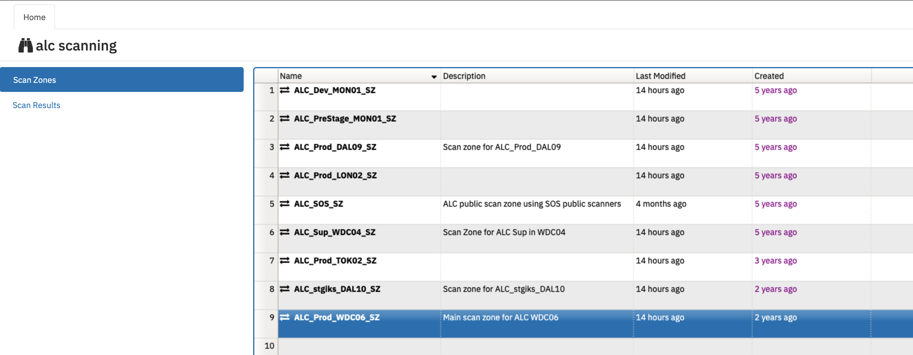
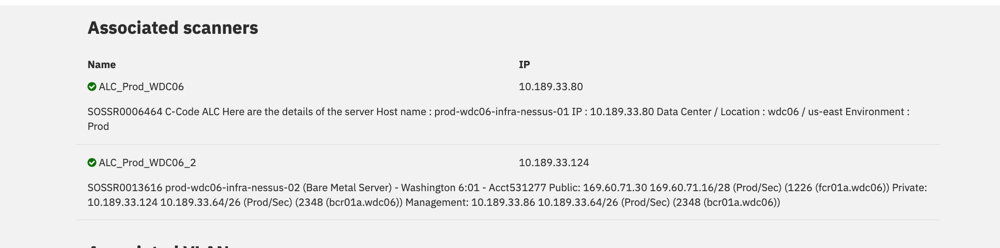
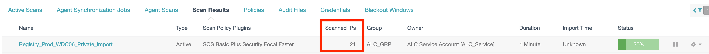
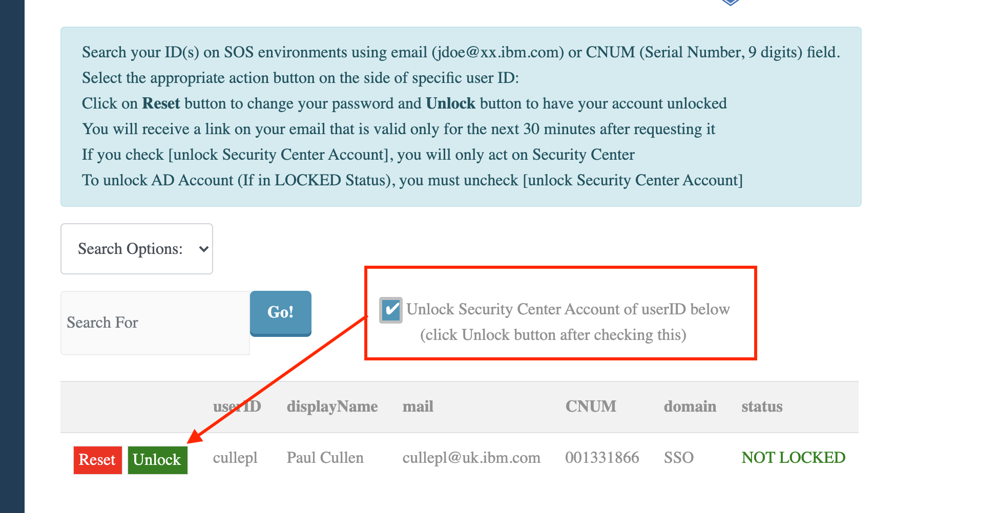

Troubleshooting
{: .label .label-red}

# Nessus scan Compliance Alerts

**Tracking down the problem with these machines will be complicated, but must be done quickly to ensure we maintain compliance**

## Overview

This runbook describes how to handle issues with nessus scans not running in a timely fashion

## Example alert(s)

SCANS FAILED - failed nessus scans require investigation

## Background

A Jenkins job runs every day and makes sure all scans have a completed on the schedule they are setup to run on.

There are two scan types that run:
- The ALC and Registry vulnerability scans should occur daily for both public and private IP addresses
- The ALC and Registry `CM7 All-ports` scans occur on a weekly basis

The scans use two different scan zones.

- All `public` scans go through the SOS Teams scanners and use `ALC_SOS_SZ` for ALC c-code and `ALC_SOS~FR2_SZ` for ALC_FR2 c-code.
- All `private` scans use a scan zone that points at our `infra-nessus` servers.  For example, `ALC_Prod_WDC06_SZ` is the scan zone for US-East and maps to `prod-wdc06-infra-nessus-XX` machines.

## Useful links

- [Link to daily scheduled compliance jenkins job](https://alchemy-conductors-jenkins.swg-devops.com/job/Conductors/job/Security-Compliance/job/nessus_scan_compliance/)
- [GHE compliance code](https://github.ibm.com/alchemy-conductors/compliance-vscan)
- To obtain access to Security Center, refer to [security center access runbook](../process/access_control_sos_security_center.html)
- For generic nessus troubleshooting information refer to the [Nessus Troubleshooting Runbook](./nessus_troubleshooting.html)
- The failed scan can be affected by maintenance. Check maintenance annoucement at [#sos-securitycenter](https://ibm-argonauts.slack.com/archives/C5CDH4XD5)
- [Nessus overview/architecture runbook](./compliance_nessus_overview.html)

## Investigation and Action

A PD alert will trigger if one of the scheduled scans failed to complete. That PD alert will contain a link to this runbook and the GHE issue in the [conductors team GHE](https://github.ibm.com/alchemy-conductors/team/issues) repository - this will contain the full list of scans that have failed.

The scan does not report if a machine within the scan has failed to be scanned.  These will be raised by the compliance team via their manual checks.  The [systems not scanned](./compliance_systems_not_scanned.html) runbook details how to investigate and address machines not recently scanned.

## Review the GHE

The GHE issue will contain details of the failed scans

For example:
~~~
The following scans are identified as failing and need investigation:

[ALC_all_envs_public_import ALC_Prod_WDC06_private_import]
~~~

The items in the square brackets are references to `nessus scan` definitions in [SOS Security Center](https://w3sccv.sos.ibm.com/)

## Review the scan(s) in Security center

1. Log into the [Security Center](https://w3sccv.sos.ibm.com/)
2. Click on `Scans` -> `Scan results` 
3. Search for the scan definition reported as failed in the GHE. You can often find more information about the scan by clicking on it and looking at the details.

Typically reported issues are:

- A scan is still in progress (delays have occurred)
- A scan failed to complete and reports a partial state
- A scheduled scan failed to run/results are missing

NB: If you are locked out of security center, see [unlocking my security center id](#unlocking-my-security-center-id) section below.

## Handling public ip scan failures

Public scans go via the SOS teams public scan zone and **not** our `infra-nessus` servers, therefore, problems in this area may need assistance from the SOS team.

Previously seen problems include:

- A set of failed scans due to public scanner issues:  
These will be displayed as `Partial` or `Error` in Security Center.  Before engaging SOS, try and re-submit the scan that has been marked as failed. See [Resubmitting the failed scan](#resubmitting-the-failed-scan) section.

If the resubmission fails, go to [escalation section](#escalation-policy)

## Handling private ip scan failures

_**NB**Only private scans use our `infra-nessus` servers therefore these steps should **NOT** be followed when investigating `public ip` scan failures as they will have no affect on public scan issues._

First, before trying to reboot any servers, try and re-submit the scan that has been marked as failed. See [Resubmitting the failed scan](#resubmitting-the-failed-scan) section

If a re-run fails, for `private scans` the usual issues are with the scanner we have which performs the actual scan.  The below table details the scanners we have and the regions they cover. 

| Nessus scanzone name | Scanners | regions covered |
| -------------- | ------- | -------------- | 
| ALC_Dev_MON01_SZ | dev-mon01-infra-nessus-02 | All of dev machines in 659397  and dev containers account (1186049) | 
| ALC_PreStage_MON01_SZ | prestage-mon01-infra-nessus-01 prestage-mon01-infra-nessus-02 | All of prestage |
| ALC_Stage_DAL09_SZ | stage-dal09-infra-nessus-01 | All of stage machines in 531277 |
| ALC_stgiks_DAL10_SZ | stgiks-dal10-infra-nessus-01 stgiks-dal10-infra-nessus-02 | All stgiks in 1858147 |
| ALC_Prod_TOK02_SZ| prod-tok02-infra-nessus-01 prod-tok02-infra-nessus-02 | AP North and South regions |
| ALC_Prod_DAL09_SZ | prod-dal09-infra-nessus-01 prod-dal09-infra-nessus-02 prod-dal09-infra-nessus-03 | US South region |
| ALC_Prod_WDC06_SZ | prod-wdc06-infra-nessus-01 prod-wdc06-infra-nessus-02 | US East region |
| ALC_Prod_LON02_SZ | prod-lon02-infra-nessus-01 prod-lon02-infra-nessus-02 prod-lon02-infra-nessus-03 | UK South and EU Central regions |
| ALC_Sup_WDC04_SZ| sup-wdc04-infra-nessus-01 | 278445 account scans |
{:.table .table-bordered .table-striped}

Scans which report 0 devices scanned usually indicate a problem with our nessus scanner(s).  Either the nessus process on the server has experienced issues or another factor on the machine is having issues.  

If scanners go down, we have a separate `sensu-uptime` alert which will fire if the machine is down or the nessusd has stopped running so check if this is firing.

### Check the scanzones for any issues.

For example, if `ALC_Prod_WDC06_private_import` has fired, the following would be checked

- Navigate to [SOS scanzone information for ALC](https://w3.sos.ibm.com/inventory.nsf/security_center.xsp?c_code=alc))
    - The scanzone for WDC06 scans is `ALC_Prod_WDC06_SZ`
  

- Open the scanzone record and check the health of the `Associated scanners` in the scanzone.  They should all be green

If any of the scanners associated with the scan zone show a red status, it means one of the following situations have been hit

1. The `nessusd` process is not running on that server
2. The server is down
3.  The server has been reloaded but SOS have not re-enabled it as a scanner in the scan zone (SOS run a job to push the scan config down onto the server if a machine gets reloaded.)

These scenerios should be investigated.  Pagerduty alerts do exist to cover scenarios 1 and 2, so check with on-call SREs to see if any alerts are firing.

### Reboot the scanner(s)

The majority of issues are fixed by issuing a reboot of the scanner and submitting a re-run of the scan that failed.  Reboots can be run via `chlorine` bot.

Example command: `reboot dev-mon01-infra-nessus-01 outage:0`

If rebooting via chlorine fails, review the state of the machine in [IBM Cloud Classic Infrastructure](https://cloud.ibm.com/classic/)

Try a hard reboot or power-off/power-on cycle.  If this doesn't resolve the issue, then consider raising a support case against the machine to get IaaS support to bring the system back up.

If you successfully reboot the scanner, proceed to the [Resubmitting the failed scan](#resubmitting-the-failed-scan) section

## Reboot failed to fix the issue

If reboots fail to resolve the issue, an osreload should fix things but should be performed as a last resort.  If you get this far, the for now, reach out to the Security Compliance squad and to Paul Cullen.  More investigation into the relability and setup of our nessus scanning will be required here rather than performing a temporary fix by reloading.

To perform an osreload, follow these steps:

1. An OSReload should be initiated via the [IBM Cloud Classic Infrastructure](https://cloud.ibm.com/classic/) interface - reloads are **NOT** Supported via chlorine for `infra` nodes.
   - Note: **Bootstrapping will not be performed if the post provision script is not selected**
   - Note: Once OSReload is complete, remember to register the node with bastion - see instructions below

2. After the osreload completes, confirm that a bootstrap completed successfully via the `bootstrap-bot-alerts` channel. If failures occur, debug and correct - seek SRE assistance if required.

3. After confirming successful bootstrap, follow these steps in the Nessus scanner deployment guide to re-initiate the scanner - [Raise an SOS ticket](./sre_nessus_scanner.html#enabling-the-scanner)

If you successfully reload the scanner and once re-registered with bastion, proceed to the [Resubmitting the failed scan](#resubmitting-the-failed-scan) section

### Register `infra` node to bastion (Important)
1. Go to one of the following jenkins jobs depending on which bastion to update 
  - [bastion-register-nodes-ww](https://alchemy-containers-jenkins.swg-devops.com/job/armada-ops/job/bastion-register-nodes-ww/) for worldwide registrations
  - [bastion-register-nodes-eu-fr2](https://alchemy-containers-jenkins.swg-devops.com/job/armada-ops/job/bastion-register-nodes/) for eu-fr2 registations

2. Enter `TARGET_HOSTS_IP`as `infra` node ip which need to be register to bastion.

3. Enter `TARGET_HOSTNAME` of region Example: if `infra` node region is `prod-wdc06` then pick one of worker of that region ie `prod-wdc04-carrier1-worker-1001`

4. Leave `Branch` field unselected, default is `master`

Monitor the output of jenkins job and make sure it is success. If it failes for some reason, open a issue with output of jenkins job and label the issue as `bastion`.

## Resubmitting the failed scan

**WARNINGS BEFORE RESUBMITTING** Be careful if the new `ALC_all_envs_public_import` scan has failed.  Consider whether you should re-submit this based on how many days since the last successful execution.  This scan currently scans **ALL** ALC machines (6000+) and takes around 24 hours to complete.
If this has successfully completed on the previous day, then leave this and let the next scheduled run occur.  Overlapping runs on the same scanzone can cause a slow down of execution.

In [SOS Security Center](https://w3sccv.sos.ibm.com/) click on `Scans -> Active Scans` to display the scan definitions.

Click on the triangle `play` button next to the scan that failed to re-submit the scan.  If successful, a message will appear stating the scan was submitted successfully.

Click on `Scans -> Scan results` to display the scan results and in-progress scans.  This screen should show the scan just submitted.  To verify the scan has started and is successfully scanning assets, you need to monitor the progress until it starts showing IP addresses as being successfully scanned.  You should be able to observe this on the main scan page (see example screen shot)

If the re-run fails to start scanning assets, then go to [escalation section](#escalation-policy)

## Unlocking my security center id

- Navigate to the [IdMgmt Reset User page](https://password.sos.ibm.com/default.aspx)

- Use the search option to find your SSO ID associated with security center

- Select the `Unlock Security Center Account of userID below` option

- Click `Unlock` to action this request

## Engage the security squad

Reach out to the Security and Compliance squad to help debug the scans Security Center.

## Engage SOS

To engage `SOS Vulnerabiltiy Scanning` squad raise a ServiceNow ticket against the SOS Vulnerability Scanning team to investigate the problem further: [Link to raising a Service Request](https://ibm.service-now.com/nav_to.do?uri=%2Fcom.glideapp.servicecatalog_cat_item_view.do%3Fv%3D1%26sysparm_id%3D45ef56a7db7c4c10c717e9ec0b96193a%26sysparm_link_parent%3D109f0438c6112276003ae8ac13e7009d%26sysparm_catalog%3De0d08b13c3330100c8b837659bba8fb4%26sysparm_catalog_view%3Dcatalog_default%26sysparm_view%3Dcatalog_default)

- Assignment Group: `SOS Vulnerability Scanning`
- C_Code: `ALC`
- Severity: `Severity 2`
- Include the names of the scans that failed and any details from within the scan such as error messages.

To gain access to the Security Center see [Access control for Argonauts Squads - SOS Security Center](https://pages.github.ibm.com/alchemy-conductors/documentation-pages/docs/process/access_control_sos_security_center.html#process).  
The userid and password to use will be the SOS IDMgt userid (not your w3Id).

## Escalation Policy

If you've exhausted all investigation and scans are not working, escalate to the SRE Security/Compliance focal to investigate further.

- SRE security compliance pagerduty escalation policy - [alchemy-security-compliance-squad](https://ibm.pagerduty.com/escalation_policies#P16WJ6X)
- Slack channel details - [{{ site.data.teams.containers-sre.comm.name }}]({{ site.data.teams.containers-sre.comm.link }}) 
