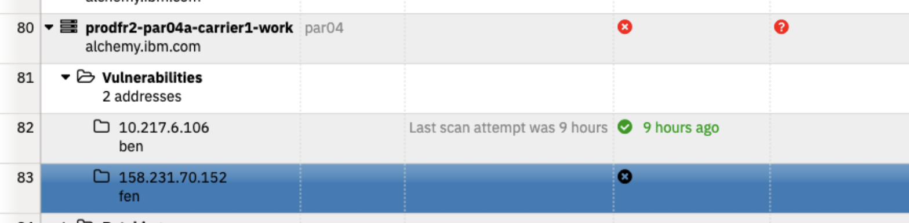
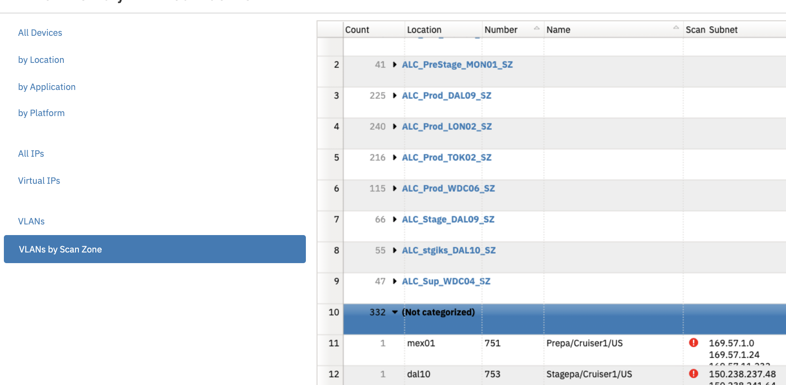
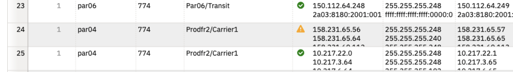
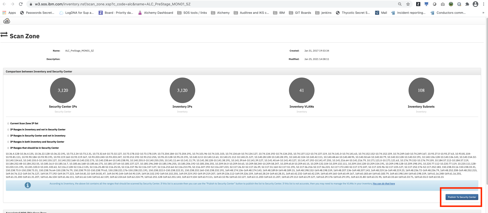

Troubleshooting
{: .label .label-red}

# Nessus scan Gap Alerts

**Tracking down the problem with these machines will be complicated, but must be done quickly to ensure we maintain compliance**

## Overview

This runbook describes how to handle issues with IP addresses that are not being scanned by Nessus

## Example alert(s)

`GAP ALERT - unscanned machines require investigation`

## Investigation and Action

There will be page raised against the Alchemy Compliance if there are >0 machines that are reported and not scanned. That page
will contain a link to this runbook and the Git Hub Enterprise issue in the [Alcatraz repo](https://github.ibm.com/alchemy-conductors/alcatraz/)
repository which will contain the full list of services.

## Tracking down the problems in the raised GHE issue

### Powered off machines

Some machines are powered off, this will prevent them from being scanned. First thing to check is if the machine is ON in the [IBM Infrastructure portal].

If **Off** check if the machine is being decommisioned - search [Conductors team tickets](https://github.ibm.com/alchemy-conductors/team/issues).

If there is no record of it being powered off ready for cancellation, then work to get the machine turned back on.

Powered off machines need to get decommisioned ASAP so as not to cause scan issues.  If the machine is to be cancelled and you find a corresponding ticket for it in [Conductors team tickets](https://github.ibm.com/alchemy-conductors/team/issues) then review the status and work to cancel the server asap.

If a cancellation request has already been submitted and the server is a baremetal, then look at updating the IBM Infrastructure ticket requesting `immediate reclaim of the server` or the server may remain in our account until the end of the current billing month.

### Does the machine exist in our accounts?

Some machines, especially KUBE machines, have the wrong code assigned and therefore show up under ALC by mistake. Check the IP address with
`@netmax` and see if a machine is found. If not then double-check in the [IBM Infrastructure portal].

If the machine is gone then you will need to change the Environment of the machine to "NOTALCHEMY" so they are not longer reported against our compliance status.

Visit the [Inventory dashboard]. Use the search box in the top right and enter the IP address and click on the magnifying glass to search.

Once the server is located then right click on the server, click on `Update` in the menu, then click on `Environment`. In the pop up select 'NOTALCHEMY' from the drop down list then click OK.

Ensure that a comment is placed on the orignal GHE ticket to document that the machine did not exist and that it was moved to being a 'NOTALCHEMY' machine

### IP exists but no machine when querying netmax

If netmax responds showing a Private _Primary_ subnet but without the details of the machine:

    netmax APP [4:18 PM]
    @rowles:
    >*10.144.112.192/26* (_Primary_) - Acct531277
    > _10.144.112.192/26_ (_Prod/Carrier6_) (_1142 (bcr01a.mil01)_)

Then the IP address *might* be the "Management" IP address. Look up the machine name in question in the IBM Infrastructure portal and
check to see if the IP matches the management IP.

If it does then the problem is likely to be a broken IPMI instance. Double check that the IP is not pingable from the appropriate
nessus machine (see below), and if it is not pingable then raise a IBM Infrastructure ticket via the explaining that the Management IP is not pingable
and ask if they can

    refresh the switch configuration for the IPMI and check that the IPMI then responds correctly

This should then resolve the problem with scanning.

### Machine is reported as `Scan attempted: never`

A machine may report a never attempted for one or more of its interfaces (public, private and IPMI are possible interfaces).

Example screenshots of a failed scan

#### Step 1: Verify the asset list is correct

Automation should be adding machines to the Asset lists to be scanned by nessus.  
The automation is [documented in the scan list generator runbook](./compliance_nessus_scan_ip_list_generator.html)

The asset lists should not be manually edited, the linked runbook should be used to debug whether the asset list generator is broken and verify the machines are in the asset list for scanning.

#### Step 2: Verify VLANs in SOS are associated with a scan zone

There is automation for ALC c_code which will automatically associate VLANs with a scan zone. This is documented in [VLAN scan zone classifier runbook](./compliance_sos_vlan_scan_zone_classifier.html).

The automation does not take care of publishing the updated VLANs to the scanner so needs to be manually verified.  

Follow these steps to validate that the VLANs where these machines are located are associated with a scan zone and published to the scan zone.

1. Log into the [SOS portal](https://w3.sos.ibm.com/inventory.nsf/index.xsp?c_code=alc)
_switch to ALC_FR2 if required by adjusting the c_code in the URL_

2. On the `Inventory` section (the link should have taken you there), select the `Network` tab and then `VLANs by scanzone`

3. Search for the VLAN where the machine which is scanning is located.  
  - If the VLAN is marked as `green` then the scanning issue is not with VLAN association and the remainder of the runbook should be consulted to aid further investigation.
  -  If the scan subnet column has a `red` circle, this means the VLAN has no assciation with an scanner. Open and edit VLAN record, and associated the VLAN with the correct scan zone, then proceed to step 4.
  
  -  If the scan subnet column has a `yellow` triangle, this means that the VLAN is associated with a scan zone, but this information has not been published to Security center, go to step 4 to publish.
  

4. Once step 3 is complete, a manual publish of the scanzone configuration is required.  Click on the `Security center` tab to show the scan zones and open the record for the zone you have just edited.  Once inside the record, click the `publish to security center` button to push the newly associated VLANs to security center. The next scheduled scan defined in Security Center should now start scanning these devices.

### Machine reports scan date > 1 year

There have been bugs in the tooling in the past - this sort of message indicates a tooling problem and a problem should be raised in the [IBM Cloud Employee Service Portal].

Once logged in, create a service request by choosing:

- **Catalog**  
   _... from the horizontal menu bar_
- **Service Request  
   Open a service request to the SOS team**  
   _... one of the "Popular items" boxes_
- and, in the new service request form:
  - assign the request to the `SOS Vulnerability scanning` group
  - C_Code is probably ALC

### Only one of public/private IP address for the machine doesn't work

If the report shows only one IP for the machine works, but the machine actually has both public and private then there is likely
a problem with the machine configuration or VLAN assignment. Find the machine in the IBM Infrastructure portal and check that the public
and private IP addresses are on a matching name pair of VLANS, the prefix or entire name of the VLAN should match on both sides, e.g.
Prod/Carrier6 for both front or back or Prod/CSMG/B and Prod/CSMG/F for back and front (private and public) respectively.

If the VLANs are mismatched then the machine will need to either be moved via a IBM Infrastructure ticket, or the machine will need to be deprovisioned and re-ordered.

If the VLANs are correct then it may be that the machine itself is badly configured. This can be the case when a public IP was added
after the machine was ordered. Log onto the machine and check the output of `ifconfig` has configuration for the problem IP. If the
IP address is not listed then the machine either needs to have the public interface removed via IBM Infrastructure ticket, or the interface
needs to be properly configured in the OS so that the machine responds to ping.

### Machine is being deleted

Machines that are powered off and pending deletion (and especially bare metal machines that will not be recovered until the next month) will show up in the compliance list as being not compliance as they will not be properly scanned.

To fix this, we can do two things.

1. Find the server in the IBM Infrastructure portal and update the server cancellation ticket associated with the device and request that the server is immediately reclaimed.

2. Mark the machines as pending deletion so that they are removed from the report.

Visit the [Inventory dashboard]. Use the search box in the top right and enter the IP address or name and click on the magnifying glass to search.

Once the server is located then right click on the server, click on `Update` in the menu, then click on `Environment`. In the pop up select 'PENDING-DELETION' from the drop down list then click OK. Then repeat this
for the 'Application' and select "Pending Deletion"

Ensure that a comment is placed on the original GHE ticket to document that the machine did not exist and that it was moved to being a 'PENDING-DELETION' machine

### Other Uncontactable machines

Machines need to be pingable to be able to be scanned, both on the public and private IP. Look at the output in the GHE ticket
and identify where the machine is located, this can then be used to map to the appropriate nessus scanner:

| Environment Name  | VPN Server Location  |
|---|---|
| PROD-AP-NORTH | prod-dal09-infra-nessus-01  |
| PROD-US-SOUTH | prod-dal09-infra-nessus-01 |
| STAGE | stage-dal09-infra-nessus-01 |
| FOUNDATION | sup-wdc04-infra-nessus-01 |
| PROD-AP-SOUTH | prod-dal09-infra-nessus-01 |
| PROD-US-EAST | prod-dal09-infra-nessus-01 |
| DEV-PRESTAGE | dev-mon01-infra-nessus-01 / prestage-mon01-infra-nessus-01 |
| PROD-EU-CENTRAL | prod-lon02-infra-nessus-01 |
| PROD-UK-SOUTH | prod-lon02-infra-nessus-01 |
{:.table .table-bordered .table-striped}

Log in to the appropriate Nessus server and then run the following command:

`ping IP_ADDRESS`

Where IP_ADDRESS is the public and private IP address of the server that you are checking. Ping should work correctly, if
it doesn't work then contact the appropriate machine owner to ensure that the firewall is open for ping.

Once ping is working correctly the machine should scan. Most machines will also allow SSH access so you can check with

`nc -zv IP_ADDRESS 22`

This will only work for private IP but is another useful way of contacting the machine and checking connectivity.

If the machine does not respond then the first course of action should be to reboot the machine via the IBM Infrastructure portal
and confirm it reboots, if that fails investigate via KVM / IPMI interface to check for kernel or booting issues. To connect via KVM console follow the runbook: [KVM Access](https://pages.github.ibm.com/alchemy-conductors/documentation-pages/docs/runbooks/kvm_access.html)

### What if the machine owner says that the machine does respond to ping

It is possible that there is a firewall problem preventing the Nessus scanners working, as a last resort open a firewall
ticket with the [NetInt team] and ensure that they are
notified in the `#Netint` channel in slack via the `@ask-netint` contact group.

### Checking the state of the Scanner nodes

There are cases where the scanner responds to ping, but `nessusd` service may be down or not able to serve requests.
For instance;

    root@prod-dal09-infra-nessus-01:~# ss -nltp | grep nessusd
    LISTEN   0         128                 0.0.0.0:8834             0.0.0.0:*        users:(("nessusd",pid=1554,fd=12))    
    LISTEN   0         128                    [::]:8834                [::]:*        users:(("nessusd",pid=1554,fd=56))    
    root@prod-dal09-infra-nessus-01:~#

To ensure the service (nessusd) is running good, check the logs (/opt/nessus/var/nessus/logs).In case of errors perform a service reset, as shown below

1) service nessusd stop 
2)/opt/nessus/sbin/nessuscli fix --reset-all 
3) service nessusd start

If this doesn't resolve the issue, go to   **Obtaining help from SOS Team** section below

Additionally note that at any time all active scans can viewed by logging into [security center](https://w3.sos.ibm.com/sccv/) -> click on scans (down arrow) and then select active scans. Out of schedule if we want to run a scan click on the arrow symbol on the right hand side of the scan name. If you have access issues with [security center](https://w3.sos.ibm.com/sccv/) then  raise an [SOS request](https://watson.service-now.com/ess_portal?id=sc_cat_item&sys_id=4f8618d0dbfec74072583c00ad96193d). Some useful information [here](https://pages.github.ibm.com/SOSTeam/SOS-Docs/sca/Security-Center-How-To%27s.html)

### Scanner is down/unreachable?

Sometimes, the easiest fix is to osreload the scanner and get it re-initialised as a nessus scanner.

This is certainly the case if the machine is down and unreachable and reboots/power-off and back on are not bringing it back online.

The high level steps to do this are:

1. Find the machine in [IBM Cloud Classic Infrastructure](https://cloud.ibm.com/classic/devices)
2. Issue and osreload, including the correct post provision script and any ssh keys you wish to add
3. Monitor the reload for completion
4. Verify the machine has successfully bootstrapped and been patched
5. Reboot the server to apply any patching updates
6. Raise an [SOS Support ticket](https://ibm.service-now.com/nav_to.do?uri=%2Fcom.glideapp.servicecatalog_cat_item_view.do%3Fv%3D1%26sysparm_id%3D45ef56a7db7c4c10c717e9ec0b96193a%26sysparm_link_parent%3D109f0438c6112276003ae8ac13e7009d%26sysparm_catalog%3De0d08b13c3330100c8b837659bba8fb4%26sysparm_catalog_view%3Dcatalog_default%26sysparm_view%3Dcatalog_default) against `SOS Vulnerability Scanning` assignment group and ask for the reloaded nessus scanner to be re-initialised - provide the name and IP address of the scanner.
7. Once the ticket is complete, scanning should resume at the next scheduled cycle.

## Obtaining help from the SOS Team

The SOS team own the scanning process.

If a none of the steps in this runbook help resolving an issue, raise a request in the [IBM Cloud Employee Service Portal].
Once logged in, click on `Catalog` followed by `Service Request - Open a service request to the SOS team` and assign it to the `SOS Vulnerability scanning` group.

## Escalation Policy

If there are any concerns with this process or problems following this runbook then contact Containers SRE using the following escalation policy [{{ site.data.teams.containers-sre.escalate.name }}]({{ site.data.teams.containers-sre.escalate.link }})

In slack, contact the on-call SRE in slack in [{{ site.data.teams.containers-sre.comm.name }}]({{ site.data.teams.containers-sre.comm.link }}) channel

- [IBM Infrastructure portal](https://control.softlayer.com/)
- [Inventory dashboard](https://w3.sos.ibm.com/inventory.nsf/servers.xsp?c_code=alc)
- [Conductors team tickets](https://github.ibm.com/alchemy-conductors/team/issues)
- [IBM Cloud Employee Service Portal](https://watson.service-now.com/ess_portal)
- [ServiceNow](https://watson.service-now.com/)
- [NetInt team](https://github.ibm.com/alchemy-netint/firewall-requests/issues/new)
