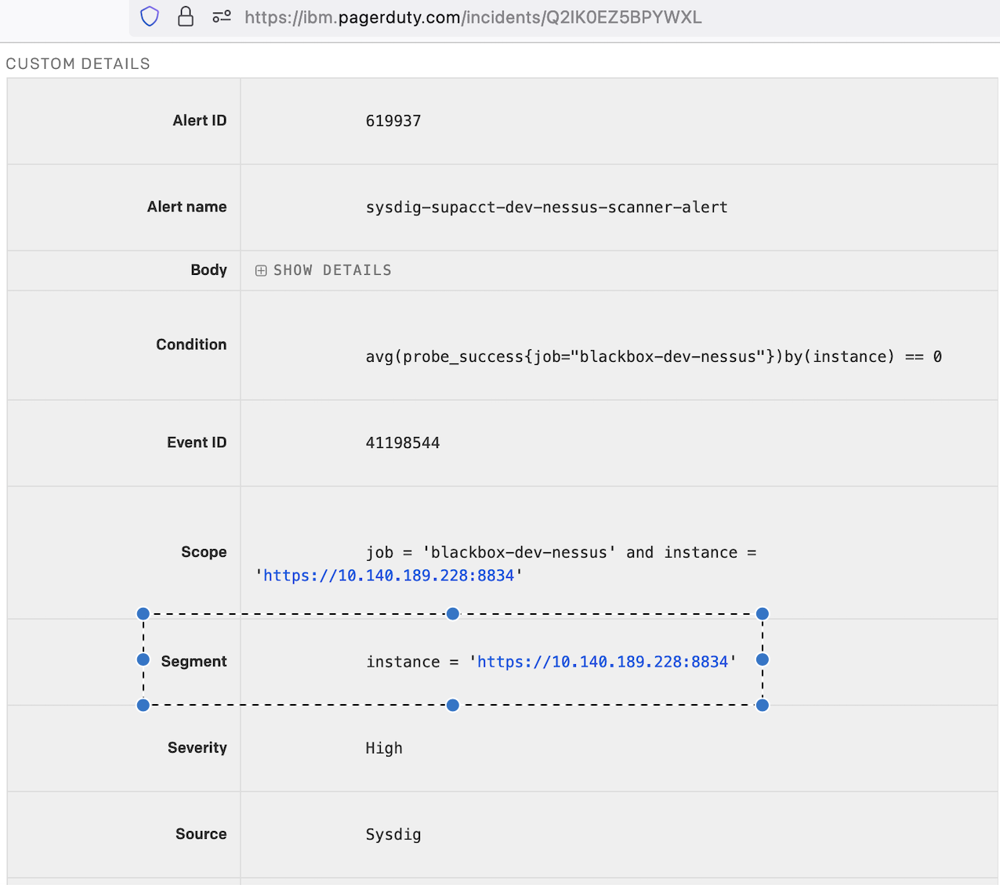

Troubleshooting
{: .label .label-red}

## Overview

The Vulnerability Scanning service provided by the [SoS](https://w3.sos.ibm.com/) organization relies on local machines on each environment that will perform the TCP/IP scans for the private network of all of our machines looking for know vulnerabilities. Each of these [Nessus](https://www.tenable.com/products/nessus/nessus-professional) scanner is accessed on TCP port 8834 directly from the SoS network through an IPSec VPN on each environment.

If the connectivity doesn't exist, the [Security Center](https://w3sccv.sos.ibm.com/#) will not be able to schedule new scan jobs or collect the results of a scan, what could compromise our IT security compliance posture and overall security of the environment.

All public networking scanning goes via SOS owned machines/scan zones.


The local nessus machines are now setup to execute  the private IP address scans **ONLY**

The `ALC_SOS_SZ` scan zone, owned and maintained by the SOS team, is used for all public IP scans, so any issues with public IP scanning will not be as a result of issues with machines SRE own.

## Example Alert

[Nessus Scanner is down in Pre-stage](https://ibm.pagerduty.com/incidents/Q3WO1V8ZU609T5)

### How to get the Nessus scanner name from Pager Duty Alert
- Get `instance` value from `Segment` section in the alert <br> 
  - Example: <br> 
        instance = `https://10.140.189.228:8834`  <br> 
        Use `netmax` bot to get the name of Nessus scanner for given IP address `10.140.189.228`. In this example it is `dev-mon01-infra-nessus-02`. <br>
        OR <br>
        Search in [NetInt-source-file](https://github.ibm.com/alchemy-netint/network-source/tree/master/softlayer-data). <br>
    
    
## Scanner details

Details of the machines we have the the scan zones they are associated with:

| Nessus scanzone name | Scanners | regions covered |
| -------------- | ------- | -------------- | 
| ALC_Dev_MON01_SZ | dev-mon01-infra-nessus-01 | All of dev machines in 659397  and dev containers account (1186049) | 
| ALC_PreStage_MON01_SZ | prestage-dal09-infra-nessus-01 | All of prestage |
| ALC_Stage_DAL09_SZ | stage-dal09-infra-nessus-01 | All of stage machines in 531277 |
| ALC_stgiks_DAL10_SZ | stgiks-dal10-infra-nessus-01 | All stgiks in 1858147 |
| ALC_Prod_TOK02_SZ| prod-tok02-infra-nessus-01<br>prod-tok02-infra-nessus-02 | AP North and South regions |
| ALC_Prod_DAL09_SZ | prod-dal09-infra-nessus-01<br>prod-dal09-infra-nessus-02<br>prod-dal09-infra-nessus-03 | US South region |
| ALC_Prod_WDC06_SZ | prod-wdc06-infra-nessus-01<br>prod-wdc06-infra-nessus-02 | US East region |
| ALC_Prod_LON02_SZ | prod-lon02-infra-nessus-01<br>prod-lon02-infra-nessus-02<br>prod-lon02-infra-nessus-03 | UK South and EU Central regions |
| ALC_Sup_WDC04_SZ| sup-wdc04-infra-nessus-01 | 278445 account scans |
{:.table .table-bordered .table-striped}


## Investigation and Action

**NB:** In some environments, there are multiple `infra-nessus` servers so please take care when reviewing the PD and the affected machine

Follow the following steps:

1. SSH/Login to the corresponding nessus scanner machine as indicated on the alert  
_They are named `{env}-{dc}-infra-nessus-{number}`, e.g. `prod-dal09-infra-nessus-01`_

1. If you are unable to ssh/login, perform a hard reboot of the device using either
    - chlorine bot - `reboot <server> outage:0` or
    - [IaaS Classic Infrastructure](https://cloud.ibm.com/gen1/infrastructure) - Search for the server and use the hard-reboot option.
 
1. If you are able to ssh to the machine, verify that the `nessusd` daemon is running:  
`sudo service nessusd status`

```
cullepl@prod-wdc06-infra-nessus-01:~$ sudo service nessusd status
* nessusd.service - The Nessus Vulnerability Scanner
   Loaded: loaded (/lib/systemd/system/nessusd.service; enabled; vendor preset: enabled)
   Active: active (running) since Mon 2021-04-12 12:51:03 UTC; 5min ago
 Main PID: 761 (nessus-service)
    Tasks: 14 (limit: 4915)
   CGroup: /system.slice/nessusd.service
           |-761 /opt/nessus/sbin/nessus-service -q
           `-766 nessusd -q

Apr 12 12:51:03 prod-wdc06-infra-nessus-01 systemd[1]: Started The Nessus Vulnerability Scanner.
```

1. If the service is not running, start it and check status again:  
`sudo service nessusd start`

   ```
   chiquito@dev-mon01-infra-nessus-01:~$ sudo service nessusd start
   Starting Nessus 
   ```
   
   Then validate it restarted correctly
   
   ```
   cullepl@prod-wdc06-infra-nessus-01:~$ sudo service nessusd status 
   * nessusd.service - The Nessus Vulnerability Scanner
   Loaded: loaded (/lib/systemd/system/nessusd.service; enabled; vendor preset: enabled)
   Active: active (running) since Mon 2021-04-12 12:51:03 UTC; 5min ago
   Main PID: 761 (nessus-service)
      Tasks: 14 (limit: 4915)
   CGroup: /system.slice/nessusd.service
           |-761 /opt/nessus/sbin/nessus-service -q
           `-766 nessusd -q

   Apr 12 12:51:03 prod-wdc06-infra-nessus-01 systemd[1]: Started The Nessus Vulnerability Scanner.
   ```
   If nessusd fails to start, debug this further.  Logs under `/var/log` maybe helpful.

1. Check if you can connect to port 8834:  
`nc -zv localhost 8834`

   ```
   dev-mon01-infra-nessus-01:~$ nc -zv localhost 8834
   Connection to localhost 8834 port [tcp/*] succeeded!
   ```
   If the above fails with:  
   `nc: connect to localhost port 8834 (tcp) failed: Connection refused`
   you may need to check the 10 address rather than localhost.
   running `netstat -l | grep 8834` will confirm that the machine is listening on the port.
   ```
   cameron@dev-mon01-infra-nessus-01:~$ netstat -l | grep 8834
   tcp        0      0 10.140.189.226:8834     0.0.0.0:*               LISTEN  
   ```
    - If you dont get any output then the service is not running properly - try restarting it to see if it comes back:
      - `sudo service nessusd stop` then 
      - `sudo service    nessusd start` \
   If the `netstat -l` command returns a line then run:
   `nc -zv 10.140.189.226 8834` (using the IP address returned above)
   this should show `succeeded`
    - If this succeeds and you have restarted the service, the PD should autoresolve shortly.

1. Test the same connectivity from the Sysdig monitoring that originated the alert  
   Follow the steps mentioned in `Sysdig Infra Monitoring debug runbook`

   - Successful test:   
   ```
   $ nc -zv 10.140.189.226 8834
   Connection to 10.140.189.226 8834 port [tcp/*] succeeded!
   ```

   - Failed test:
   ```
   $ nc -zv 10.140.189.226 8834
   nc: connect to 10.140.189.226 port 8834 (tcp) failed: Connection refused
   ```

1. If the server was reachable via ssh, and all the points above do not resolve the issue, consider a hard reboot of the server as per step 2.

1. If the connection is successful locally on the machine but not from the Sysdig Infra Monitoring (AAA Cluster in Support Account) you have a network connectivity issue.  
Please escalate to the Netint team following the escalation procedure.

## Additional debug

Useful tools to assist debugging issues with these machines.

- `dmesg -T` - this will display messages from the kernels message buffer.  This maybe helpful when debugging these alerts.  We've previously seen issues with OOM on these machines and kernel killing the `nessusd` process. 


- Review `/var/log/syslog` - search for `nessusd` -  this may have entries relating the the nessusd service being killed/restarted.  We recently experienced issues like this before increasing all nessus servers to 32GB RAM.  Example below:

```
Mar 23 19:37:35 prod-wdc06-infra-nessus-01.alchemy.ibm.com kernel: [24722.728154] Out of memory: Kill process 29573 (nessusd) score 935 or sacrifice child
Mar 23 19:37:35 prod-wdc06-infra-nessus-01.alchemy.ibm.com kernel: [24722.729196] Killed process 29573 (nessusd) total-vm:58110256kB, anon-rss:15776724kB, file-rss:0kB, shmem-rss:0kB
Mar 23 19:37:35 prod-wdc06-infra-nessus-01.alchemy.ibm.com kernel: [24723.409791] oom_reaper: reaped process 29573 (nessusd), now anon-rss:0kB, file-rss:104kB, shmem-rss:0kB
Mar 23 19:55:51 prod-wdc06-infra-nessus-01.alchemy.ibm.com kernel: [25820.431916] ixgbe 0000:04:00.1 eth1: Detected Tx Unit Hang
```

## False Positive alert
If PagerDuty Alert is still open after verifying that Nessus Scanner is up and running, refer to [Sysdig Monitoring On Support Act runbook](https://pages.github.ibm.com/alchemy-conductors/documentation-pages/docs/runbooks/sysdig-suptacct-debug.html) for further debugging steps.
    
## Escalation Policy
The nessus servers are owned and maintained by the SRE squad.  If you are unable to address problems hit, then reach out to the IKS SRE Security Compliance Lead.

If you do suspect that a networking or firewall issue is the cause of the problem, then reach out to the netint squad in the `#netint` slack channel, opening an [firewall request](https://github.ibm.com/alchemy-netint/firewall-requests/issues) or by the escalation policy `Alchemy - Network Intel 24x7`

## Automation

none
