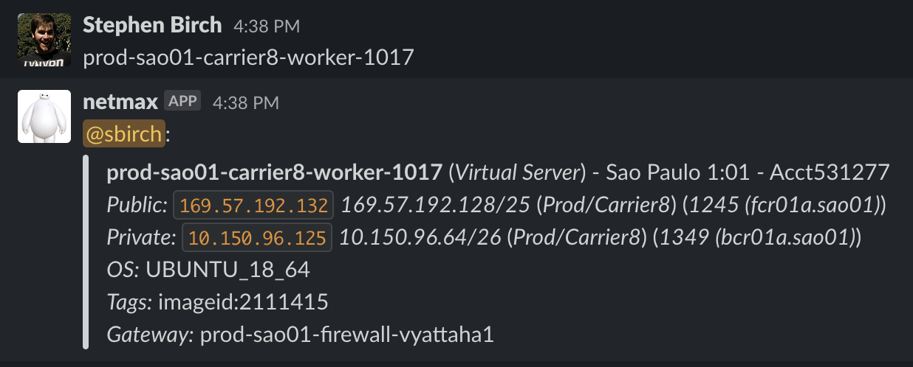
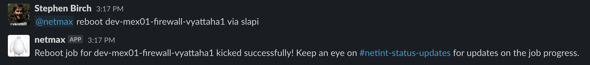
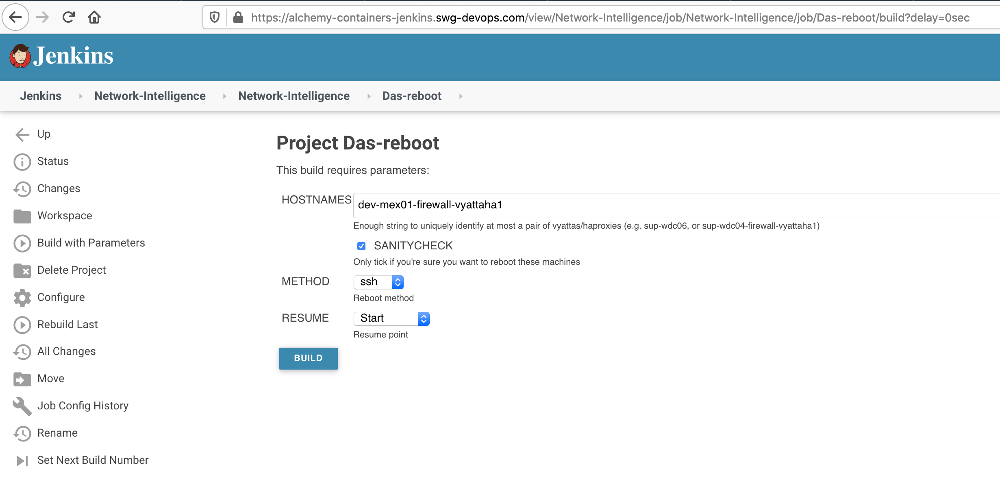

Informational
{: .label }

## Overview

Occasionally SRE will have requests to reboot vyattas in order to help services such as etcd to recover.

This runbook is just here to provide some more confidence whilst doing such actions.

## Detailed Information

See below.

---

## Overview

This runbook assists with requests to reboot vyatta devices.

We normally reboot vyattas when there are high ping times between availability zones (AZs) and users are reporting issues with services such as etcd or master operations timing out.

If executed correctly, no outages will occur as the job is designed to reboot one node of the vyatta pair at a time, with post verification built in to check that everything is running okay before moving onto the next device.

## Which vyatta to reboot?

If you're unsure which vyatta needs rebooting, you can use the `@netmax` bot.

_This has been disabled in sre-cfs, at the conductor's request_, you'll have to direct message the bot instead.

If you're able to find any worker machine, or any ip from the service you're attempting to recover, you can paste this to netmax and it'll say what vyatta it's behind.

In this example, I know I need to reboot to aid etcd (or similar) running on prod-sao01-carrier8-worker-1017. Netmax recognises this machine, and knows that the gateway is prod-sao01-firewall-vyattaha1. This can then be used in the next step. 

This can be particularly useful in the busier environments, since we have at least 3 different vyatta pairs in prod-dal12 for example.

---

## How to actually do the reboot?

First check that there's no reboots being actioned already to resolve this issue.  
_This can be checked by looking in the [#netint-status-updates channel](https://ibm-argonauts.slack.com/messages/CL29P3MHT)_

Now you have a choice, you can either use netmax:

This simply invokes the [Jenkins Job](https://alchemy-containers-jenkins.swg-devops.com/view/Network-Intelligence/job/Network-Intelligence/job/Das-reboot/).

Or the jenkins job directly:

---

## Escalation Policy

[Alchemy - Network Intel 24x7](https://ibm.pagerduty.com/escalation_policies#PSB1EKU)

If something goes wrong with a Production vyatta during a reboot, or the above steps aren't working, engage the Netint team directly. 
For non-production issues, speak to the Netint squad via slack in [#netint channel](https://ibm-argonauts.slack.com/archives/C53PUD2TE) 
---
