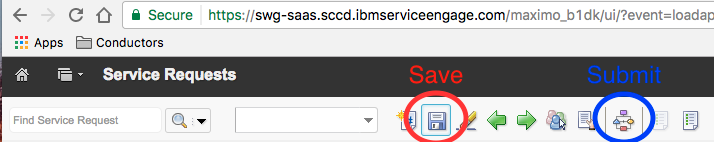
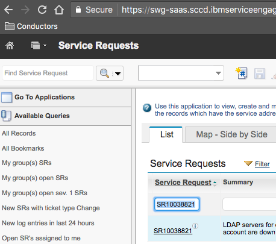

Troubleshooting
{: .label .label-red}

## Overview

# PD Description

## Example Alerts
  * *Description*: Container openvpn-$environment-$number is in error state. Openvpn may not be running! See container logs below

## Presteps

These checks are coming from the alchemy-devtest machine. IP address 9.20.33.66. 

To request access go to [ITIM](https://huritim.hursley.ibm.com/itim/self/RequestAccounts.do) and search for alchemy-devtest. 

## Symptoms

  * More detailed information can be found in the details of the pagerduty incident
  * What other PD incidents might we expect to co-occur?
    * Depending on the symptions both VPNs on the environment or all environment PDs may trigger

## Investigation and Action
If container logs contain one of the following:

  * Problem 1: **AUTH_FAILED**
    * This means the user was unable authenticate to the openvpn server. The USAM user connecting is `dashboard-prod`, there may be a problem with the user.
    Steps to resolve:
    1. Log onto the alchemy-devtest machine
    2. switch to root `sudo su`
    3. navigate to the root openvpn folder `cd /openvpn/`
    4. The username and password found in `ldap-login.txt` should match the password located in [Thycotic](https://pim.sos.ibm.com/SecretView.aspx?secretid=1019)
    5. If passwords do not match, update them so that they do and follow [this](#reset-openvpn-containers) guide to reset the openvpn containers
    6. Check to see if the container stays up `docker ps | grep openvpn-$environment-$number`. If it stays up, alert should resolve after the container has been up for 5 minutes
    7. If container crashes with the same AUTH_FAILED error, double check step 4 again, then [check container logs](#check-container-logs)
    8. If all else fails follow [escalation](#escalation-policy)
  * Problem 2: **was not able to find the container at all!**
    * This means the container is not running. 
    1. Follow [this](#reset-openvpn-containers) guide to reset the openvpn containers
    2. If no solution is found follow [escalation](#escalation-policy)
  * Problem 3: **OpenVPN connection is up, but failed to reach endpoint XX.XXX.XX.XX**
    * The container is up and running, but something is going on with the connection
    1. Check to see if the endpoint is accessible
    2. If the endpoint is down, attempt to bring it up. It most likely has nothing to do with the openvpn service itself
    3. If the endpoint is up then [check container logs](#check-container-logs)
    4. If all else fails follow [escalation](#escalation-policy)

### Reset openvpn containers

1. On the alchemy-devtest machine navigate to the folder with docker-compose.yml `cd /openvpn/`
2. Run the following cmd:

~~~~
docker-compose up -d
~~~~

### Check container logs

1. On the alchemy-devtest machine check the logs of the container in question `docker logs --tail=100 openvpn-$environment-$num`
2. If the end of the logs do not contain `Initialization Sequence Completed` that means the connection to the server is failing.
3. If it is failing then [check openvpn status](#check-openvpn-status)
4. If it is passing the alert will resolve after the container has been up for 5 minutes

### Check OpenVPN Status

1. First, check to see if your personal OpenVPN account can connect to the server listed in the pagerduty incident. If successful, [check dashboard-prod user](#dashboard-prod-cannot-connect-to-openvpn), if it fails continue to step 2
2. Go to the server that is listed in the PagerDuty incident. This is the server that the openvpn is trying to reach. 
3. run `service openvpn status`
4. If service is stopped. Start it with `service openvpn start`. If successful loopback to step 1
5. If service fails to start check the logs `/etc/openvpn/openvpn-status.log` and `/var/log/syslog`. Try to find any information on why the service cannot start.
6. If a solution cannot be found follow [escalation](#escalation-policy)

### Dashboard-Prod cannot connect to openvpn

1. Something is wrong with the dashboard-prod user in USAM. The password might have expired or locked out.
2. On the openvpn server run this command. Where $username is dashboard-prod. $password can be found in [Thycotic](https://pim.sos.ibm.com/SecretView.aspx?secretid=1019). $ldapserver can be found in `/etc/openvpn/auth/auth-ldap.conf`

~~~~
ldapsearch -LLL -x -H ldap://$ldapserver.sso.ad.isops.ibm.com -D '$ldapuser@sso.ad.isops.ibm.com' -w '$password' -b "DC=sso,DC=ad,DC=isops,DC=ibm,DC=com" '(&(uid=$username))'
~~~~~

3. From this output, it will show if the user is locked out and other additional information.

## Escalation Policy
  
  1. Open a GHE issue with any information gathered above 
  1. If at least 1 openvpn server is running and users can connect to it successfully, snooze the alert and the issue will be looked at next working day. 
  1. If this looks like a SSO/USAM issue please see [SSO escalation](#escalation-sso)
  1. The service and checks are owned by conductors. If unable to solve #netint might possibly be able to help

## Escalation SSO  
  
 The SSO team does not have 24x7 support. The best thing we can do is raise a service request as a SEV1.

 **If VPN is in critical need to support service stability, we will need to work with the person deploying the change and switching over to Softlayer VPN.**

 **If all else fails management escalation may be needed to get the SSO team available.**

 1. Create a Service Request [here](https://swg-saas.sccd.ibmserviceengage.com/maximo_b1dk/ui/?event=loadapp&value=sr&uisessionid=399&csrftoken=ib04ljtkgb368cm856tii9qqh6)
 2. Required Fields: 
  * Assignment Group: SOS WINDOWS ID MGMT - SSO
  * Environment: Dev/Test, Production
  * Module: Windows ID management - SSO
  * C_CODE: ALC
  * Severity: P3 - Important (or higher)
  * Site: CSS
 3. Save Service Request (See Image Below)
 4. Submit Service Request (See Image Below)

 

 An example Service Request can be found by going to the link above and searching SR10038821 in the "Service Request" column, then hitting "Filter". (See Image Below)

 

## Further reading

  * Link to informational documentation [openvpn additional information](./openvpn_additional_info.html)  
