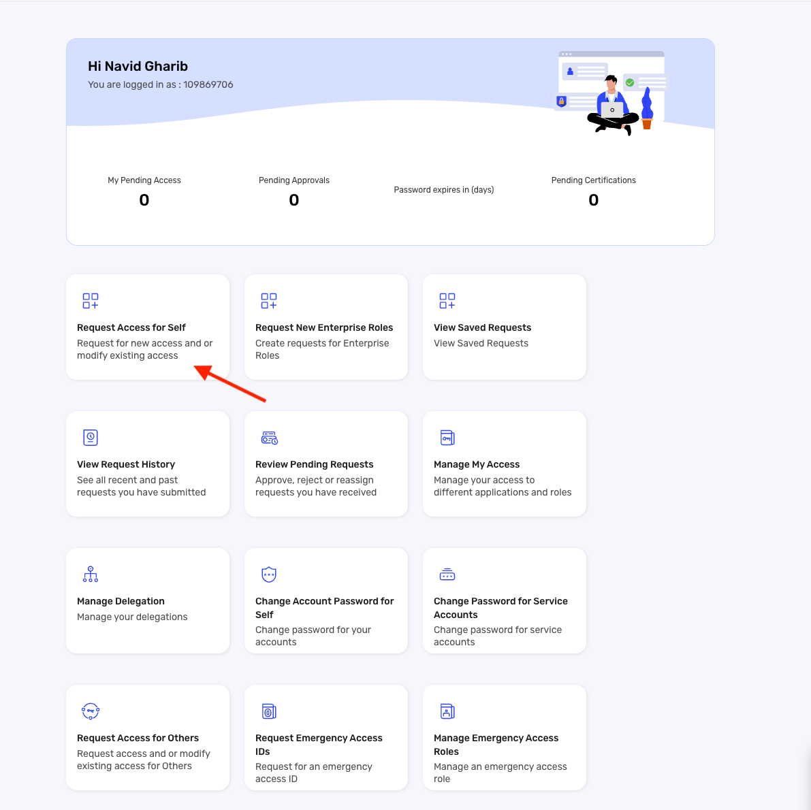
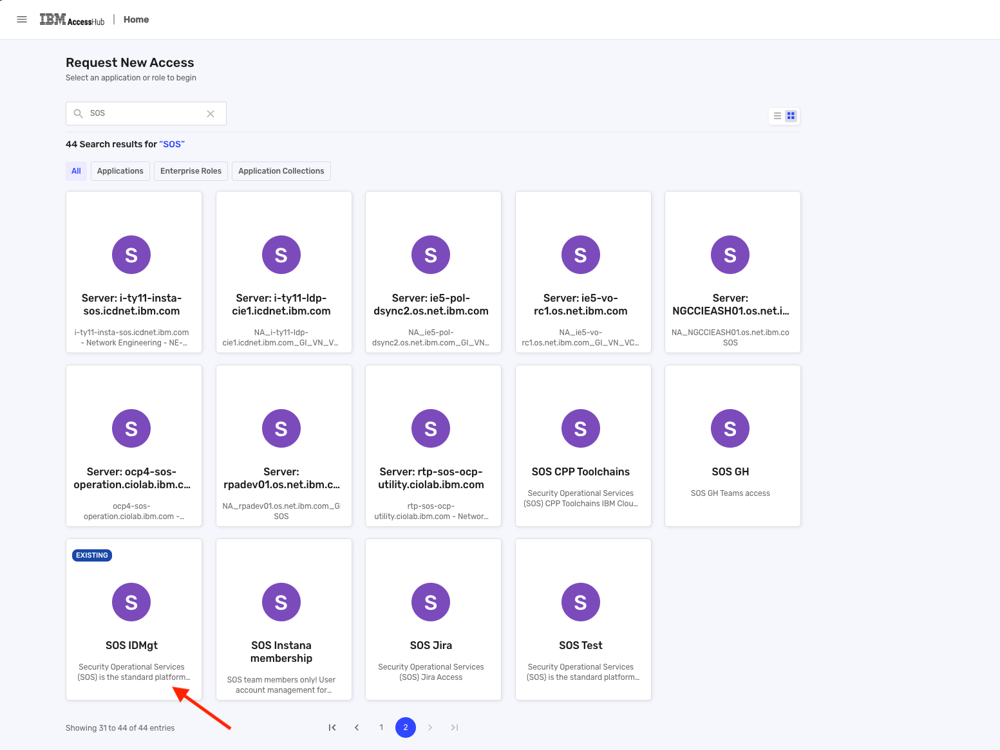
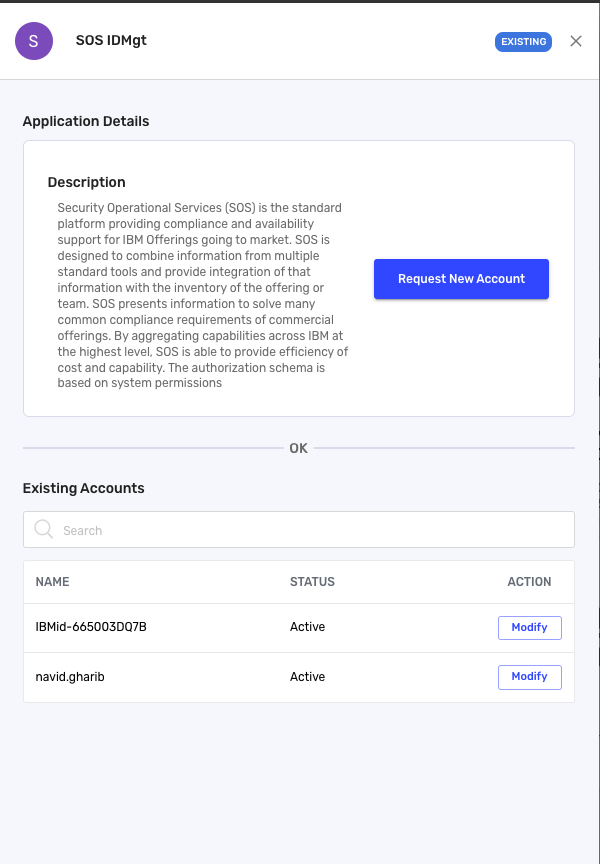
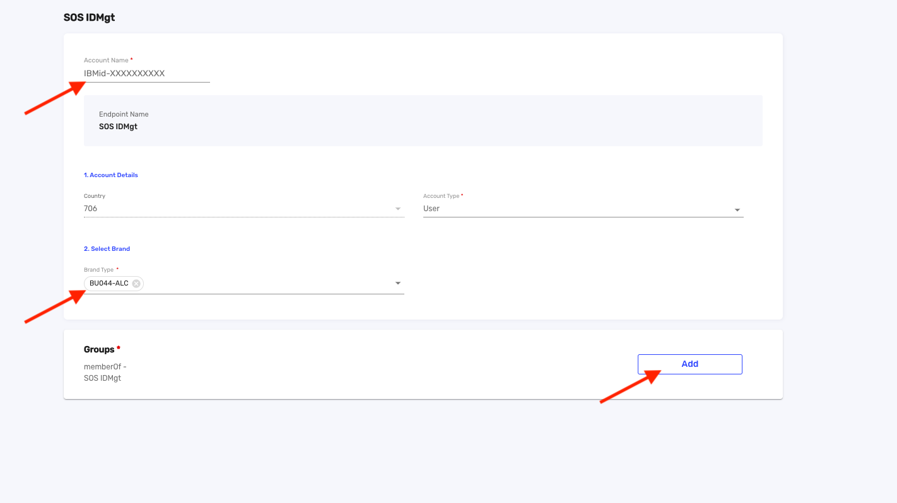
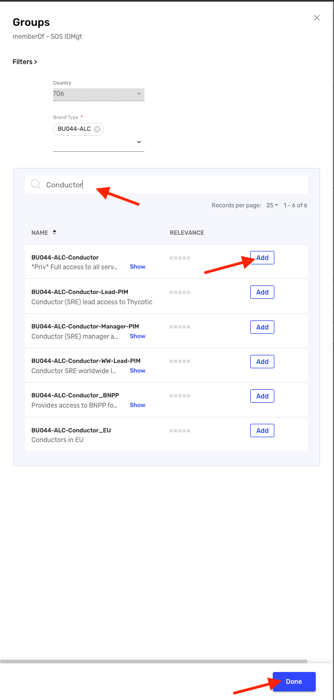
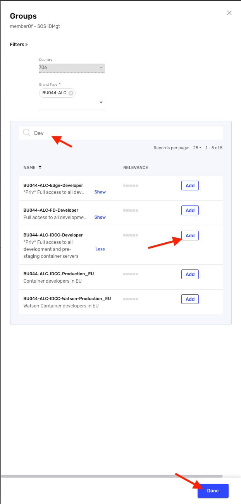

Informational
{: .label }

# Create new SOS ID for Privileged Access Gateway(PAG) access

## Overview
Privileged Access Gateway(PAG) is using IBM unique id as username when connecting to VSIs via ssh. In order to leverage SOSAD and linux PAM scripts already existing on our machines, all SRE and Dev users should request a new SOSID, which will be only used for PAG integration.

## Detailed Information
### Where can I find my IBM unique Id?
If you have the proper access to list account users you can use the following command by replacing `${USER_EMAIL}` with your email address (**lowercase**)
```
ic account users --output json | jq -r '.[] | select(.userId | ascii_downcase == "'${USER_EMAIL}'") | .ibmUniqueId'
```

If not, please reach out to SRE in [#conductors](https://ibm.enterprise.slack.com/archives/C54H08JSK)

### Create a new SOSId
1. Go to [AccessHub](https://ibm-support.saviyntcloud.com/ECMv6/request/requestHome)
1. Click on `Request Access for Self` \

1. Click on `SOS IDMgt` \

1. Click on `Request New Account` \

1. Fill the required information
  - Account Name: `Your IBMID` (`IBMid-XXXXXXXXX`)
  - Brand: `BU044-ALC`
  - Under `Groups` click on `Add` \

1. Select the group
   - SRE:
     - `BU044-ALC-Conductor` (Needed for all SREs)
     - `BU044-ALC-Conductor_EU` (Only for EU SREs)
   - Developer:
     - Dev/Prestage: `BU044-ALC-IDCC-Developer`
     - Stage: `BU044-ALC-IDCC-Staging` \
  
1. Click on `Submit & Review`
1. Provide a business justification. example: `Member of IKS SRE squad, requesting new SOSID for PAG onboarding`
1. Submit

When the request is approved by the approver chain, you should be able to use PAG for connecting to VSIs via ssh.

### Further information
[PAG VSI Preparation Documentation](https://test.cloud.ibm.com/docs/privileged-access-gateway?topic=privileged-access-gateway-pag-prep-vsi)
