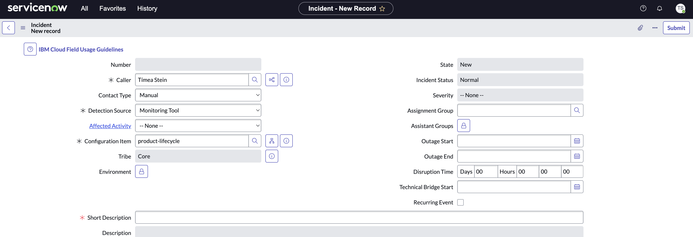

Informational
{: .label }

## Overview
This describes the process for service teams to escalate the Partner Center Sell's SRE team via both Service Now and PagerDuty.

## Detailed Information

#### Service Now Incident/CIE

1. Create a new incident in [ServiceNow](https://watson.service-now.com/now/nav/ui/classic/params/target/incident.do)
2. Fill in the mandatory fields:
  - `Detection Source`
  - `Configuration Item` = `product-lifecycle`
  - `Severity`
    - Sev-1: For Critical customer impacting issues
    - Sev-2: For time sensitive important issues
  - `Short Description`

#### PagerDuty direct call out (High Priority Only)
- Add Responder to existing PagerDuty Incident
  - [LOX escalation policy](https://ibm.pagerduty.com/escalation_policies#PDNQFZ3){:target="_blank"}
- New Incident via UI
  - Impacting Service: [Dreadnought Product Lifecycle](https://ibm.pagerduty.com/service-directory/PPHVCVJ){:target="_blank"}
  - Assigned to: [LOX escalation policy](https://ibm.pagerduty.com/escalation_policies#PDNQFZ3){:target="_blank"}
- New Incident via Email
  - [dn-product-lifecycle@ibm.pagerduty.com](email:dn-product-lifecycle@ibm.pagerduty.com)

## Further Information

N/A
